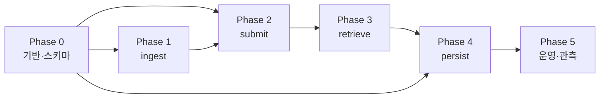

# Recipe Ingestion 구현 계획 (Phase별)

`recipe_ingestion_guidelines.md`에 정의된 OpenAI Batch API 기반 레시피 수집 파이프라인을 **단계적으로 구현**하기 위한 실행 계획이다.

---

## 참조 문서

| 문서 | 용도 |
|------|------|
| `guidelines/recipe_ingestion_guidelines.md` | 파이프라인 절차·상태 전이·멱등성 **SSOT (절차)** |
| `spec/backend_architecture_spec_consumer.md` | Consumer 패키지 파일·토픽 **명세 (구현 후 동기화 대상)** |
| `spec/backend_architecture_spec_shared.md` | Mongoose·Prisma·Kafka 상수 |
| `../common/schema.md` | Recipe·Ingredient 도메인 스키마 |
| `guidelines/backend_development_guidelines.md` | TDD·Producer/Consumer 설계·standalone job 패턴 |

---

## 파이프라인 개요

```
[ingest] → [submit] → [retrieve] → [persist]
```

| 단계 | 수행 주체 | 구동 | 예정 경로 |
|------|-----------|------|-----------|
| ingest + submit | standalone job | cron → CLI | `server/consumer/src/jobs/recipe-ingestion/` |
| retrieve | standalone job | cron → CLI | `server/consumer/src/jobs/recipe-ingestion-retrieve/` |
| persist | always-on consumer | Kafka 구독 | `server/consumer/src/consumers/recipe-ingestion-persist/` |

**SSOT**: MongoDB `recipe_ingestion_jobs` (파이프라인) · PostgreSQL (레시피 도메인) · Kafka (persist 트리거만)

### 운영·인프라 결정 (고정)

| 항목 | 결정 | 비고 |
|------|------|------|
| Batch `expired` | `retry_count++` 후 `status: ingested` | `failed`와 동일 재시도 정책 |
| LLM 모델 | `OPENAI_BATCH_MODEL` env (챗봇 `OPENAI_CHAT_MODEL`과 분리) | JSONL `body.model`에 사용 |

---

## 공공데이터 API (COOKRCP01)

식품의약품안전처 Open API **조리식품의 레시피 DB**에서 원본을 가져온다. 상세 절차·응답 코드 처리는 `guidelines/recipe_ingestion_guidelines.md` §4를 따른다.

### 요청 URL

```
http://openapi.foodsafetykorea.go.kr/api/{keyId}/{serviceId}/{dataType}/{startIdx}/{endIdx}
```

### ingestion에서 사용하는 인자

| 인자 | 출처 | 값 |
|------|------|-----|
| `keyId` | `PUBLIC_DATA_API_KEY` | Open API 인증키 |
| `serviceId` | `PUBLIC_DATA_SERVICE_ID` | `COOKRCP01` (기본) |
| `dataType` | `PUBLIC_DATA_TYPE` | `json` (기본) |
| `startIdx` | ingest 로직 계산 | `last_end_idx + 1` |
| `endIdx` | ingest 로직 계산 | `startIdx + ingestFetchLimit - 1` |

**미사용 (선택 쿼리)**: `RCP_NM`, `RCP_PARTS_DTLS`, `CHNG_DT`, `RCP_PAT2`

### API 제약·응답

- 1회 요청 최대 **1000건** (`ERROR-336`) — `ingestFetchLimit` ≤ 1000
- `INFO-000`: 정상 · row 파싱 후 upsert
- `INFO-200`: 데이터 없음 · 0건 종료
- `INFO-100` / `INFO-300` / `INFO-400` / `ERROR-5xx` 등: 가이드라인 표의 재시도·실패 정책

### 페이징 vs 멱등 키

| 저장·필드 | 용도 |
|-----------|------|
| `recipe_ingestion_state.last_end_idx` | API `startIdx`/`endIdx` 순번 커서 |
| `recipe_ingestion_jobs.source_id` | 응답 `RCP_SEQ` — upsert 멱등 키 |

---

## Phase 의존 관계



| Phase | 이름 | 핵심 산출 | 가이드라인 대응 |
|-------|------|-----------|-----------------|
| 0 | 기반·스키마 | Mongoose·Kafka·공통 상수·env | §2.6, §3 |
| 1 | ingest | 공공데이터 수집 job | §5.1 |
| 2 | submit | OpenAI Batch 제출 job | §5.2, §6 |
| 3 | retrieve | Batch 완료 조회·결과 반영 job | §5.3 |
| 4 | persist | Kafka consumer + PG 영속화 | §5.4, §2.5 |
| 5 | 운영·관측 | ECS/cron·메트릭·재시도·명세 동기화 | §2.3, §2.6, §7 |

---

## Phase 0 — 기반·스키마

**목표**: 파이프라인 SSOT 컬렉션·Kafka 계약·공통 상수를 먼저 고정하여 이후 Phase가 동일 계약 위에서 개발되도록 한다.

**선행 조건**: 없음

### 작업 항목

- [ ] MongoDB `recipe_ingestion_state` Mongoose 스키마 — `last_end_idx` API 커서 (singleton)
- [ ] MongoDB `recipe_ingestion_jobs` Mongoose 스키마·모델 정의
  - 필드: `source_id`(unique, API `RCP_SEQ`), `status`, `retry_count`, `raw_data`, `batch_id`, `retrieved_data`, `error_message`, 타임스탬프(`ingested_at` ~ `failed_at`)
  - `status` enum: `ingested | submitting | submitted | retrieving | retrieved | persisting | persisted | failed`
- [ ] `RecipeIngestionJobRepository` (MongoDB) — upsert·조건부 status 전환(낙관적 락)·batch 단위 조회
- [ ] `RecipeIngestionStateRepository` — `last_end_idx` get/set
- [ ] `@mealio/shared` Kafka 상수 등록 (기존 토픽과 동일 — `backend_architecture_spec_consumer.md` §2.2)
  - `KAFKA_TOPICS.RECIPE_INGESTION_RETRIEVED`: `recipe-ingestion-retrieved`
  - `KAFKA_DLQ_TOPICS.RECIPE_INGESTION_RETRIEVED_DLQ`: `recipe-ingestion-retrieved-dlq`
  - 로컬: Producer `KafkaAdminService`가 상수 목록 기준 메인·DLQ 자동 생성 (`NODE_ENV === production`에서는 생성 스킵)
- [ ] `CONSUMER_GROUPS.RECIPE_INGESTION_PERSIST` 추가 (`recipe-ingestion-persist-group`)
- [ ] lag·메트릭용 토픽↔그룹 매핑 **양쪽** 갱신
  - `reliability/monitoring/topic-consumer-group.map.ts` (processor 메트릭·DLQ 라벨)
  - `reliability/monitoring/consumer-lag.monitor.ts` (`GROUP_TOPIC_MAP` — lag 수집)
- [ ] `env.validation.ts` — 공공데이터 API·OpenAI Batch 관련 변수 검증
  - `PUBLIC_DATA_API_KEY` (필수)
  - `PUBLIC_DATA_SERVICE_ID` (기본 `COOKRCP01`)
  - `PUBLIC_DATA_TYPE` (기본 `json`)
  - `OPENAI_BATCH_MODEL` (필수 — Batch JSONL `body.model`. `OPENAI_CHAT_MODEL`과 분리)
- [ ] Consumer `.env.example`에 위 변수·예시 값 반영
- [ ] Prisma — `IngredientAlias` 테이블 추가 (persist 2차 매칭용, alias → canonical ingredient)
- [ ] `backend_architecture_spec_consumer.md` §2.1·§2.2에 신규 경로·토픽 **초안** 반영 (Phase 5에서 최종 동기화)

### 예정 파일 (shared / consumer)

| 경로 | 역할 |
|------|------|
| `server/shared/src/database/mongoose/schemas/recipe-ingestion-job.schema.ts` | Job Mongoose 스키마 |
| `server/shared/src/database/mongoose/schemas/recipe-ingestion-state.schema.ts` | API 커서 Mongoose 스키마 |
| `server/shared/src/constants/kafka-topics.ts` | 토픽·DLQ 상수 |
| `server/consumer/src/persistence/repositories/mongodb/recipe-ingestion-job.repository.ts` | Job CRUD·상태 전환 |
| `server/consumer/src/persistence/repositories/mongodb/recipe-ingestion-state.repository.ts` | `last_end_idx` 커서 |
| `server/consumer/src/config/consumer-groups.ts` | consumer group 상수 |
| `server/consumer/src/reliability/monitoring/topic-consumer-group.map.ts` | 토픽 → consumer group (메트릭) |
| `server/consumer/src/reliability/monitoring/consumer-lag.monitor.ts` | group → topic (lag 폴링) |
| `server/shared/src/database/prisma/schema.prisma` | `IngredientAlias` 모델 |

### 완료 기준

- Job 문서 CRUD·`source_id` unique upsert·`status` 조건부 update 단위 테스트 통과 (`__tests__/` 하위 spec)
- 로컬: Producer 기동 후 KafkaAdminService로 메인·DLQ 토픽 생성 확인
- Prisma migration 적용 후 `IngredientAlias` 시드/수동 insert 가능

---

## Phase 1 — ingest

**목표**: 공공데이터 API에서 신규 레시피를 수집해 `recipe_ingestion_jobs`에 `status: ingested`로 적재한다.

**선행 조건**: Phase 0

### 작업 항목

- [ ] **공공데이터 API 클라이언트** (`integrations/public-data/public-data-api.client.ts`)
  - URL: `GET /api/{keyId}/{serviceId}/{dataType}/{startIdx}/{endIdx}`
  - 경로 인자만 사용 — 선택 쿼리(`RCP_NM` 등) 미사용
  - `RESULT.CODE` 파싱 — `INFO-000` / `INFO-200` / 오류 코드별 분기 (가이드라인 §4.3)
  - `ingestFetchLimit` > 1000 요청 시 클라이언트 단에서 거부 또는 분할 (API `ERROR-336`)
- [ ] **`IngestService`**
  1. `recipe_ingestion_state`에서 `last_end_idx` 조회 (없으면 `0`)
  2. `startIdx = last_end_idx + 1`, `endIdx = startIdx + ingestFetchLimit - 1` 계산
  3. API 호출 (`COOKRCP01`, `json`)
  4. `INFO-000`: 각 row `RCP_SEQ` → `source_id` upsert (`status: ingested`, `raw_data`, `ingested_at`)
  5. `INFO-200`: 0건 반환, 커서 미갱신
  6. 성공 시 `last_end_idx = endIdx` 저장
- [ ] 실패 처리: recoverable 오류 재시도 · job 단위 `retry_count++` · `retry_count >= 3` → `failed`
- [ ] 단위 테스트 — API mock · `INFO-200` · `ERROR-336` · 동일 `RCP_SEQ` upsert · 커서 갱신 (`backend_development_guidelines.md` §2 — `__tests__/services/`)

### 예정 파일

| 경로 | 역할 |
|------|------|
| `server/consumer/src/jobs/recipe-ingestion/services/ingest.service.ts` | ingest 로직 |
| `server/consumer/src/integrations/public-data/public-data-api.client.ts` | 공공 API HTTP 클라이언트 |
| `server/consumer/src/jobs/recipe-ingestion/__tests__/services/ingest.service.spec.ts` | 단위 테스트 |

### 완료 기준

- `startIdx`/`endIdx` 구간 요청 URL이 스펙과 일치 (샘플: `.../COOKRCP01/json/1/100`)
- `INFO-200` 시 커서·job 건수 변화 없음
- 동일 `RCP_SEQ`(`source_id`) 재수집 시 job 문서 1건만 유지(upsert)
- API 장애·`INFO-300` 시 재시도 정책이 가이드라인과 일치
- `ingestFetchLimit` CLI 플래그(`--ingest-fetch-limit`, 기본 100, 최대 1000) 파싱 가능 (Phase 2 orchestration에서 사용)

---

## Phase 2 — submit (ingest+submit 오케스트레이션)

**목표**: `status: ingested` job을 OpenAI Batch API에 제출하고 `status: submitted`로 전환한다. ingest 부족 시 자동 수집 후 submit한다.

**선행 조건**: Phase 0, Phase 1

### 작업 항목

- [ ] **오케스트레이션** (`RecipeIngestionOrchestrator`)
  1. `ingested` 건수 조회 → `available`
  2. `available < submitBatchSize`이면 `IngestService` 호출
  3. `min(submitBatchSize, available)`건에 `SubmitService` 실행
- [ ] **카테고리 컨텍스트** — Redis TTL 1h 캐시 (기존 `FoodCategoriesHandler` 패턴 재사용 또는 공유 서비스 추출)
- [ ] **system_prompt** 템플릿 — 출력 JSON 스키마·어조·노이즈 제거·카테고리 목록·재료 정규화·`parse_confidence`/`parse_issues`/`ingredient_alias` 지시
- [ ] **JSONL 생성** — `custom_id` = job `_id`, model = `ConfigService.getOrThrow('OPENAI_BATCH_MODEL')`, `response_format: json_object`
- [ ] **OpenAI Batch 연동**
  - Files API 업로드 (`purpose: batch`)
  - Batches API 생성 (`endpoint: /v1/chat/completions`, `completion_window: 24h`)
- [ ] 상태 전이: `ingested` → `submitting` → `submitted` (+ `batch_id`, `submitted_at`)
- [ ] CLI 엔트리포인트 `run-recipe-ingestion.ts` + `package.json` script `job:recipe-ingestion`
- [ ] 통합 테스트 — OpenAI mock·JSONL 형식·`OPENAI_BATCH_MODEL` 주입 검증 (`__tests__/services/`)

### 예정 파일

| 경로 | 역할 |
|------|------|
| `server/consumer/src/jobs/recipe-ingestion/recipe-ingestion.module.ts` | Nest 모듈 |
| `server/consumer/src/jobs/recipe-ingestion/recipe-ingestion.orchestrator.ts` | ingest+submit 오케스트레이션 |
| `server/consumer/src/jobs/recipe-ingestion/services/submit.service.ts` | submit 로직 |
| `server/consumer/src/jobs/recipe-ingestion/services/category-context.service.ts` | Redis·DB 카테고리 조회 |
| `server/consumer/src/jobs/recipe-ingestion/prompts/recipe-ingestion.system-prompt.ts` | system prompt |
| `server/consumer/src/integrations/openai/openai-batch.service.ts` | Files·Batches API |
| `server/consumer/src/jobs/recipe-ingestion/run-recipe-ingestion.ts` | CLI |

### CLI 계약

```bash
pnpm --filter consumer run job:recipe-ingestion
pnpm --filter consumer run job:recipe-ingestion --submit-batch-size 50 --ingest-fetch-limit 100
```

| 플래그 | 기본값 | 제약 |
|--------|--------|------|
| `--submit-batch-size` | 100 | `ingestFetchLimit >= submitBatchSize` 권장 |
| `--ingest-fetch-limit` | 100 | API 1회 최대 1000 (`ERROR-336`) |

### 완료 기준

- E2E(mock): ingest → JSONL 업로드 → batch 생성 → Mongo `submitted` 일괄 반영
- Batch API 실패 시 `submitting` job이 `ingested`로 복귀·retry_count 증가
- cron → CLI → `NestFactory.createApplicationContext` 패턴 준수 (`run-kpi-rollup.ts` 참고)

---

## Phase 3 — retrieve

**목표**: OpenAI Batch 완료 batch의 output을 Mongo에 저장하고 Kafka로 persist를 트리거한다.

**선행 조건**: Phase 2 (최소 1건 `submitted` batch 존재)

### 작업 항목

- [ ] **RetrieveService** — `status: submitted`인 distinct `batch_id` 조회
- [ ] Batch 상태 확인 (`GET /v1/batches/{id}`)
  - `completed` → retrieve 단계 수행
  - `failed` / `expired` → `retry_count++`, `status: ingested` (`expired`도 재시도 횟수 소모 — 가이드라인 §5.3)
  - `retry_count >= 3` → `status: failed`, `failed_at`
  - `in_progress` / `validating` / `finalizing` → 변경 없음
- [ ] output JSONL 스트리밍 다운로드·라인 파싱
  - 오류 라인: `retry_count++`, `status: ingested`, `error_message`
  - 성공 라인: `retrieved_data` 저장, `status: retrieved`, `retrieved_at`
- [ ] Kafka `recipe-ingestion-retrieved` 발행 — payload `{ jobId }`, key = `jobId`
- [ ] CLI 엔트리포인트 `run-recipe-ingestion-retrieve.ts` + `package.json` script `job:recipe-ingestion-retrieve`

### 예정 파일

| 경로 | 역할 |
|------|------|
| `server/consumer/src/jobs/recipe-ingestion-retrieve/recipe-ingestion-retrieve.module.ts` | Nest 모듈 |
| `server/consumer/src/jobs/recipe-ingestion-retrieve/recipe-ingestion-retrieve.service.ts` | retrieve·파싱·emit |
| `server/consumer/src/jobs/recipe-ingestion-retrieve/run-recipe-ingestion-retrieve.ts` | CLI |

### CLI 계약

```bash
pnpm --filter consumer run job:recipe-ingestion-retrieve
```

### 완료 기준

- mock batch `completed` → job별 `retrieved` + Kafka 메시지 1건/job
- mock batch `expired` → 해당 batch job `retry_count++`·`ingested` 복귀
- partial failure JSONL → 성공·실패 job 분리 처리
- `in_progress` batch — CLI 1회 실행 시 job 상태 불변, 이후 cron 재실행 시 `completed` 처리
- cron → CLI → `NestFactory.createApplicationContext` 패턴 준수 (`run-kpi-rollup.ts` 참고)
- retrieve job이 submit job과 **독립 모듈·CLI·배포**

---

## Phase 4 — persist

**목표**: Kafka 이벤트를 소비해 PostgreSQL 레시피 도메인에 멱등 upsert한다.

**선행 조건**: Phase 0 (Kafka·repository), Phase 3 (이벤트 발행)

### 작업 항목

#### 4-A — Consumer 골격·멱등성

- [ ] `recipe-ingestion-persist` consumer (processor·consumer·module)
- [ ] `ConsumersModule` 등록
- [ ] persist 멱등성 흐름
  1. `{ jobId }`로 job 조회
  2. `status === retrieved`일 때만 `persisting` 조건부 전환
  3. 이미 `persisting` / `persisted` → skip
  4. 성공 → `persisted`, `persisted_at`
  5. 실패 → `retry_count++`, `status: retrieved` 복귀 → Kafka redelivery 또는 DLQ

#### 4-B — 도메인 영속화

- [ ] `retrieved_data` JSON 스키마 검증 (`response-parser` 또는 전용 validator)
- [ ] 레시피·재료 카테고리 신규 제안 upsert
- [ ] **재료 매칭** (단계적)
  - 4-B-1 (MVP): 1차 정규화 + 2차 `IngredientAlias` + 3차 exact match
  - 4-B-2 (후속): 4차 임베딩 유사도 (threshold 0.90 / 0.85~0.90 검수 큐 / 0.85 미만 신규 후보)
- [ ] `match_method` (`exact | alias | vector | new`) 기록
- [ ] Recipe + RecipeIngredient **Prisma `$transaction`** upsert — `(source, sourceRecipeId)` unique
- [ ] `parse_confidence: low` → `isPublished: false`
- [ ] `recipe-creation.transaction.ts` (명세 §2.1 미구현 항목) 구현 또는 persist handler 내부 트랜잭션
- [ ] DLQ — `BaseTopicProcessor` 재시도 후 `recipe-ingestion-retrieved-dlq`

### 예정 파일

| 경로 | 역할 |
|------|------|
| `server/consumer/src/consumers/recipe-ingestion-persist/recipe-ingestion-persist.processor.ts` | processor |
| `server/consumer/src/consumers/recipe-ingestion-persist/recipe-ingestion-persist.consumer.ts` | consumer |
| `server/consumer/src/consumers/recipe-ingestion-persist/recipe-ingestion-persist.module.ts` | module |
| `server/consumer/src/consumers/recipe-ingestion-persist/handlers/PersistRecipeHandler.ts` | persist 오케스트레이션 |
| `server/consumer/src/consumers/recipe-ingestion-persist/__tests__/handlers/PersistRecipeHandler.spec.ts` | handler 단위 테스트 |
| `server/consumer/src/consumers/recipe-ingestion-persist/services/ingredient-matcher.service.ts` | 재료 매칭 |
| `server/consumer/src/persistence/transactions/recipe-creation.transaction.ts` | Prisma 트랜잭션 |
| `server/consumer/src/persistence/repositories/postgresql/recipe-ingredient.repository.ts` | RecipeIngredient 쓰기 |

### 완료 기준

- 동일 `{ jobId }` Kafka redelivery 시 PG 중복 insert 없음
- `(source, sourceRecipeId)` 기준 upsert로 재처리 안전
- MVP(4-B-1) 매칭으로 end-to-end 1건 persist 성공
- consumer lag·DLQ 토픽 모니터링 대상 등록 (Phase 5)

### Phase 4 분할 권장

| 서브 Phase | 범위 | 배포 가능 여부 |
|------------|------|----------------|
| 4-A | consumer + 멱등 shell + skip 로직 | Kafka consume만 (no-op handler) |
| 4-B-1 | exact·alias 매칭 + transaction upsert | **MVP persist** |
| 4-B-2 | vector 매칭 + 검수 큐 | 품질 개선 (별도 스프린트) |

---

## Phase 5 — 운영·관측·복구

**목표**: 프로덕션 cron·메트릭·장애 복구 경로를 완성하고 명세를 동기화한다.

**선행 조건**: Phase 1~4 (MVP persist 완료)

### 작업 항목

| Scheduled Task | 호출 CLI | 주기 (초안) | 배포 단위 |
|----------------|----------|-------------|-----------|
| recipe-ingestion-orchestrator | `pnpm --filter consumer run job:recipe-ingestion` | 운영 정책 확정 | ingest+submit 1 태스크 |
| recipe-ingestion-retrieve | `pnpm --filter consumer run job:recipe-ingestion-retrieve` | 1~5분 | retrieve 별도 태스크 |
| recipe-ingestion-persist | — | always-on | Kafka consumer ECS service |

- [ ] ECS Scheduled Task / cron 스케줄 정의 (ingest+submit, retrieve 분리)
- [ ] ECS Task Definition·IAM·환경 변수 (`OPENAI_BATCH_MODEL`·공공데이터 API 키 포함)
- [ ] EventBridge / cron 표현식·타임존·동시 실행 정책
- [ ] **단계별 Prometheus 메트릭** (`consumer-metrics.service` 확장)
  - 수집·제출·완료·실패 건수
  - `parse_confidence: low` 비율
  - 재료 신규 생성·`match_method` 분포
  - LLM 토큰 usage 합산 (output JSONL)
  - stage latency
- [ ] `consumer-lag.monitor` `GROUP_TOPIC_MAP` — `recipe-ingestion-retrieved` lag 알림 (Phase 0에서 매핑 추가, Phase 5에서 대시보드·알림 연동)
- [ ] CLI `--retry-failed` — `status: failed` job 재큐잉 (정책·runbook 확정)
- [ ] CLI persist replay — `{ jobId }` 수동 Kafka emit 또는 direct persist (운영용)
- [ ] `backend_architecture_spec_consumer.md` **최종 동기화** (§2.1 파일 목록·§2.2 토픽 표·스케줄러 행)
- [ ] `../observability/validation.md`에 ingestion E2E 검증 시나리오 추가 (선택)
- [ ] Admin API·검수 UI — **향후 계획** (본 Phase 범위 외, backlog 기록만)

### 완료 기준

- Grafana/Prometheus에서 stage별 counter·histogram 조회 가능
- `failed` job 수동 재시도 절차 runbook화
- 명세·가이드라인·실제 코드 경로 일치 (`spec_driven_development_guidelines.md` 준수)

---

## E2E 검증 시나리오 (전 Phase 통합)

Phase 5 또는 각 Phase 완료 시 아래를 순차 검증한다.

1. **Happy path**: 공공 API mock 10건 → ingest → submit(mock batch) → retrieve(mock output) → persist → PG Recipe 10건·Mongo `persisted`
2. ** ingest 부족**: `ingested` 0건 상태에서 orchestrator가 ingest 후 submit
3. **Batch partial fail**: JSONL 일부 `status_code != 200` → 해당 job만 `ingested` 복귀·`retry_count++`
4. **Batch expired**: OpenAI batch `expired` → batch 소속 job `retry_count++`·`ingested` 복귀
5. **Kafka redelivery**: persist 중복 consume → PG row count 불변
6. **retry ceiling**: `retry_count >= 3` → `failed`, 더 이상 자동 submit 제외

---

## 상태 전이 체크리스트

가이드라인 §8과 구현 대응:

```
ingested → submitting → submitted
        → retrieving → retrieved
        → persisting → persisted
retry_count >= 3 → failed
```

| 전이 | 구현 Phase | 검증 |
|------|------------|------|
| → ingested | 1 | upsert |
| ingested → submitting → submitted | 2 | batch_id 설정 |
| submitted → retrieving → retrieved | 3 | retrieved_data·Kafka |
| retrieved → persisting → persisted | 4 | PG upsert |
| any → failed (retry ≥ 3) | 1~4 공통 | failed_at |

---

## Backlog (본 계획 범위 외)

- Admin API / UI — failed job 검수·수동 재처리
- 재료 검수 큐 (vector 0.85~0.90 구간) 전용 워크플로
- `recipe-ingestion-retrieved` 파티션 키·처리량 튜닝
- OpenAI 서킷 브레이커 (`circuit-breaker.ts` 명세 미구현 항목)

---

## 구현 순서 요약

```
Phase 0 (기반)
  └─► Phase 1 (ingest)
        └─► Phase 2 (submit + orchestration + CLI)
              └─► Phase 3 (retrieve + CLI)
                    └─► Phase 4-A → 4-B-1 (persist MVP)
                          └─► Phase 5 (운영)
                                └─► Phase 4-B-2 (vector 매칭, 선택)
```

각 Phase는 **독립 PR**로 나누어 리뷰·배포하는 것을 권장한다. Phase 2 완료 시점부터 OpenAI Batch 실 API smoke test, Phase 4-B-1 완료 시점부터 스테이징 E2E를 수행한다.
