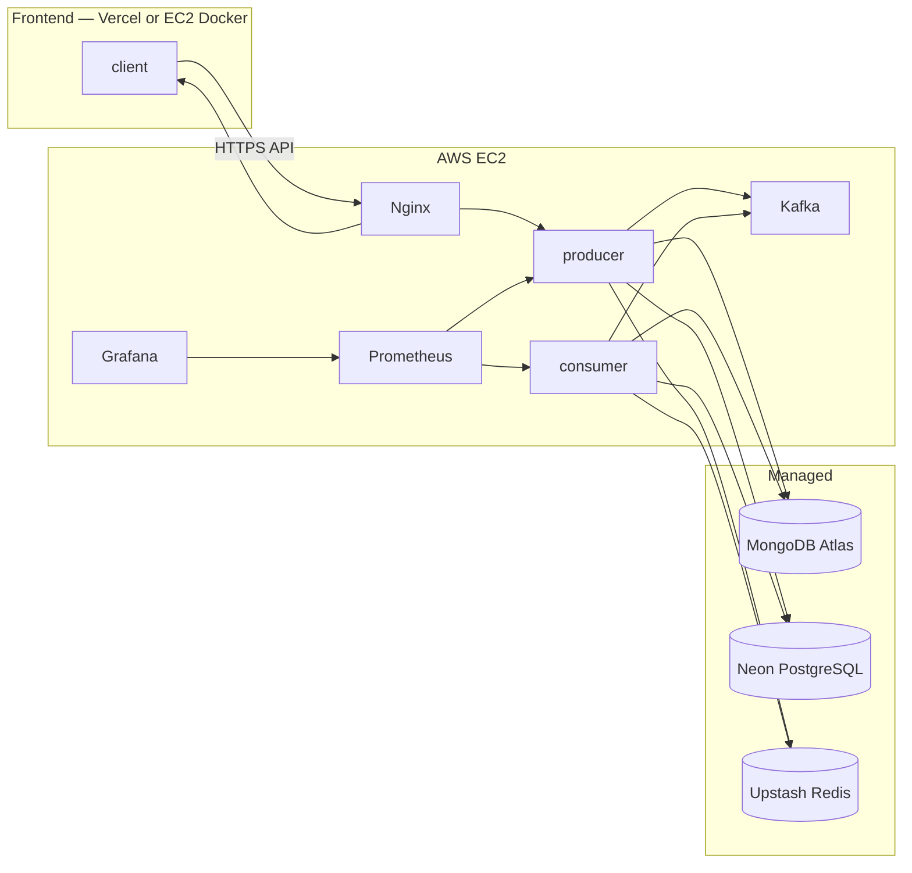

# Mealio 배포 전략

> **내부 문서** — 이 문서는 Mealio 데모 배포를 위한 내부 전략 문서입니다. 오픈소스 공개 문서(`docs/docs/`)에는 이 문서의 내용이나 여기서 언급하는 구체적 플랫폼(Neon, Upstash, EC2 등)을 직간접적으로 노출하지 않습니다.

## 1) 확정 아키텍처

Mealio MVP·초기 프로덕션 배포는 아래 스택으로 **고정**한다.

| 계층 | 플랫폼 | 담당 컴포넌트 |
|---|---|---|
| 프론트엔드 | **Vercel** 또는 **AWS EC2** (Docker Compose) | `client` (Next.js) — 배포 시 **둘 중 하나 선택** |
| 백엔드·메시지·관측 | **AWS EC2** (Docker Compose) | `producer`, `consumer`, `Kafka`, `Prometheus`, `Grafana` |
| 문서 DB | **MongoDB Atlas** | EventLog, ChatbotLog, NoSQL 도메인 |
| 관계 DB | **Neon** | User, Recipe, Ingredient 등 PostgreSQL (Prisma) |
| 캐시 | **Upstash** | Redis (세션·캐시) |

개발 환경은 Compose로 `mongodb` / `postgres` / `redis` / `kafka` / `kafka-ui` 등 인프라만 로컬에 띄우고, `producer` / `consumer`는 **`docker/producer`·`docker/consumer` 없이 호스트에서 기동**한다. 프로덕션 EC2에는 DB·Kafka UI 컨테이너를 **배포하지 않는다**.

### 프론트엔드 배포 선택

| 옵션 | 적합한 경우 | Compose / 플랫폼 |
|---|---|---|
| **Vercel** (기본 권장) | Preview·ISR·CDN·제로옵스 운영, 트래픽 변동 | Vercel 프로젝트 (`client/`) |
| **EC2 Docker** | 단일 EC2에 프론트·백엔드 통합, Vercel 미사용 | `docker/client/compose.yml` + Nginx |

두 옵션 모두 `NEXT_PUBLIC_API_BASE_URL`은 EC2 API 도메인을 가리킨다. EC2 Docker 선택 시 `FRONTEND_APP_BASE_URL`(OAuth·CORS)은 Nginx 뒤 클라이언트 URL로 맞춘다.

### 설계 원칙

- **저비용·저트래픽**: 동시 사용자 수십 이하, `recipe-ingestion`은 일 1회 이하의 느린 배치
- **역할 분리**: EC2는 앱·Kafka·관측만; 데이터 영속·캐시는 매니지드 SSOT
- **실무형 운영**: Compose 분리, Nginx TLS, Prometheus/Grafana, 점진적 AWS 확장 여지 유지

### 아키텍처 개요



Vercel 배포 시 `Client`는 EC2 외부(Vercel 엣지)에 위치하고 API만 Nginx(또는 API 도메인)로 향한다.

---

## 2) 환경별 컴포넌트 배치

### 프로덕션

| 컴포넌트 | 배포 위치 | 비고 |
|---|---|---|
| `client` | **Vercel** 또는 **EC2** | Vercel: Git 연동 · EC2: `docker/client/compose.yml` |
| `producer` | EC2 | `docker/producer/compose.yml` |
| `consumer` | EC2 | `docker/consumer/compose.yml` |
| `Kafka` | EC2 | `docker/kafka/compose.yml` |
| `Prometheus`, `Grafana`, `Pushgateway` | EC2 | `docker/prometheus/compose.yml`, `docker/grafana/compose.yml`, `docker/pushgateway/compose.yml` |
| MongoDB | Atlas | `MONGODB_URL` (TLS, IP allowlist 또는 VPC peering 검토) |
| PostgreSQL | Neon | `POSTGRESQL_URL` (connection pooling 권장) |
| Redis | Upstash | `REDIS_URL` (TLS) |
| `kafka-ui` | **미배포** | 개발 전용 |

### 개발 (로컬 / CI)

| 컴포넌트 | 배포 위치 | 비고 |
|---|---|---|
| `producer`, `consumer` | 호스트 | `docker/producer`·`docker/consumer` **미기동** |
| `client` | 호스트 (`pnpm run start:client`) | `PORT` 기본 `4000` |
| DB·캐시·Kafka·Kafka UI·관측 | Docker Compose | 아래 §4 Compose 표 참고 (`docker/producer`·`docker/consumer`·`docker/client` 제외) |
| DB·캐시 URL | `docker/mongodb`·`docker/postgres`·`docker/redis` 또는 매니지드 | Atlas/Neon/Upstash URL로 하이브리드 가능 |

---

## 3) EC2 운영 기준

### 인스턴스·OS

- 인스턴스: `t4g.medium` (2 vCPU, 4 GiB) + gp3 80~120 GB
- OS: Ubuntu 22.04 LTS
- 리버스 프록시: Nginx (80/443), API·프론트(선택) 라우팅·TLS 종료
- 오케스트레이션: Docker Compose (역할별 compose 파일)

### Security Group

- Inbound 허용: `80`, `443`, `22`(관리 IP만)
- Compose 포트 매핑은 호스트의 모든 인터페이스(`0.0.0.0`)에 바인딩되며, 외부 노출 여부는 Security Group으로 제어
- 앱·Kafka·메트릭 포트(`PORT`, `9092`, `9090` 등)는 SG에서 **외부 미노출**을 기본으로 하고, 공개가 필요한 서비스만 Nginx(80/443) 또는 허용 포트로 라우팅
- Atlas / Neon / Upstash는 각 콘솔에서 EC2 egress IP allowlist 또는 공개 엔드포인트 + 자격 증명으로 접근

### Grafana 접근

- 프로덕션 Grafana는 비공개 전제: Nginx Basic Auth + IP allowlist, 또는 VPN / SSM 터널

### 백업·스냅샷

| 대상 | 방식 |
|---|---|
| Neon | Neon 콘솔 백업·PITR (플랜에 따름) |
| Atlas | Atlas 백업 정책 |
| Upstash | 매니지드 스냅샷·복제 (플랜에 따름) |
| EC2 EBS | Kafka·관측 볼륨 주기 스냅샷 |
| Grafana | provisioning / 대시보드 JSON은 Git 관리 |

### 성능·가용성 목표 (초기)

- API p95 500ms 미만 (저트래픽 가정)
- Kafka 소비 지연: 이벤트 발생 후 수 초 이내
- 단일 EC2 장애 시 RTO 1시간 내 수동 복구

---

## 4) Compose 파일 및 기동 방식

Compose는 **`docker/{서비스명}/compose.yml`** 형태로 **서비스당 단일 compose 파일**이 SSOT이다. 모든 compose 파일은 `networks.mealio-net.name: mealio-net`으로 **동일한 이름의 브리지 네트워크**를 공유한다(`external: true` 사용 안 함). 인프라 compose를 **먼저** 기동해 네트워크·DB·Kafka를 준비한 뒤 `docker/producer`·`docker/consumer`·`docker/client`를 기동한다(`README.md` Usage · Production 순서). 여러 `-f` 플래그로 한 프로젝트(`name: mealio`)에 병합해 기동한다.

환경 변수 파일 준비 (`README.md` Installation):

```bash
cp .env.docker.example .env.docker
cp client/.env.example client/.env
cp server/producer/.env.example server/producer/.env
cp server/consumer/.env.example server/consumer/.env
cp client/.env.docker.example client/.env.docker
cp server/producer/.env.docker.example server/producer/.env.docker
cp server/consumer/.env.docker.example server/consumer/.env.docker
```

| Compose 파일 | 기동 대상 | 프로덕션 | 개발 |
|---|---|---|---|
| `docker/producer/compose.yml` | `producer` | EC2 | **미기동** |
| `docker/consumer/compose.yml` | `consumer` | EC2 | **미기동** |
| `docker/client/compose.yml` | `client` | EC2 (Vercel 미사용 시) | 선택 |
| `docker/mongodb/compose.yml` | `mongodb` | **사용 안 함** | 로컬/CI |
| `docker/postgres/compose.yml` | `postgres` | **사용 안 함** | 로컬/CI |
| `docker/redis/compose.yml` | `redis` | **사용 안 함** | 로컬/CI |
| `docker/kafka/compose.yml` | `kafka` | EC2 | 로컬/CI |
| `docker/kafka-ui/compose.yml` | `kafka-ui` | **사용 안 함** | 로컬/CI |
| `docker/pushgateway/compose.yml` | `pushgateway` | EC2 | 로컬/CI |
| `docker/prometheus/compose.yml` | `prometheus` | EC2 | 로컬/CI |
| `docker/grafana/compose.yml` | `grafana` | EC2 | 로컬/CI |

### 환경 변수 파일 역할

| 파일 | 용도 |
|---|---|
| 루트 `.env.docker` | **인프라 Compose 전용** — DB·Kafka·관측 (`docker/mongodb`·`docker/kafka`·`docker/prometheus` 등). 템플릿: `cp .env.docker.example .env.docker` |
| `client/.env` | 호스트에서 `pnpm run start:client` 실행 시. 템플릿: `cp client/.env.example client/.env` |
| `server/producer/.env` | 호스트에서 `pnpm run start:producer` 실행 시. 템플릿: `cp server/producer/.env.example server/producer/.env` |
| `server/consumer/.env` | 호스트에서 `pnpm run start:consumer` 실행 시. 템플릿: `cp server/consumer/.env.example server/consumer/.env` |
| `server/shared/.env.local` | Prisma·Mongoose·Kafka 토픽 CLI(`db:*`). 템플릿: `cp server/shared/.env.example server/shared/.env.local` |
| `client/.env.docker` | `docker/client` 기동 시 client 컨테이너 env. 템플릿: `cp client/.env.docker.example client/.env.docker` |
| `server/producer/.env.docker` | `docker/producer` 컨테이너 env. 템플릿: `cp server/producer/.env.docker.example server/producer/.env.docker` |
| `server/consumer/.env.docker` | `docker/consumer` 컨테이너 env. 템플릿: `cp server/consumer/.env.docker.example server/consumer/.env.docker` |

`docker/client`·`docker/producer`·`docker/consumer`는 Compose YAML에 env 파일 경로를 고정하지 않는다. 기동 시 `--env-file`로 각 패키지 `.env.docker`(앱)를 전달하면 `${VAR}` 치환·`environment`·빌드 arg에 반영된다. 인프라 Compose는 별도로 `--env-file .env.docker`를 사용한다.

`docker/producer`·`docker/consumer`는 `image: ${DOCKERHUB_USERNAME}/mealio-producer:latest`(또는 `mealio-consumer`) 형식을 사용한다. `DOCKERHUB_USERNAME`은 각 패키지 `.env.docker`에 두고 `--env-file`로 전달한다. CI(`server` 워크플로)가 푸시하는 Docker Hub 이미지 이름과 동일한 접두사를 쓴다. 앱 부팅 Joi 검증 대상은 아니다.

### 개발 환경

인프라 기동 (`README.md` Usage · Development):

```bash
docker compose --env-file .env.docker -f docker/mongodb/compose.yml -f docker/postgres/compose.yml -f docker/redis/compose.yml -f docker/kafka/compose.yml -f docker/kafka-ui/compose.yml -f docker/pushgateway/compose.yml -f docker/prometheus/compose.yml -f docker/grafana/compose.yml up -d
```

DB 시드·마이그레이션 후 앱은 호스트에서 기동:

```bash
pnpm run db:prisma:generate
pnpm run db:prisma:migrate:dev
pnpm run db:mongoose:sync-indexes
pnpm run db:prisma:seed
pnpm run db:mongoose:seed

pnpm run start:producer
pnpm run start:consumer
pnpm run start:client
```

- `producer` / `consumer` / `client`: 각 패키지 `.env` 사용. `KAFKA_BROKERS` 등은 published 포트 기준(예: `localhost:9092`).
- DB·Redis 기본값은 Compose 내부. 패키지 `.env`에 Atlas/Neon/Upstash URL만 두면 **하이브리드 개발** 가능.
- `docker/mongodb`·`docker/postgres`·`docker/redis` 볼륨은 개발 전용; EC2 매니지드 DB 프로덕션의 데이터 SSOT는 Atlas/Neon/Upstash이다.

### 프로덕션 (Docker Compose — `README.md` Usage · Production)

인프라:

```bash
docker compose --env-file .env.docker -f docker/mongodb/compose.yml -f docker/postgres/compose.yml -f docker/redis/compose.yml -f docker/kafka/compose.yml -f docker/kafka-ui/compose.yml -f docker/pushgateway/compose.yml -f docker/prometheus/compose.yml -f docker/grafana/compose.yml up -d
```

마이그레이션:

```bash
pnpm run db:prisma:migrate:deploy
pnpm run db:mongoose:sync-indexes:production
pnpm run db:kafka:create-topics:production
```

`db:kafka:create-topics:production`은 EC2에서 `docker/kafka` 기동 후·`docker/producer`/`docker/consumer` 기동 전에 실행한다. KafkaJS Admin API로 메인·DLQ 토픽 14개를 생성한다. env는 `server/shared/.env.production.local`(또는 `.env.local`)을 사용한다. EC2 **호스트**에서 실행할 때는 `KAFKA_BROKERS`를 published 포트 기준(예: `localhost:9092`)으로 맞춘다. 앱 Compose용 `kafka:19092`와 다를 수 있다.

앱 (인프라 Compose가 선행되어야 `mealio-net`에 Kafka 등이 준비됨):

```bash
docker compose --env-file server/producer/.env.docker -f docker/producer/compose.yml up -d --build

docker compose --env-file server/consumer/.env.docker -f docker/consumer/compose.yml up -d --build

docker compose --env-file client/.env.docker -f docker/client/compose.yml up -d --build
```

`NEXT_PUBLIC_*`는 **이미지 빌드 시** Dockerfile `ARG`로 주입된다. 값은 `client/.env.docker`에 두고 `--env-file client/.env.docker`로 전달하며, 변경 시 `--build`로 재빌드한다. 런타임 시크릿(`REVALIDATE_SECRET` 등)은 compose `environment`의 `${VAR}` 치환으로 컨테이너에 전달된다.

Docker Compose로 앱을 띄울 때 패키지 `.env.docker` 연결 URL 예시:

- 로컬 Compose DB: `postgres` / `mongodb` / `redis` / `kafka:19092` 등 **서비스명** 기준
- EC2 + 매니지드 DB: `MONGODB_URL`(Atlas), `POSTGRESQL_URL`(Neon pooler), `REDIS_URL`(Upstash `rediss://`), `KAFKA_BROKERS`(`kafka:19092`)
- `PORT`(client·producer), `METRICS_PORT`(producer·consumer) — 패키지 `.env.docker`에서 관리
- `PUSHGATEWAY_PORT` — 루트 `.env.docker`, `docker/pushgateway/compose.yml` 호스트 바인딩
- Prometheus 스크랩 대상 — 루트 `.env.docker`의 `PROMETHEUS_PRODUCER_TARGET`·`PROMETHEUS_CONSUMER_TARGET` (`host:port`). 기본값 `producer:9100`·`consumer:9101`, 호스트 개발 시 `host.docker.internal:포트`로 덮어씀
- Pushgateway 스크랩 대상 — `PROMETHEUS_PUSHGATEWAY_TARGET`. 기본값 `pushgateway:9091`, 호스트 개발 시 `host.docker.internal:9091`로 덮어씀

### 프로덕션 EC2 (매니지드 DB — Vercel 대신 Docker 선택 시)

EC2에는 `docker/mongodb`·`docker/postgres`·`docker/redis`·`docker/kafka-ui`를 **배포하지 않는다**. 인프라는 Kafka·관측만 `.env.docker`로 기동하고, 앱 compose 명령은 위 Production 절과 동일하다.

```bash
docker compose --env-file .env.docker -f docker/kafka/compose.yml -f docker/pushgateway/compose.yml -f docker/prometheus/compose.yml -f docker/grafana/compose.yml up -d

pnpm run db:prisma:migrate:deploy:production
pnpm run db:mongoose:sync-indexes:production
pnpm run db:kafka:create-topics:production

docker compose --env-file server/producer/.env.docker -f docker/producer/compose.yml up -d --build

docker compose --env-file server/consumer/.env.docker -f docker/consumer/compose.yml up -d --build

docker compose --env-file client/.env.docker -f docker/client/compose.yml up -d --build
```

패키지 `.env.docker`에는 Atlas/Neon/Upstash URL·`JWT_SECRET`·OAuth·`OPENAI_API_KEY` 등 앱 시크릿을 설정한다.

---

## 5) 매니지드 서비스 연동

### MongoDB Atlas

- 용도: NoSQL 도메인, EventLog, ChatbotLog 등 (`agent/common/schema.md` 기준)
- 연결: `MONGODB_URL` (`mongodb+srv://...`)
- 초기: M0(무료) 또는 M2+ (트래픽·저장량에 따라)
- EC2 → Atlas: 네트워크 allowlist에 EC2 탄력 IP 등록

### Neon (PostgreSQL)

- 용도: Prisma RDB (`User`, `Recipe`, `Ingredient` 등)
- 연결: `POSTGRESQL_URL`
- 권장: Neon connection pooler endpoint 사용, `pgvector` 확장 필요 시 Neon 프로젝트에서 활성화
- 마이그레이션: 배포 파이프라인 또는 EC2에서 `prisma migrate deploy` 1회 실행 정책 고정

### Upstash (Redis)

- 용도: 캐시, OAuth/세션 보조
- 연결: `REDIS_URL` (TLS)
- 초기: 무료·저가 플랜; 초당 요청·키 수 모니터링

### 환경 변수 정리

| 변수 | 프로덕션 | 개발 (Compose DB) |
|---|---|---|
| `MONGODB_URL` | Atlas | `mongodb://...@mongodb:27017/...` (기본) |
| `POSTGRESQL_URL` | Neon | `postgresql://...@postgres:5432/...` (기본) |
| `REDIS_URL` | Upstash | `redis://:devpassword@redis:6379` (기본) |

루트 `.env.docker.example`(인프라 → `.env.docker`)와 각 패키지 `.env.example`·`.env.docker.example`, 배포 시크릿 저장소(AWS SSM Parameter Store, GitHub Actions secrets 등)를 동기화한다.

---

## 6) 프론트엔드 배포

### 옵션 A — Vercel (기본 권장)

- `client` 저장소 루트 또는 `client/` 경로를 Vercel 프로젝트에 연결
- `FRONTEND_APP_BASE_URL`: Vercel 프로덕션 URL
- `OAUTH_CALLBACK_BASE_URL` / API 호출: EC2 API 도메인 (`https://api.<domain>`)
- Preview 배포: Preview URL을 OAuth·CORS allowlist에 등록
- 환경 변수: `client/.env.example`의 `NEXT_PUBLIC_*`·`REVALIDATE_SECRET`; 시크릿은 서버 전용 env에만 둔다

### 옵션 B — EC2 Docker

- `docker/Dockerfile.client` + `docker/client/compose.yml`
- Nginx가 `PORT` 컨테이너로 프록시; `FRONTEND_APP_BASE_URL`은 공개 HTTPS URL
- `NEXT_PUBLIC_*`는 build-arg로 이미지에 bake; API URL은 EC2 API 도메인
- `REVALIDATE_SECRET`: compose 런타임 env

---

## 7) 배포·릴리스 흐름

### EC2 (수동 → 자동화)

1. EC2에 Docker·Compose 설치, 루트 `.env.docker`(인프라)와 패키지 `.env.docker`(앱) 또는 SSM에서 시크릿 주입
2. 이미지: `docker compose build` 또는 CI에서 ECR 푸시 후 `pull`
3. DB 마이그레이션: Neon 대상 `prisma migrate deploy`
4. 기동: §4 프로덕션 EC2 compose 명령 (인프라 → `docker/producer`·`docker/consumer` → `docker/client`)
5. 헬스: Producer `/health`, Consumer 메트릭·Kafka lag 확인

### Vercel

- `main` 브랜치 push 시 프로덕션 배포 (또는 GitHub Actions → Vercel 연동)
- API 스키마 변경 시 OpenAPI·프론트 타입 생성 파이프라인과 함께 릴리스

### 권장 자동화 (점진 도입)

- GitHub Actions: lint/test → Docker build → EC2 SSH 또는 SSM `compose pull && compose up -d`
- 시크릿: Atlas/Neon/Upstash URL, `JWT_SECRET`, OAuth, OpenAI 키는 Actions secrets / SSM

---

## 8) recipe-ingestion (느린 주기)

트래픽·즉시성 요구가 낮아 초기에는 단순 스케줄을 유지한다.

| 항목 | 권장 |
|---|---|
| 주기 | 일 1회(오프피크). 필요 시 주 2~3회로 더 완화 |
| 실행 | `consumer` `@nestjs/schedule` + **Upstash Redis 락**(중복 방지) |
| 대안 | GitHub Actions cron → `producer` ingestion endpoint |
| 보호 | 타임아웃, 재시도 상한, 최대 처리 건수 |
| 추적 | Kafka 또는 EventLog(Atlas)에 실행 로그 |

---

## 9) 관측·알림

- **Prometheus** (`docker/prometheus/compose.yml`): `producer`·`consumer` 메트릭 스크랩
- **Pushgateway** (`docker/pushgateway/compose.yml`): recipe-ingestion **CLI** batch job 메트릭 push 수집 (`PUSHGATEWAY_URL`·`PUSHGATEWAY_PORT`)
- **Grafana**: API p95, 5xx, Kafka consumer lag, ingestion 처리량
- **알람(초기)**: 5xx 비율, Kafka lag, cron 실패
- **로그**: JSON stdout; 필요 시 Loki·CloudWatch로 확장
- **제품 KPI**: `agent/observability/` 문서·Grafana MongoDB datasource(Atlas 읽기 전용 계정)

Slack 웹훅(`SLACK_OPS_WEBHOOK_URL` 등)은 선택 연동.

---

## 10) 비용 추정 (월간, 대략)

환율·리전·트래픽에 따라 변동하는 러프 추정.

| 항목 | 예상 |
|---|---|
| Vercel Hobby | $0 (팀·Pro 필요 시 별도) |
| EC2 `t4g.medium` | $25~35 |
| EBS gp3 ~100 GB | $8~12 |
| 데이터 전송·기타 AWS | $5~15 |
| MongoDB Atlas M0 | $0 (상위 플랜 시 증가) |
| Neon Free / Launch | $0~19 |
| Upstash Free / Pay-as-you-go | $0~10 |
| **합계** | **약 $38~90 / 월** |

EC2 Docker로 프론트를 같이 호스팅하면 Vercel 비용은 $0이지만, 동일 EC2 리소스를 공유한다.

---

## 11) 확장 로드맵 (확정 스택 이후)

현재 스택을 전제로, 병목·트래픽 증가 시 **계층별**만 확장한다. MVP 단계에서 RDS·ElastiCache·MSK로 일괄 이전하지 않는다.

### Phase 1 — 현재 (확정)

- 프론트: Vercel **또는** EC2 `docker/client`
- 백엔드: EC2(`docker/producer` · `docker/consumer` · `docker/kafka` · `docker/prometheus` · `docker/grafana` · `docker/pushgateway`) + Atlas + Neon + Upstash
- 개발: Compose 인프라 + 호스트 `producer`/`consumer` (`docker/producer`·`docker/consumer` 미기동)
- End-to-End 운영·KPI 검증

### Phase 2 — 트래픽·안정성

- Neon / Upstash / Atlas 플랜 상향
- Kafka 단일 브로커 → 다중 브로커 또는 **MSK** 검토
- EC2 수직 스케일 또는 Producer/Consumer 프로세스 분리(동일 호스트 → 다중 호스트)
- Prometheus/Grafana 전용 인스턴스 또는 매니지드 관측

### Phase 3 — 성숙 운영

- 무중단 배포(Rolling / Blue-Green)
- IaC(Terraform): EC2, SG, Route53, SSM
- 백업·복구·장애 리허설 정례화
- (선택) RDS·ElastiCache는 Neon/Upstash 한계 또는 규정 요구 시에만 검토

---

## 12) 체크리스트 (프로덕션 최초 기동)

- [ ] 프론트: Vercel 연결 **또는** `docker/client` + Nginx 라우팅
- [ ] API·OAuth URL: `FRONTEND_APP_BASE_URL`, `OAUTH_CALLBACK_BASE_URL`, `NEXT_PUBLIC_API_BASE_URL`
- [ ] EC2 + Nginx TLS, Security Group
- [ ] Atlas / Neon / Upstash 프로젝트 생성, EC2 IP allowlist
- [ ] 루트 `.env.docker`(인프라), 패키지 `.env.docker`: `MONGODB_URL`, `POSTGRESQL_URL`, `REDIS_URL`, `KAFKA_BROKERS`, `DOCKERHUB_USERNAME`(producer·consumer compose), 시크릿
- [ ] `prisma migrate deploy` (Neon)
- [ ] `docker/kafka` + `docker/pushgateway` + `docker/prometheus` + `docker/grafana` 기동 → `pnpm run db:kafka:create-topics:production` → `docker/producer`·`docker/consumer`·`docker/client` 기동
- [ ] Prometheus·Pushgateway 타겟 UP, Grafana 대시보드·인증
- [ ] Producer `/health`, 샘플 API·Kafka consume 확인
- [ ] `recipe-ingestion` cron·Redis 락·로그 확인

---

## 13) 관련 문서

- 시스템 구성: `agent/common/architecture.mermaid`, `agent/common/proposal.md`
- 스키마·RDB/NoSQL 구분: `agent/common/schema.md`
- 관측·KPI: `agent/observability/`
- 백엔드 모듈: `agent/backend/spec/backend_architecture_spec.md`
