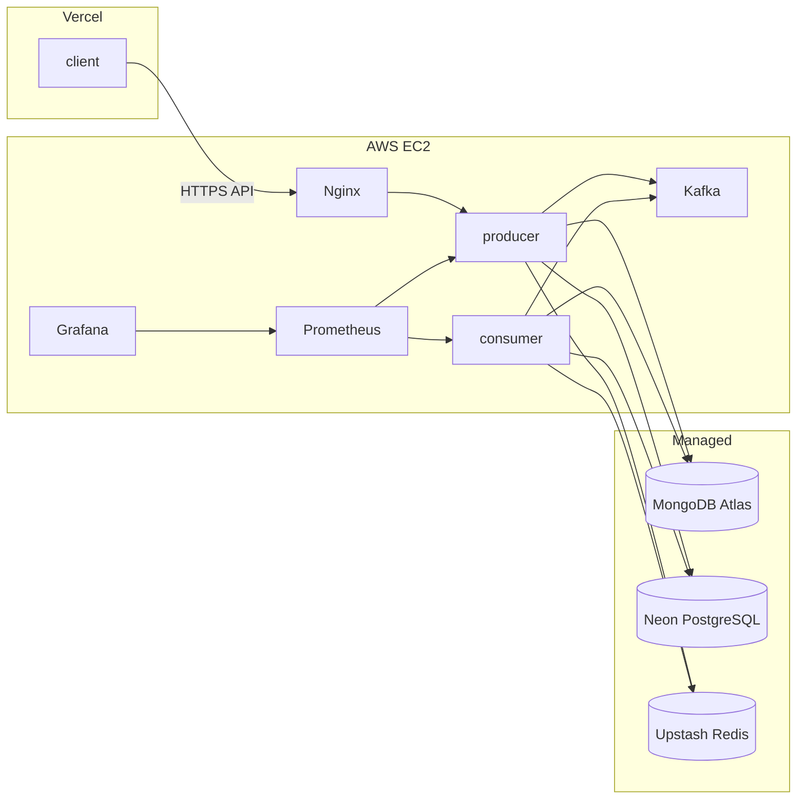

# Mealio 배포 전략

## 1) 확정 아키텍처

Mealio MVP·초기 프로덕션 배포는 아래 스택으로 **고정**한다.

| 계층 | 플랫폼 | 담당 컴포넌트 |
|---|---|---|
| 프론트엔드 | **Vercel** | `client` (Next.js) |
| 백엔드·메시지·관측 | **AWS EC2** (Docker Compose) | `producer`, `consumer`, `Kafka`, `Prometheus`, `Grafana` |
| 문서 DB | **MongoDB Atlas** | EventLog, ChatbotLog, NoSQL 도메인 |
| 관계 DB | **Neon** | User, Recipe, Ingredient 등 PostgreSQL (Prisma) |
| 캐시 | **Upstash** | Redis (세션·캐시·분산 락) |

개발 환경은 Compose로 `mongodb` / `postgres` / `redis` / `kafka` / `kafka-ui` 등 인프라만 로컬에 띄우고, `producer` / `consumer`는 **`compose-app` 없이 호스트에서 기동**한다. 프로덕션 EC2에는 DB·Kafka UI 컨테이너를 **배포하지 않는다**.

### 설계 원칙

- **저비용·저트래픽**: 동시 사용자 수십 이하, `recipe-ingestion`은 일 1회 이하의 느린 배치
- **역할 분리**: EC2는 앱·Kafka·관측만; 데이터 영속·캐시는 매니지드 SSOT
- **실무형 운영**: Compose 분리, Nginx TLS, Prometheus/Grafana, 점진적 AWS 확장 여지 유지

### 아키텍처 개요



---

## 2) 환경별 컴포넌트 배치

### 프로덕션

| 컴포넌트 | 배포 위치 | 비고 |
|---|---|---|
| `client` | Vercel | `NEXT_PUBLIC_*` API 베이스 URL → EC2 API 도메인 |
| `producer`, `consumer` | EC2 | `docker/compose-app.yml` |
| `Kafka` | EC2 | `docker/compose-kafka.yml` |
| `Prometheus`, `Grafana` | EC2 | `docker/compose-monitoring.yml` |
| MongoDB | Atlas | `MONGODB_URL` (TLS, IP allowlist 또는 VPC peering 검토) |
| PostgreSQL | Neon | `POSTGRESQL_URL` (connection pooling 권장) |
| Redis | Upstash | `REDIS_URL` (TLS) |
| `kafka-ui` | **미배포** | 개발 전용 |

### 개발 (로컬 / CI)

| 컴포넌트 | 배포 위치 | 비고 |
|---|---|---|
| `producer`, `consumer` | 호스트 | `docker/compose-app.yml` **미기동** |
| DB·캐시·Kafka·Kafka UI·관측 | Docker Compose | 아래 §4 Compose 표 참고 (`compose-app` 제외) |
| DB·캐시 URL | `docker/compose-database.yml` 또는 매니지드 | Atlas/Neon/Upstash URL로 하이브리드 가능 |

---

## 3) EC2 운영 기준

### 인스턴스·OS

- 인스턴스: `t4g.medium` (2 vCPU, 4 GiB) + gp3 80~120 GB
- OS: Ubuntu 22.04 LTS
- 리버스 프록시: Nginx (80/443), API 라우팅·TLS 종료
- 오케스트레이션: Docker Compose (역할별 compose 파일)

### Security Group

- Inbound 허용: `80`, `443`, `22`(관리 IP만)
- 앱·Kafka·메트릭 포트(`3000`, `9092`, `9090` 등)는 **외부 미노출**, Nginx 또는 localhost 바인딩
- Atlas / Neon / Upstash는 각 콘솔에서 EC2 egress IP allowlist 또는 공개 엔드포인트 + 자격 증명으로 접근

### Grafana 접근

- 프로덕션 Grafana는 비공개 전제: Nginx Basic Auth + IP allowlist, 또는 VPN / SSM 터널

### 백업·스냅샷

| 대상 | 방식 |
|---|---|
| Neon | Neon 콘솔 백업·PITR (플랜에 따름) |
| Atlas | Atlas 백업 정책 |
| Upstash | 매니지드 스냅샷·복제 (플랜에 따름) |
| EC2 EBS | Kafka·관측 볼륨 주기 스냅샷 |
| Grafana | provisioning / 대시보드 JSON은 Git 관리 |

### 성능·가용성 목표 (초기)

- API p95 500ms 미만 (저트래픽 가정)
- Kafka 소비 지연: 이벤트 발생 후 수 초 이내
- 단일 EC2 장애 시 RTO 1시간 내 수동 복구

---

## 4) Compose 파일 및 기동 방식

Compose는 **`docker/`** 아래 역할별 파일 분리가 SSOT이다.

| Compose 파일 | 기동 대상 | 프로덕션 | 개발 |
|---|---|---|---|
| `docker/compose-app.yml` | `producer`, `consumer` | EC2 | **미기동** |
| `docker/compose-database.yml` | `mongodb`, `postgres`, `redis` | **사용 안 함** | 로컬/CI |
| `docker/compose-kafka.yml` | `kafka` | EC2 | 로컬/CI |
| `docker/compose-kafka-ui.yml` | `kafka-ui` | **사용 안 함** | 로컬/CI |
| `docker/compose-monitoring.yml` | `prometheus`, `grafana` | EC2 | 로컬/CI |

### 프로덕션 EC2

```bash
docker compose --env-file .env -f docker/compose-app.yml -f docker/compose-kafka.yml -f docker/compose-monitoring.yml up -d
```

필수 환경 변수(예시):

- `MONGODB_URL` → Atlas connection string
- `POSTGRESQL_URL` → Neon connection string (pooler URL 권장)
- `REDIS_URL` → Upstash Redis URL (`rediss://`)
- `KAFKA_BROKERS` → EC2 내부 Kafka (`kafka:19092` 등 compose 서비스명)
- `JWT_SECRET`, OAuth, `OPENAI_API_KEY` 등 앱 시크릿

### 개발 환경

```bash
docker compose --env-file .env -f docker/compose-database.yml -f docker/compose-kafka.yml -f docker/compose-kafka-ui.yml -f docker/compose-monitoring.yml up -d
```

- `producer` / `consumer`: 호스트에서 실행. `KAFKA_BROKERS` 등은 published 포트 기준(예: `localhost:9092`)으로 `.env` 설정.
- DB·Redis 기본값은 Compose 내부. `.env`에 Atlas/Neon/Upstash URL만 두면 **하이브리드 개발** 가능.
- `docker/compose-database.yml` 볼륨은 개발 전용; 프로덕션 데이터 SSOT는 매니지드이다.

---

## 5) 매니지드 서비스 연동

### MongoDB Atlas

- 용도: NoSQL 도메인, EventLog, ChatbotLog 등 (`agent/common/schema.md` 기준)
- 연결: `MONGODB_URL` (`mongodb+srv://...`)
- 초기: M0(무료) 또는 M2+ (트래픽·저장량에 따라)
- EC2 → Atlas: 네트워크 allowlist에 EC2 탄력 IP 등록

### Neon (PostgreSQL)

- 용도: Prisma RDB (`User`, `Recipe`, `Ingredient` 등)
- 연결: `POSTGRESQL_URL`
- 권장: Neon connection pooler endpoint 사용, `pgvector` 확장 필요 시 Neon 프로젝트에서 활성화
- 마이그레이션: 배포 파이프라인 또는 EC2에서 `prisma migrate deploy` 1회 실행 정책 고정

### Upstash (Redis)

- 용도: 캐시, OAuth/세션 보조, cron 분산 락(`recipe-ingestion`)
- 연결: `REDIS_URL` (TLS)
- 초기: 무료·저가 플랜; 초당 요청·키 수 모니터링

### 환경 변수 정리

| 변수 | 프로덕션 | 개발 (Compose DB) |
|---|---|---|
| `MONGODB_URL` | Atlas | `mongodb://...@mongodb:27017/...` (기본) |
| `POSTGRESQL_URL` | Neon | `postgresql://...@postgres:5432/...` (기본) |
| `REDIS_URL` | Upstash | `redis://redis:6379` (기본) |

`.env.example` 및 배포 시크릿 저장소(AWS SSM Parameter Store, GitHub Actions secrets 등)와 동기화한다.

---

## 6) Vercel (프론트엔드)

- `client` 저장소 루트 또는 `client/` 경로를 Vercel 프로젝트에 연결
- `FRONTEND_APP_BASE_URL`: Vercel 프로덕션 URL
- `OAUTH_CALLBACK_BASE_URL` / API 호출: EC2 API 도메인 (`https://api.<domain>`)
- Preview 배포: Preview URL을 OAuth·CORS allowlist에 등록
- 환경 변수: `NEXT_PUBLIC_*`만 클라이언트 노출; 시크릿은 서버 전용 env에만 둔다

---

## 7) 배포·릴리스 흐름

### EC2 (수동 → 자동화)

1. EC2에 Docker·Compose 설치, `.env` 또는 SSM에서 시크릿 주입
2. 이미지: `docker compose build` 또는 CI에서 ECR 푸시 후 `pull`
3. DB 마이그레이션: Neon 대상 `prisma migrate deploy`
4. 기동: §4 프로덕션 compose 명령
5. 헬스: Producer `/health`, Consumer 메트릭·Kafka lag 확인

### Vercel

- `main` 브랜치 push 시 프로덕션 배포 (또는 GitHub Actions → Vercel 연동)
- API 스키마 변경 시 OpenAPI·프론트 타입 생성 파이프라인과 함께 릴리스

### 권장 자동화 (점진 도입)

- GitHub Actions: lint/test → Docker build → EC2 SSH 또는 SSM `compose pull && compose up -d`
- 시크릿: Atlas/Neon/Upstash URL, `JWT_SECRET`, OAuth, OpenAI 키는 Actions secrets / SSM

---

## 8) recipe-ingestion (느린 주기)

트래픽·즉시성 요구가 낮아 초기에는 단순 스케줄을 유지한다.

| 항목 | 권장 |
|---|---|
| 주기 | 일 1회(오프피크). 필요 시 주 2~3회로 더 완화 |
| 실행 | `consumer` `@nestjs/schedule` + **Upstash Redis 락**(중복 방지) |
| 대안 | GitHub Actions cron → `producer` ingestion endpoint |
| 보호 | 타임아웃, 재시도 상한, 최대 처리 건수 |
| 추적 | Kafka 또는 EventLog(Atlas)에 실행 로그 |

---

## 9) 관측·알림

- **Prometheus** (`docker/compose-monitoring.yml`): `producer`·`consumer` 메트릭 스크랩
- **Grafana**: API p95, 5xx, Kafka consumer lag, ingestion 처리량
- **알람(초기)**: 5xx 비율, Kafka lag, cron 실패
- **로그**: JSON stdout; 필요 시 Loki·CloudWatch로 확장
- **제품 KPI**: `agent/observability/` 문서·Grafana MongoDB datasource(Atlas 읽기 전용 계정)

Slack 웹훅(`SLACK_OPS_WEBHOOK_URL` 등)은 선택 연동.

---

## 10) 비용 추정 (월간, 대략)

환율·리전·트래픽에 따라 변동하는 러프 추정.

| 항목 | 예상 |
|---|---|
| Vercel Hobby | $0 (팀·Pro 필요 시 별도) |
| EC2 `t4g.medium` | $25~35 |
| EBS gp3 ~100 GB | $8~12 |
| 데이터 전송·기타 AWS | $5~15 |
| MongoDB Atlas M0 | $0 (상위 플랜 시 증가) |
| Neon Free / Launch | $0~19 |
| Upstash Free / Pay-as-you-go | $0~10 |
| **합계** | **약 $38~90 / 월** |

---

## 11) 확장 로드맵 (확정 스택 이후)

현재 스택을 전제로, 병목·트래픽 증가 시 **계층별**만 확장한다. MVP 단계에서 RDS·ElastiCache·MSK로 일괄 이전하지 않는다.

### Phase 1 — 현재 (확정)

- Vercel + EC2(`compose-app` · `compose-kafka` · `compose-monitoring`) + Atlas + Neon + Upstash
- 개발: Compose 인프라 + 호스트 `producer`/`consumer` (`compose-app` 미기동)
- End-to-End 운영·KPI 검증

### Phase 2 — 트래픽·안정성

- Neon / Upstash / Atlas 플랜 상향
- Kafka 단일 브로커 → 다중 브로커 또는 **MSK** 검토
- EC2 수직 스케일 또는 Producer/Consumer 프로세스 분리(동일 호스트 → 다중 호스트)
- Prometheus/Grafana 전용 인스턴스 또는 매니지드 관측

### Phase 3 — 성숙 운영

- 무중단 배포(Rolling / Blue-Green)
- IaC(Terraform): EC2, SG, Route53, SSM
- 백업·복구·장애 리허설 정례화
- (선택) RDS·ElastiCache는 Neon/Upstash 한계 또는 규정 요구 시에만 검토

---

## 12) 체크리스트 (프로덕션 최초 기동)

- [ ] Vercel 프로젝트 연결, API·OAuth URL 설정
- [ ] EC2 + Nginx TLS, Security Group
- [ ] Atlas / Neon / Upstash 프로젝트 생성, EC2 IP allowlist
- [ ] `.env`: `MONGODB_URL`, `POSTGRESQL_URL`, `REDIS_URL`, `KAFKA_BROKERS`, 시크릿
- [ ] `prisma migrate deploy` (Neon)
- [ ] `compose-app` + `compose-kafka` + `compose-monitoring` 기동
- [ ] Prometheus 타겟 UP, Grafana 대시보드·인증
- [ ] Producer `/health`, 샘플 API·Kafka consume 확인
- [ ] `recipe-ingestion` cron·Redis 락·로그 확인

---

## 13) 관련 문서

- 시스템 구성: `agent/common/architecture.mermaid`, `agent/common/proposal.md`
- 스키마·RDB/NoSQL 구분: `agent/common/schema.md`
- 관측·KPI: `agent/observability/`
- 백엔드 모듈: `agent/backend/spec/backend_architecture_spec.md`
