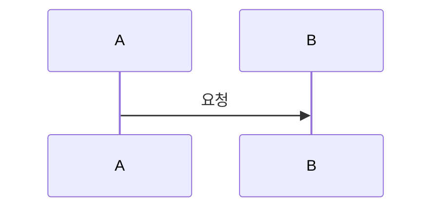

# Mealio Docusaurus 문서 작성 가이드

Mealio 공식 문서 사이트(`docs/`)에 Markdown 페이지를 추가·수정할 때 따르는 **작성 규칙·구조·워크플로**를 정의한다.

- **독자**: 기여자, 에이전트, 문서 유지보수 담당자
- **역할**: `agent/` 명세·지침(SSOT)을 바탕으로, 오픈소스 공개용 문서를 **일관된 형식**으로 작성·동기화하기 위한 가이드
- **범위**: `docs/docs/` 본문, `docs/sidebars.ts` 목차, 로컬·CI 빌드

---

## 1. agent 문서와 Docusaurus 문서의 관계

| 구분 | 경로 | 역할 |
| --- | --- | --- |
| **명세·지침 (SSOT)** | `agent/` | 구현·API·스키마·아키텍처의 단일 근거. 파일·경로·계약의 정본 |
| **공개 문서** | `docs/docs/` | 신규 기여자·운영자가 빠르게 탐색할 수 있는 **요약·흐름·링크 허브** |

Docusaurus 문서는 SSOT를 **대체하지 않는다**. 아래에 집중한다.

- 왜 존재하는지, 어디를 봐야 하는지, 무엇을 변경하면 되는지
- 크로스 패키지 흐름(인증·추천·챗봇·ETL 등)의 개요·시퀀스
- 코드 경로·`agent/` 명세·OpenAPI로의 교차 링크

구현 세부(필드 단위 DTO, 전체 파일 트리 등)는 SSOT에 두고, Docusaurus에서는 링크로 연결한다.

---

## 2. 작성 원칙

1. **문서 1개 = 주제 1개** — 개요·아키텍처·운영·모듈별 상세를 한 파일에 섞지 않는다.
2. **근거 없는 문장 금지** — 코드 경로, 내부 명세(SSOT), OpenAPI 참조 없이 단정하지 않는다.
3. **중복 최소화** — 상세는 해당 섹션 문서 또는 SSOT로 링크하고, 프로젝트 문서에는 패키지 간 흐름만 둔다.
4. **동기화 단위** — 코드·명세·Docusaurus를 **같은 PR/작업 단위**로 갱신한다.
5. **링크 검증** — CI에서 깨진 링크는 빌드 실패(`throw`)이므로, 상대 경로·doc ID를 정확히 쓴다.
6. **공개 문서에서는 `agent/` 경로 노출 금지** — Docusaurus 문서 본문에는 `agent/…`와 같은 내부 경로를 직접 쓰지 않고, “내부 문서”, “내부 명세”와 같이만 지칭한다.

크로스 패키지 주제(인증·캐시·추천·챗봇·ETL)는 **프로젝트** 문서에 전체 흐름, **client/producer/consumer** 문서에는 각 패키지 책임만 기술한다.

---

## 3. 사이트·파일 구조

| 항목 | 경로 |
| --- | --- |
| 문서 패키지 | `docs/` (`mealio-docs`) |
| 사이드바 SSOT | `docs/sidebars.ts` |
| Markdown 본문 | `docs/docs/{section}/{slug}.md` |
| 사이트 설정 | `docs/docusaurus.config.ts` |
| 스타일 | `docs/src/css/custom.css` |

### 섹션 디렉터리

| `docs/docs/` 폴더 | 사이드바 라벨 | 내용 성격 |
| --- | --- | --- |
| `(root)` | — | `intro.md` (랜딩, `slug: /`) |
| `project/` | 프로젝트 | 앱 바깥·전체 관점(온보딩, 도메인, E2E, 배포) |
| `client/` | client | Next.js 프론트엔드 |
| `producer/` | producer | NestJS API |
| `consumer/` | consumer | Kafka Consumer·배치 |
| `shared/` | shared | 공용 타입·DB·상수 |
| `other/` | 기타 | Observability, DS, 기여, 규약, FAQ |

새 페이지를 추가할 때는 **파일 생성 + `sidebars.ts` 등록**을 함께 수행한다. 사이드바만 바꾸고 파일이 없으면 CI가 실패한다.

### doc ID 규칙

- doc ID = `docs/docs/` 기준 경로에서 `.md` 제외 (예: `docs/docs/client/auth.md` → `client/auth`)
- 사이드바 `items`와 frontmatter `id`는 이 doc ID와 일치해야 한다.
- 같은 섹션 내 상대 링크: `./cache`, `../project/e2e-scenarios`
- Docusaurus 내부 링크는 확장자 `.md` 없이 작성한다.

---

## 4. 페이지 템플릿

기존 완성 문서를 참고 모델로 삼는다.

- 온보딩·절차형: `docs/docs/project/getting-started.md`
- 아키텍처·흐름형: `docs/docs/client/auth.md`

### frontmatter

```yaml
---
title: 문서 제목          # 필수. 사이드바·브라우저 탭에 표시
sidebar_position: 1      # 선택. 같은 카테고리 내 정렬 (intro만 slug: / 사용)
---
```

`intro.md`만 예외적으로 `slug: /`, `sidebar_position: 0`을 사용한다.

### 본문 골격 (권장 순서)

```markdown
# {title과 동일한 H1}

## 이 문서로 해결할 질문

- 독자가 이 페이지만 읽고 답할 수 있는 질문 2~3개

## {주제별 섹션}

(표·목록·코드·Mermaid로 구조화)

## 관련 문서

- [다른 Docusaurus 페이지](../other/section) — 상대 doc 링크

## SSOT

- 공개 문서에서는 **내부 단일 근거**만 표기한다(예: “내부 문서”, “내부 명세” 등).  
  실제 `agent/…` 경로는 이 가이드와 `agent` 문서를 참고해 에이전트/개발자가 매핑한다.
```

- **「이 문서로 해결할 질문」** — 모든 본문 문서에 넣는다. 검색·목차 진입 시 독자 의도를 명확히 한다.
- **「관련 문서」** — 같은 주제의 다른 패키지 문서·프로젝트 허브로 연결한다.
- **「SSOT」** — 이 페이지 내용의 정본이 되는 내부 단일 근거를 한 줄로만 설명한다.  
  (예: “내부 명세 문서”, “내부 데이터 스키마”, “내부 OpenAPI 명세” 등. **`agent/…` 경로는 쓰지 않는다.**)

`Last Updated`·`Owner` 필드는 사용하지 않는다. 변경 이력은 Git으로 추적한다.

---

## 5. 콘텐츠 작성 규칙

### 무엇을 쓸지 / 쓰지 말지

| 쓴다 | 쓰지 않는다 |
| --- | --- |
| 책임 경계, 데이터·요청 흐름, 운영 시 확인 포인트 | SSOT와 동일한 전체 API 목록 복사 |
| 핵심 파일·모듈 경로 표 | 명세에 없는 경로·엔드포인트 임의 추가 |
| Mermaid 시퀀스·아키텍처 다이어그램 | 장문의 구현 코드 붙여넣기 |
| 환경 변수·명령어 표(온보딩 문서) | 비밀값·실제 키 예시 |

### 표·코드·다이어그램

- **표**: 비교·책임 분담·파일 인덱스에 사용한다.
- **코드 블록**: 셸 명령, 짧은 설정 예시, 디렉터리 트리(`text`)에 한정한다.
- **Mermaid**: `docusaurus.config.ts`에서 활성화됨. 시퀀스·플로우는 fenced block으로 작성한다.



### 내부·외부 링크

| 대상 | 작성법 |
| --- | --- |
| Docusaurus 페이지 | `[제목](./slug)` 또는 `[제목](../project/overview)` |
| 내부 명세(SSOT) | “내부 문서”, “내부 명세”, “내부 스키마” 등으로만 지칭 (경로·파일명은 쓰지 않음) |
| GitHub blob 링크 | intro 등 랜딩에서만 필요 시 사용. 본문은 상대 경로 우선 |

CI(`CI=true`)에서는 `onBrokenLinks`·`onBrokenMarkdownLinks`가 `throw`이다. 로컬 개발 시에는 `warn`이므로, PR 전에 `pnpm run ci:build:docs`로 검증한다.

---

## 6. 섹션별 배치 가이드

새 내용을 **어느 파일에 넣을지** 판단할 때 사용한다. 파일이 없으면 아래 slug로 추가한다.

### 프로젝트 (`project/`)

| 주제 | doc ID | SSOT 참고(내부) |
| --- | --- | --- |
| 로컬 개발/온보딩 | `project/getting-started` | 내부 배포/환경 명세 |
| 프로젝트 개요 | `project/overview` | 내부 기획서(서비스 개요) |
| 도메인 개요 | `project/domain` | 내부 통합 데이터 스키마 |
| 시스템 아키텍처 | `project/architecture` | 내부 아키텍처 다이어그램 |
| E2E·화면 흐름 | `project/e2e-scenarios` | 내부 화면 플로우·프론트 아키텍처 명세 |
| 추천 시스템(전체) | `project/recommendation` | 내부 producer/consumer/shared 명세 |
| 레시피 수집(ETL) 개요 | `project/recipe-ingestion` | 내부 ETL 계획·가이드 |
| 모노레포 구조 | `project/monorepo` | 내부 백엔드/프론트 아키텍처 명세 |
| 배포/환경 | `project/deployment` | 내부 배포 전략·기획서 |
| 데이터/계약 인덱스 | `project/contracts-index` | 내부 스키마·OpenAPI 명세 |

### client (`client/`)

| 주제 | doc ID |
| --- | --- |
| 아키텍처·라우팅·렌더링 | `client/architecture` |
| 컴포넌트 구조 | `client/components` |
| 인증 | `client/auth` |
| 캐시 | `client/cache` |
| API·BFF | `client/api-bff` |
| 상태 관리 | `client/state` |
| 에러·Toast | `client/error-toast` |
| 챗봇 UI | `client/chatbot-ui` |
| 접근성·성능 | `client/accessibility-performance` |

### producer (`producer/`)

| 주제 | doc ID |
| --- | --- |
| 아키텍처 | `producer/architecture` |
| 인증/인가 | `producer/auth` |
| 캐시 | `producer/cache` |
| 도메인 API | `producer/domain-api` |
| 추천 API | `producer/recommendation-api` |
| API 공통·OpenAPI | `producer/api` |
| 이벤트 발행 | `producer/event-publishing` |
| 챗봇/SSE | `producer/chatbot-sse` |
| 운영 | `producer/operations` |

### consumer (`consumer/`)

| 주제 | doc ID |
| --- | --- |
| 아키텍처 | `consumer/architecture` |
| Kafka 신뢰성 | `consumer/kafka-reliability` |
| 캐시 | `consumer/cache` |
| 캐시 무효화 | `consumer/cache-invalidation` |
| 챗봇 처리 | `consumer/chatbot` |
| 추천 파이프라인 | `consumer/recommendation-pipeline` |
| 이벤트/분석 | `consumer/analytics-pipeline` |
| 레시피 수집 상세 | `consumer/recipe-ingestion` |
| 배치/스케줄 | `consumer/batch-jobs` |
| 운영/복구 | `consumer/operations` |

### shared (`shared/`)

| 주제 | doc ID |
| --- | --- |
| 패키지 개요 | `shared/overview` |
| 데이터 모델 | `shared/data-models` |
| Redis 키 계약 | `shared/redis-cache-contract` |
| 공유 계약(Kafka·타입) | `shared/contracts` |

### 기타 (`other/`)

| 주제 | doc ID |
| --- | --- |
| Observability | `other/observability` |
| Design System | `other/design-system` |
| 기여 가이드 | `other/contributing` |
| 개발 규약 | `other/development-conventions` |
| 용어집/FAQ | `other/glossary-faq` |

---

## 7. 새 문서 추가 절차

1. **주제·doc ID 결정** — 위 §6 표에서 기존 slug를 쓰거나, 새 slug를 정하고 `sidebars.ts`에 반영할지 검토한다.
2. **SSOT 확인** — `agent/` 명세·지침을 읽고 요약 범위를 정한다.
3. **파일 생성** — `docs/docs/{section}/{slug}.md`에 §4 템플릿으로 작성한다.
4. **사이드바 등록** — `docs/sidebars.ts` 해당 카테고리 `items`에 doc ID 추가.
5. **교차 링크** — 관련 페이지의 「관련 문서」·본문 링크를 양방향으로 보강한다.
6. **빌드 검증**:

   ```bash
   pnpm install
   pnpm start:docs          # 로컬 미리보기
   pnpm run ci:build:docs   # CI와 동일 (baseUrl: /mealio/)
   ```

7. **코드 변경과 함께** — 구현 PR이면 `agent/` 명세·OpenAPI도 같은 단위로 갱신한다 (`other/contributing` 워크플로 참고).

### 스텁(미작성) 페이지

이미 사이드바에만 있고 본문이 비어 있는 페이지가 있으면, 최소한 다음만 채운다.

- 「이 문서로 해결할 질문」
- SSOT 링크 목록
- 관련 문서 링크

---

## 8. 코드·명세 변경 시 문서 동기화

```text
1. agent 명세·OpenAPI에서 계약 변경 확인
2. 코드 구현
3. Docusaurus 해당 doc ID 본문·관련 문서 링크 갱신
4. pnpm run ci (또는 ci:build:docs)
5. PR — 리뷰어가 SSOT·docs 일치 여부 확인
```

| 변경 유형 | 갱신 대상 예시 |
| --- | --- |
| 새 API 엔드포인트 | `producer/domain-api`, `producer/api`, `project/contracts-index` |
| OAuth·인증 | `client/auth`, `producer/auth`, `project/e2e-scenarios` |
| 캐시 키·TTL | 패키지별 cache 문서, `shared/redis-cache-contract` |
| Kafka 토픽·이벤트 | `producer/event-publishing`, `consumer/*`, `shared/contracts`, `other/observability` |
| 프론트 라우트 | `client/architecture`, `project/e2e-scenarios` |

에이전트 작업 시 `.cursor/rules/agent-docs.mdc`의 **문서 정합성** 절차를 함께 따른다.

---

## 9. 로컬 실행·CI·배포

### 명령어

```bash
pnpm install
pnpm start:docs          # 개발 서버 (baseUrl: /)
pnpm build:docs          # 로컬 정적 빌드 (baseUrl: /)
pnpm run ci:build:docs   # CI·GitHub Pages와 동일 (baseUrl: /mealio/)
```

### CI·배포

| 워크플로 | 트리거 | 역할 |
| --- | --- | --- |
| `.github/workflows/ci.yml` (`Docs` job) | PR·`main` push | typecheck + `ci:build:docs` |
| `.github/workflows/docs.yml` | `docs/**` 등 변경 시 `main` push | GitHub Pages 배포 |

- 배포 URL: `https://tkddnr1022.github.io/mealio`
- `GITHUB_PAGES=true`일 때 `baseUrl`은 `/mealio/`
- 로케일: `ko` (`docusaurus.config.ts` `i18n`)

---

## 10. agent 폴더 참조 순서 (작성 시)

주제별로 SSOT를 읽을 때 권장 순서. 상세 목록은 `.cursor/rules/agent-docs.mdc`를 따른다.

| 작업 | 참조 순서 |
| --- | --- |
| 백엔드 API/모듈/DB | `backend_architecture_spec.md` → `spec_driven_development_guidelines.md` → `schema.md` → OpenAPI |
| OAuth/인증 | `oauth_implementation_guidelines.md` → producer spec §1.3 → OpenAPI |
| 프론트엔드 페이지/라우팅 | `frontend_architecture_spec.md` → `screen_flowchart.mermaid` → OpenAPI frontend |
| 관측성·KPI | `observability/validation.md` → `event_dictionary.md` → `product_kpi_contract.md` |
| 디자인·DS | `design_to_code_guidelines.md` → `design_tokens.json` → `frontend_development_guidelines.md` |

---

## 11. 체크리스트 (PR 전)

- [ ] doc ID·파일 경로·`sidebars.ts` 일치
- [ ] 「이 문서로 해결할 질문」·「관련 문서」·「SSOT」 포함
- [ ] 코드·명세 경로가 실제 저장소와 일치
- [ ] 크로스 패키지 주제는 프로젝트 문서와 패키지 문서 역할 분리
- [ ] `pnpm run ci:build:docs` 통과 (깨진 링크 없음)
- [ ] 코드 변경 PR이면 `agent/` 명세·OpenAPI 동기화 완료
