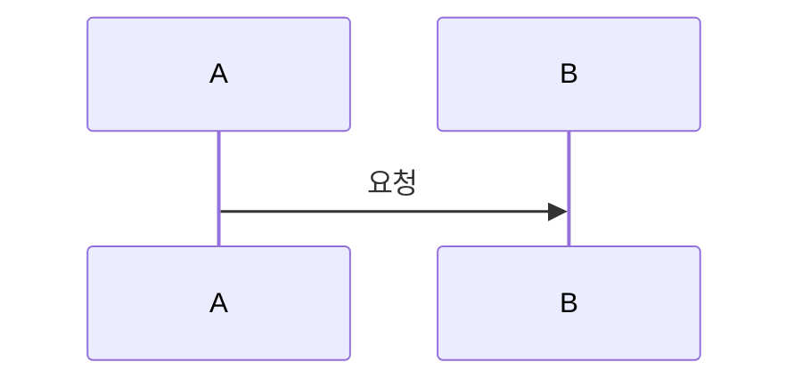

# Mealio Docusaurus 문서 작성 가이드

Mealio 공식 문서 사이트(`docs/`)에 Markdown 페이지를 추가·수정할 때 따르는 **작성 규칙·구조·워크플로**를 정의한다.

- **독자**: 기여자, 에이전트, 문서 유지보수 담당자
- **역할**: `agent/` 명세·지침(SSOT)을 바탕으로, 오픈소스 공개용 문서를 **일관된 형식**으로 작성·동기화하기 위한 가이드
- **범위**: `docs/docs/` 본문, `docs/sidebars.ts` 목차, 로컬·CI 빌드

---

## 1. agent 문서와 Docusaurus 문서의 관계

| 구분 | 경로 | 역할 |
| --- | --- | --- |
| **명세·지침 (SSOT)** | `agent/` | 구현·API·스키마·아키텍처의 단일 근거. 파일·경로·계약의 정본 |
| **공개 문서** | `docs/docs/` | 신규 기여자·운영자가 빠르게 탐색할 수 있는 **요약·흐름·링크 허브** |

Docusaurus 문서는 SSOT를 **대체하지 않는다**. 아래에 집중한다.

- 왜 존재하는지, 어디를 봐야 하는지, 무엇을 변경하면 되는지
- 크로스 패키지 흐름(인증·추천·챗봇·ETL 등)의 개요·시퀀스
- 코드 경로·내부 명세·OpenAPI로의 교차 링크

구현 세부(필드 단위 DTO, 전체 파일 트리 등)는 SSOT에 두고, Docusaurus에서는 링크로 연결한다.

---

## 2. 작성 원칙

1. **문서 1개 = 주제 1개** — 개요·아키텍처·운영·모듈별 상세를 한 파일에 섞지 않는다.
2. **근거 없는 문장 금지** — 코드 경로, 내부 명세(SSOT), OpenAPI 참조 없이 단정하지 않는다.
3. **중복 최소화** — 상세는 해당 섹션 문서 또는 SSOT로 링크하고, 프로젝트 문서에는 패키지 간 흐름만 둔다.
4. **동기화 단위** — 코드·명세·Docusaurus를 **같은 PR/작업 단위**로 갱신한다.
5. **링크 검증** — CI에서 깨진 링크는 빌드 실패(`throw`)이므로, 상대 경로·doc ID를 정확히 쓴다.
6. **공개 문서 내부 경로·참조 표기** — [§5.4 내부 경로·참조 표기 금지](#54-내부-경로참조-표기-금지)를 따른다.
7. **본문은 문장, 표 셀은 라벨** — 본문·목록은 완전한 문장으로, 표 셀은 짧은 키워드·인덱스로 쓴다. [§5 본문 문체와 표 셀](#본문-문체와-표-셀) 참고.

크로스 패키지 주제(인증·캐시·추천·챗봇·ETL)는 **프로젝트** 문서에 전체 흐름, **client/producer/consumer** 문서에는 각 패키지 책임만 기술한다.

---

## 3. 사이트·파일 구조

| 항목 | 경로 |
| --- | --- |
| 문서 패키지 | `docs/` (`mealio-docs`) |
| 사이드바 SSOT | `docs/sidebars.ts` |
| Markdown 본문 | `docs/docs/{section}/{slug}.md` |
| 사이트 설정 | `docs/docusaurus.config.ts` |
| 스타일 | `docs/src/css/custom.css` |

### 섹션 디렉터리

| `docs/docs/` 폴더 | 사이드바 라벨 | 내용 성격 |
| --- | --- | --- |
| `(root)` | — | **사용하지 않음** — `intro.md` 등 루트 Markdown 파일을 두지 않는다 |
| `project/` | 프로젝트 | 앱 바깥·전체 관점(온보딩, 도메인, E2E, 배포) |
| `client/` | client | Next.js 프론트엔드 |
| `producer/` | producer | NestJS API |
| `consumer/` | consumer | Kafka Consumer·배치 |
| `shared/` | shared | 공용 타입·DB·상수 |
| `other/` | 기타 | Observability, DS, 기여, 규약, FAQ |

**루트 디렉터리 규칙**

- `docs/docs/` 바로 아래에 Markdown 파일을 두지 않는다. (`intro.md` 포함)
- 사이트 진입(랜딩)은 `sidebars.ts` **첫 번째 doc ID**(`project/overview`)로 한다.
- 새 페이지는 반드시 `{section}/` 하위에 생성한다.

새 페이지를 추가할 때는 **파일 생성 + `sidebars.ts` 등록**을 함께 수행한다. 사이드바만 바꾸고 파일이 없으면 CI가 실패한다.

### doc ID 규칙

- doc ID = `docs/docs/` 기준 경로에서 `.md` 제외 (예: `docs/docs/client/auth.md` → `client/auth`)
- 사이드바 `items`의 doc ID와 파일 경로가 일치해야 한다.
- 같은 섹션 내 상대 링크: `./cache`, `../project/e2e-scenarios`
- Docusaurus 내부 링크는 확장자 `.md` 없이 작성한다.

---

## 4. 페이지 템플릿

기존 완성 문서를 참고 모델로 삼는다.

- 온보딩·절차형: `docs/docs/project/getting-started.md`
- 아키텍처·흐름형: `docs/docs/client/auth.md`

### frontmatter

**기본적으로 사용하지 않는다.** 제목·정렬은 아래 규칙으로 관리한다.

| 항목 | 규칙 |
| --- | --- |
| 제목 | 본문 첫 줄 `# H1` — 사이드바·브라우저 탭 제목으로 사용 |
| 사이드바 순서 | `docs/sidebars.ts` 해당 카테고리 `items` 배열 순서 |
| 사이트 랜딩 | `sidebars.ts` 최상단 doc ID (`project/overview`) |

**유일한 예외** — Docusaurus 3.x에서 루트 URL(`/`)을 지정하려면 `project/overview.md`에 `slug: /`만 허용한다. `title`, `sidebar_position`, `description`, `tags` 등 그 외 frontmatter 필드는 쓰지 않는다.

```yaml
---
slug: /
---
```

변경 이력은 Git으로 추적한다.

### 본문 골격 (권장 순서)

```markdown
# {문서 제목}

## 이 문서로 해결할 질문

- 독자가 이 페이지만 읽고 답할 수 있는 질문 2~3개

## {주제별 섹션}

(표·목록·코드·Mermaid로 구조화)

## 관련 문서

- [다른 Docusaurus 페이지](./slug) — 같은 섹션은 `./`, 다른 섹션은 `../section/slug`
- [크로스 패키지 흐름](../project/overview) — 프로젝트·다른 패키지 허브
```

- **「이 문서로 해결할 질문」** — 모든 본문 문서에 넣는다. 검색·목차 진입 시 독자 의도를 명확히 한다.
  - **문체**: 목록 문장은 **~요** 체로 통일한다 (`…무엇인가요?`, `…하나요?`, `…인가요?`). `~하는가?`, `~은?` 같은 문어체·단문 종결은 쓰지 않는다.
  - 예: `NestJS 모듈 구조와 책임 경계는?` → `NestJS 모듈 구조와 책임 경계는 무엇인가요?` / `…어떻게 보장하는가?` → `…어떻게 보장하나요?`
- **「관련 문서」** — 같은 주제의 다른 패키지 문서·프로젝트 허브·내부 명세 대응 Docusaurus 페이지로 연결한다. SSOT(내부 명세) 안내는 별도 섹션을 두지 않고 여기서 교차 링크로 처리한다.

---

## 5. 콘텐츠 작성 규칙

### 무엇을 쓸지 / 쓰지 말지

| 쓴다 | 쓰지 않는다 |
| --- | --- |
| 책임 경계, 데이터·요청 흐름, 운영 시 확인 포인트 | SSOT와 동일한 전체 API 목록 복사 |
| 핵심 파일·모듈 경로 표 | 명세에 없는 경로·엔드포인트 임의 추가 |
| Mermaid 시퀀스·아키텍처 다이어그램 | 장문의 구현 코드 붙여넣기 |
| 환경 변수·명령어 표(온보딩 문서) | 비밀값·실제 키 예시 |

### 표·코드·다이어그램

- **표**: 비교·책임 분담·파일 인덱스에 사용한다.
- **코드 블록**: 셸 명령, 짧은 설정 예시, 디렉터리 트리(`text`)에 한정한다.
- **CLI 명령어**: 셸·`docker compose` 등 **한 줄로 작성**한다. 줄바꿈 연속(`\`)은 쓰지 않는다. 복사·붙여넣기 편의를 위해 공백으로 옵션을 이어 붙인다.
- **Mermaid**: `docusaurus.config.ts`에서 활성화됨. fenced block으로 작성한다.

#### Mermaid 다이어그램 유형

| 용도 | 권장 타입 | 예시 |
| --- | --- | --- |
| 컴포넌트 의존·처리 파이프라인 | `flowchart TD` / `flowchart LR` | Provider 트리, Kafka 핸들러 체인 |
| API·이벤트 시퀀스 | `sequenceDiagram` | OAuth 흐름, 요청-응답 타임라인 |
| 패키지·모듈 관계 | `flowchart LR` | 모노레포 패키지, 레이어 구조 |



#### 본문 문체

**본문**(일반 문단, 불릿·번호 목록, 체크리스트)은 **완전한 문장**으로 작성한다. `키: 값` 라벨, 마침표로 끊긴 명사구, `A · B · C` 키워드 나열처럼 주어·서술어 없이 단어만 이어 붙이지 않는다.

아래는 문체 규칙 적용 **제외** 항목이다.

- 제목(`#`, `##`), frontmatter, 코드 블록, Mermaid
- 엔드포인트 경로·환경 변수명·Kafka 토픽·Redis 키 예시 등 **기술 데이터 인덱스** 표(식별자·값 열은 단문 유지)
- 「이 문서로 해결할 질문」— [§4](#4-페이지-템플릿)의 **~요** 체 규칙을 따른다

### 코드 경로 표기 (`docs/docs/` 본문)

마크다운 **코드 블록·Mermaid fenced block 밖** 본문(표·목록·문단)에서 저장소 파일·디렉터리 경로를 쓸 때 아래를 따른다.

| 규칙 | 설명 |
| --- | --- |
| **백틱 필수** | 코드 블록이 아닌 본문에서는 경로를 반드시 `` ` `` 로 감싼다. |
| **깊이 4 이상 축약** | 경로 segment가 **4개 이상**이면 패키지 루트와 파일(또는 최종 디렉터리)명만 남기고 중간은 `...`로 축약한다. |
| **패키지 루트** | `client/src`, `server/producer`, `server/consumer`, `server/shared` — 문서 맥락상 패키지 내부 상대 경로(`modules/`, `lib/` 등)는 해당 패키지 기준으로 동일 규칙을 적용한다. |
| **코드 블록 예외** | ```text``` 디렉터리 트리·```bash``` 복사 명령 등 fenced block 안에서는 전체 경로를 그대로 쓸 수 있다. |

API URL·HTTP 경로(`/api/v1/...`)는 파일 경로가 아니므로 이 규칙 대상이 아니다.

### 5.3 부정문 사용 원칙

본문(문단·목록·표 설명)에서 부정문(`~않습니다`, `~없습니다`, `~아닙니다` 등)은 **꼭 필요한 경우에만** 쓴다.

**허용**: 아래 조건 중 하나를 충족해야 한다.

- 이 프로젝트에만 적용되는 **예외 사항**으로, 독자가 반드시 알아야 하는 설계적 사실인 경우
- 모든 문서를 통틀어 **유일하게 존재**하며 중복되지 않는 내용인 경우

**교정 대상**: 아래 중 하나라도 해당하면 완전 제거하거나 긍정문으로 대체한다.

- '예외 사항'이 아닌 **예방 사항**(`~하지 마세요`, `~쓰지 않습니다` 형태의 금지·경고)
- 독자가 몰라도 되는 불필요한 내용
- "Worst Practice를 피하도록 이렇게 구현했다"는 의미를 가지는 부정문
- 보편적인 개발 Best Practice를 설명하는 부정문(학습 뉘앙스)
- 다른 문장·표·다이어그램에서 **충분히 유추 가능**한 내용을 강조 또는 중복으로 쓴 경우

**교정 방법**: 부정문을 제거하거나, 동일한 의미를 담은 긍정문으로 대체한다. 긍정문 대체 시 의미가 희석되지 않도록 주어·서술어를 명확히 작성한다.

### 5.4 내부 경로·참조 표기 금지

공개 문서(`docs/docs/`) 본문에서는 아래를 **직접 노출하지 않는다.**

| 금지 | 대신 |
| --- | --- |
| `agent/…` 경로·파일명 | “내부 문서”, “내부 명세”, “내부 스키마”, “내부 OpenAPI 명세” 등으로만 지칭 |
| `§` 절 번호 (`§5.1`, `agent` 명세 절 번호 등) | Docusaurus doc·헤딩 앵커 링크 사용 |
| 내부 명세 파일명 (`backend_architecture_spec.md` 등) | 관련 Docusaurus 페이지 또는 “내부 명세”로 지칭 |

**섹션 링크 작성법**

- **같은 페이지** 섹션: `[섹션 제목](#헤딩-앵커)`
- **다른 페이지** 섹션: `[문서 제목 — 섹션 제목](../section/slug#헤딩-앵커)`
- 대응 섹션이 Docusaurus에 없으면 **문서 링크만** 쓰거나, 요약 섹션을 해당 doc에 추가한 뒤 링크한다.

### 내부·외부 링크

| 대상 | 작성법 |
| --- | --- |
| 같은 섹션 Docusaurus 페이지 | `[제목](./slug)` |
| 다른 섹션 Docusaurus 페이지 | `[제목](../project/overview)` |
| `project/overview` (`slug: /`) | 랜딩 URL이 `/`이므로 `./slug`는 깨짐 → `[제목](project/slug)` 또는 `[제목](../section/slug)` 사용 |
| Docusaurus 페이지 내 섹션 | `[제목](./slug#헤딩-앵커)` — Docusaurus가 생성한 헤딩 ID 사용 (미리보기에서 링크 아이콘으로 확인) |
| GitHub blob 링크 | 필요 시에만 사용. 본문은 상대 doc 링크 우선 |

CI(`CI=true`)에서는 `onBrokenLinks`·`onBrokenMarkdownLinks`가 `throw`이다. 로컬 개발 시에는 `warn`이므로, PR 전에 `pnpm run ci:build:docs`로 검증한다.

---

## 6. 섹션별 배치 가이드

새 내용을 **어느 파일에 넣을지** 판단할 때 사용한다. 아래 목록은 `docs/sidebars.ts`·`docs/docs/`와 동기화된 **현재 doc ID 전체**이다. 파일이 없으면 아래 slug로 추가한다.

### 프로젝트 (`project/`)

| 주제 | doc ID |
| --- | --- |
| 프로젝트 개요 (사이트 랜딩) | `project/overview` |
| 로컬 개발/온보딩 | `project/getting-started` |
| 모노레포 구조 | `project/monorepo` |
| 인프라 환경 변수 | `project/infrastructure-environment-variables` |
| 시스템 아키텍처 | `project/architecture` |
| 도메인 개요 | `project/domain` |
| 추천 시스템(전체) | `project/recommendation` |
| 레시피 수집(ETL) 개요 | `project/recipe-ingestion` |
| 배포/환경 | `project/deployment` |
| E2E·화면 흐름 | `project/e2e-scenarios` |

### client (`client/`)

| 주제 | doc ID |
| --- | --- |
| 아키텍처·라우팅·렌더링 | `client/architecture` |
| 환경 변수 | `client/environment-variables` |
| 컴포넌트 구조 | `client/components` |
| 인증 | `client/auth` |
| API·BFF | `client/api-bff` |
| 상태 관리 | `client/state` |
| 캐시 | `client/cache` |
| 에러·Toast | `client/error-toast` |
| 챗봇 UI | `client/chatbot-ui` |
| 접근성·성능 | `client/accessibility-performance` |

### producer (`producer/`)

| 주제 | doc ID |
| --- | --- |
| 아키텍처 | `producer/architecture` |
| 환경 변수 | `producer/environment-variables` |
| 인증/인가 | `producer/auth` |
| API 공통·OpenAPI | `producer/api` |
| 도메인 API | `producer/domain-api` |
| 추천 API | `producer/recommendation-api` |
| 캐시 | `producer/cache` |
| 이벤트 발행 | `producer/event-publishing` |
| 챗봇/SSE | `producer/chatbot-sse` |
| 운영 | `producer/operations` |

### consumer (`consumer/`)

| 주제 | doc ID |
| --- | --- |
| 아키텍처 | `consumer/architecture` |
| 환경 변수 | `consumer/environment-variables` |
| Kafka 신뢰성 | `consumer/kafka-reliability` |
| 캐시 | `consumer/cache` |
| 캐시 무효화 | `consumer/cache-invalidation` |
| 추천 파이프라인 | `consumer/recommendation-pipeline` |
| 레시피 수집 상세 | `consumer/recipe-ingestion` |
| 챗봇 처리 | `consumer/chatbot` |
| 이벤트/분석 | `consumer/analytics-pipeline` |
| 배치/스케줄 | `consumer/batch-jobs` |
| 운영/복구 | `consumer/operations` |

### shared (`shared/`)

| 주제 | doc ID |
| --- | --- |
| 패키지 개요 | `shared/overview` |
| 데이터 모델 | `shared/data-models` |
| 공유 계약(Kafka·타입) | `shared/contracts` |
| Redis 키 계약 | `shared/redis-cache-contract` |
| 환경 변수 | `shared/environment-variables` |

### 기타 (`other/`)

| 주제 | doc ID |
| --- | --- |
| 개발 규약 | `other/development-conventions` |
| 기여 가이드 | `other/contributing` |
| Design System | `other/design-system` |
| Observability | `other/observability` |
| 용어집/FAQ | `other/glossary-faq` |

신규 doc ID를 추가하면 **이 표와 `sidebars.ts`를 같은 PR에서** 갱신한다.

---

## 7. 새 문서 추가 절차

1. **주제·doc ID 결정** — 아래 「6. 섹션별 배치 가이드」 표에서 기존 slug를 쓰거나, 새 slug를 정하고 `sidebars.ts`·§6 표에 반영할지 검토한다.
2. **SSOT 확인** — `agent/` 명세·지침을 읽고 요약 범위를 정한다.
3. **파일 생성** — `docs/docs/{section}/{slug}.md`에 §4 페이지 템플릿으로 작성한다. `project/overview`를 제외하고 frontmatter 없이 `# H1`부터 시작한다.
4. **사이드바 등록** — `docs/sidebars.ts` 해당 카테고리 `items`에 doc ID 추가.
5. **교차 링크** — 관련 페이지의 「관련 문서」·본문 링크를 양방향으로 보강한다.
6. **빌드 검증**:

   ```bash
   pnpm install
   pnpm start:docs          # 로컬 미리보기
   pnpm run ci:build:docs   # CI와 동일 (baseUrl: /mealio/)
   ```

7. **코드 변경과 함께** — 구현 PR이면 `agent/` 명세·OpenAPI도 같은 단위로 갱신한다 (`other/contributing` 워크플로 참고).

### 스텁(미작성) 페이지

이미 사이드바에만 있고 본문이 비어 있는 페이지가 있으면, 최소한 다음만 채운다.

- 「이 문서로 해결할 질문」
- 「관련 문서」 링크 (크로스 패키지·내부 명세 대응 Docusaurus 페이지 포함)

### 스텁 → 완성 전환 기준

아래를 모두 만족하면 스텁이 아닌 완성 문서로 본다.

- 주제별 본문 섹션이 **2개 이상** 실질적 내용(표·흐름·경로 등)으로 채워져 있다.
- 코드 경로 표 또는 Mermaid 다이어그램이 **1개 이상** 포함되어 있다.
- 「이 문서로 해결할 질문」 항목이 본문에서 실제로 답변 가능하다.

---

## 8. 코드·명세 변경 시 문서 동기화

```text
1. agent 명세·OpenAPI에서 계약 변경 확인
2. 코드 구현
3. Docusaurus 해당 doc ID 본문·관련 문서 링크 갱신
4. pnpm run ci (또는 ci:build:docs)
5. PR — 리뷰어가 SSOT·docs 일치 여부 확인
```

| 변경 유형 | 갱신 대상 예시 |
| --- | --- |
| 새 API 엔드포인트 | `producer/domain-api`, `producer/api`, `project/architecture` |
| OAuth·인증 | `client/auth`, `producer/auth`, `project/e2e-scenarios` |
| 캐시 키·TTL | 패키지별 cache 문서, `shared/redis-cache-contract` |
| Kafka 토픽·이벤트 | `producer/event-publishing`, `consumer/*`, `shared/contracts`, `other/observability` |
| 프론트 라우트 | `client/architecture`, `project/e2e-scenarios` |
| 환경 변수 | `project/infrastructure-environment-variables`, 패키지별 `environment-variables` |

에이전트 작업 시 `.cursor/rules/agent-docs.mdc`의 **문서 정합성** 절차를 함께 따른다.

---

## 9. 로컬 실행·CI·배포

### 명령어

```bash
pnpm install
pnpm start:docs          # 개발 서버 (baseUrl: /)
pnpm build:docs          # 로컬 정적 빌드 (baseUrl: /)
pnpm run ci:build:docs   # CI·GitHub Pages와 동일 (baseUrl: /mealio/)
```

### CI·배포

| 워크플로 | 트리거 | 역할 |
| --- | --- | --- |
| `.github/workflows/ci.yml` (`Docs` job) | PR·`main` push | typecheck + `ci:build:docs` |
| `.github/workflows/docs.yml` | `docs/**` 등 변경 시 `main` push | GitHub Pages 배포 |

- 배포 URL: `https://tkddnr1022.github.io/mealio`
- `GITHUB_PAGES=true`일 때 `baseUrl`은 `/mealio/`
- 로케일: `ko` (`docusaurus.config.ts` `i18n`)

---

## 10. agent 폴더 참조 순서 (작성 시)

주제별 SSOT 참조 순서는 `.cursor/rules/agent-docs.mdc` — **작업별 권장 참조 순서** 절을 따른다.

---

## 11. 체크리스트 (PR 전)

- [ ] 부정문이 있으면 §5.3 허용 조건을 충족하는지 확인, 아니면 제거 또는 긍정문으로 대체
- [ ] doc ID·파일 경로·`sidebars.ts` 일치
- [ ] frontmatter 없이 `# H1`으로 시작 (`project/overview`만 `slug: /` 예외)
- [ ] 「이 문서로 해결할 질문」·「관련 문서」 포함
- [ ] 「이 문서로 해결할 질문」 목록이 ~요 체인지 확인
- [ ] 본문·목록·체크리스트가 완전한 문장인지 확인 ([본문 문체와 표 셀](#본문-문체와-표-셀))
- [ ] 표 셀은 짧은 라벨·키워드를 유지했는지 확인 (표 설명을 문장형으로 늘리지 않음)
- [ ] 코드·명세 경로가 실제 저장소와 일치
- [ ] 크로스 패키지 주제는 프로젝트 문서와 패키지 문서 역할 분리
- [ ] CLI·셸 명령어는 `\` 줄바꿈 없이 한 줄로 작성
- [ ] 코드 변경 PR이면 `agent/` 명세·OpenAPI 동기화 완료
- [ ] `§` 절 번호·`agent/` 경로 노출 없음 ([§5.4](#54-내부-경로참조-표기-금지) 준수)
- [ ] 본문 코드 경로: 백틱 적용, segment 4개 이상이면 `...` 축약 (코드 블록·API URL 제외)
- [ ] 신규 doc ID라면 §6 배치 가이드 표 갱신 여부 확인
- [ ] 같은 섹션 내부 링크가 `./slug` 형식인지 확인 (`../client/slug` 아님)
- [ ] Mermaid 다이어그램이 있다면 로컬 미리보기에서 렌더링 확인
