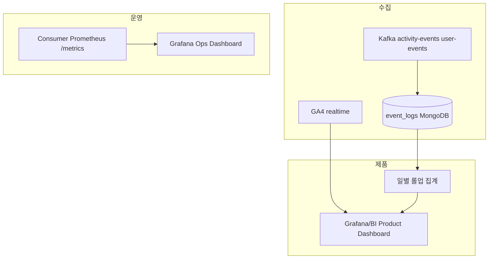

# 집계 파이프라인 (원본 → 롤업 → 대시보드)

EventLog TTL **90일** (`expireAfterSeconds: 7776000`). 일/주 롤업은 MongoDB 집계 또는 BI(Metabase·Grafana Mongo datasource)로 수행한다.

## 1. 파이프라인 개요



## 2. 수직 슬라이스 (우선 3 KPI)

### 슬라이스 A — `kpi_recipe_favorite_cvr`

| 단계 | 산출물 |
|------|--------|
| 원본 | `event_logs` `type` ∈ `recipe.view`, `recipe.favorites_add` |
| 롤업 | `kpi_daily_recipe_favorite_cvr` (date, views_users, favorites_users, cvr) |
| 대시보드 | Product — "Recipe favorite CVR (daily)" |

구현: `server/consumer/src/jobs/kpi-rollup/kpi-rollup.service.ts` — `rollupRecipeFavoriteCvr()`

### 슬라이스 B — `kpi_kafka_fail_rate` + `kpi_kafka_lag_p95`

| 단계 | 산출물 |
|------|--------|
| 원본 | `kafka_messages_*`, `kafka_consumer_lag` (Consumer `/metrics`) |
| 롤업 | Prometheus recording rules (선택) |
| 대시보드 | Ops — "Kafka health by topic" |

PromQL: `observability/grafana/provisioning/dashboards/json/mealio-ops.json`, 알림: `observability/grafana/provisioning/alerting/rules.yml`

### 슬라이스 C — `kpi_recommendation_e2e_latency`

| 단계 | 산출물 |
|------|--------|
| 원본 | `event_logs` `type='recipe.favorites_add'`, 필드 `occurredAt`, `processedAt` |
| 롤업 | 일별 p50/p95/p99 ms |
| 대시보드 | Product+Ops — "Recommendation apply latency" |

구현: `server/consumer/src/jobs/kpi-rollup/kpi-rollup.service.ts` — `rollupRecommendationLatency()`

## 3. 집계 잡 운영 (권장)

| 잡 ID | 주기 | 대상 | 저장 | 비고 |
|-------|------|------|------|------|
| `rollup_eventlog_daily` | 02:00 UTC | EventLog KPI A,C + search CTR | `kpi_rollups` 컬렉션 또는 BI DB | cron/ECS scheduled task |
| `scrape_consumer_metrics` | 15s | Prometheus | TSDB | 기존 운영 |
| `ga4_bigquery_export` | GA 기본 | `kpi_ga_recipe_funnel` | BigQuery (선택) | GA4 링크만으로도 1차 운영 가능 |

### 3.1 `kpi_rollups` 스키마 (제안)

```json
{
  "kpiId": "kpi_recipe_favorite_cvr",
  "date": "2026-05-22",
  "value": 0.12,
  "numerator": 120,
  "denominator": 1000,
  "computedAt": "2026-05-23T02:05:00Z"
}
```

- TTL: 400일(원본 90일보다 길게 보관해 YoY 비교).
- Mongoose 스키마: `server/shared/src/database/mongoose/schemas/kpi-rollup.schema.ts`
- 구현체: `server/consumer/src/jobs/kpi-rollup/` (NestJS standalone CLI)

### 3.2 배치 잡 실행

```bash
# 전일(UTC) 집계 (cron/ECS 에서 매일 UTC 02:00 호출)
pnpm --filter consumer run job:kpi-rollup

# 지정일 집계
pnpm --filter consumer run job:kpi-rollup 2026-05-22

# 최근 7일 백필
pnpm --filter consumer run job:kpi-rollup --backfill 7
```

- idempotent: `(kpiId, date)` unique 인덱스 기반 upsert. 재실행 시 동일 결과.
- 잡 실패 시 재시도: 동일 명령 재실행 또는 `--backfill N`으로 누락 구간 보충.

## 4. 대시보드 분리

| 대시보드 | UID | 패널 예 | 데이터 소스 |
|----------|-----|---------|-------------|
| **Mealio Overview** | `mealio-overview` | HTTP rate, p95, throughput, lag | Prometheus |
| **Mealio Ops — Kafka Health** | `mealio-ops` | fail rate, lag, processing p95, DLQ | Prometheus |
| **Mealio Product — KPI Rollups** | `mealio-product` | CVR, CTR, latency p95, rollup table | MongoDB (`kpi_rollups`) |
| **Mealio — UX** | — | LCP/INP/CLS | Vercel Analytics, Sentry |

Grafana provisioning 경로: `observability/grafana/provisioning/dashboards/json/`

### 4.1 Grafana 데이터소스

| 이름 | UID | 타입 | 프로비저닝 파일 |
|------|-----|------|-----------------|
| Prometheus | `prometheus` | prometheus | `datasources/prometheus.yml` |
| MongoDB | `mongodb` | grafana-mongodb-datasource | `datasources/mongodb.yml` |

MongoDB 플러그인은 `docker-compose.yml`의 `GF_INSTALL_PLUGINS` 환경변수로 자동 설치.

알림 임계치·장애 대응은 [product_kpi_runbook.md](./product_kpi_runbook.md)를 참조한다.

## 5. BI / Mongo 직접 조회

- 인덱스: `(type, occurredAt)`, `(actor.userId, occurredAt)` — [schema.md](../common/schema.md).
- 대용량 시 `occurredAt` 범위를 **항상** `$match` 첫 단계에 둔다.

## 6. 관련 문서

- [product_kpi_contract.md](./product_kpi_contract.md)
- [product_kpi_runbook.md](./product_kpi_runbook.md)
- [event_dictionary.md](./event_dictionary.md)
