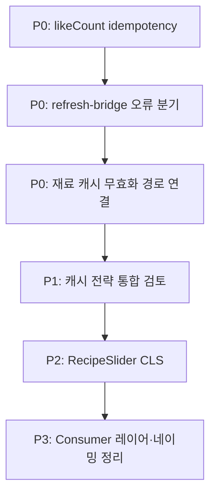

# TODOS

## P0 — 즉시 대응 권장 (보안·데이터 정합성)

| # | 위치 | 내용 | 이유 |

|---|------|------|------|

| 1 | `server/consumer/src/consumers/user-events/services/recipe-stats-updater.service.ts:4` | **`likeCount` 중복 증가 방지 로직 검토** | Kafka 재처리·중복 이벤트 시 통계 왜곡 가능 |

| 2 | `client/src/app/api/auth/refresh-bridge/route.ts:49` | **네트워크 오류를 `sessionExpired`로 처리하지 않도록 분기** | fetch 실패 시 로그인 리다이렉트 + “세션 만료” UX로 오인됨 |

| 3 | `server/consumer/src/consumers/cache-invalidation/cache-invalidation-request.service.ts:91` | **재료 마스터 변경 시 캐시 무효화 호출 연결** (admin/배치 경로) | 인프라는 준비됐으나 런타임 발행 경로 미연결 → **stale cache** (`agent/backend/spec/backend_architecture_spec_producer.md:131`에도 명시) |

---

## P1 — 높음 (인증·캐시·핵심 UX)

| # | 위치 | 내용 | 이유 |

|---|------|------|------|

| 4 | `server/producer/src/modules/inventory/inventory.service.ts:271` | **인벤토리 캐시 전략 검토** | Cache-Aside + Mongo 폴백 경로, 트래픽 증가 시 병목 |

| 5 | `server/producer/src/modules/recipes/recipes.service.ts:260` | **검색 API 조인 비용·Write Behind 캐시 정책 검토** | 짧은 TTL Cache-Aside로 조회 부담 큼 (주석에도 명시) |

| 6 | `server/producer/src/modules/users/users.service.ts:79` | **유저 조회 캐시 적용 검토** | 반복 조회 최적화 여지 |

| 7 | `server/shared/src/constants/cache-keys.ts:27` | **캐시 키 재사용 전략 수립** | 키 체계·무효화 범위 SSOT 부재 |

---

## P2 — 중간 (성능·확장성·기능 갭)

| # | 위치 | 내용 | 이유 |

|---|------|------|------|

| 11 | `client/src/components/recipe/lists/RecipeSlider/RecipeSlider.tsx:42` | **`recipes` optional + fallback** | 데이터 없을 때 컴포넌트 재사용성 |

| 12 | `client/src/components/recipe/lists/RecipeSlider/RecipeSlider.tsx:74` | **CLS 최적화용 SSR placeholder** | Core Web Vitals(특히 CLS) 개선 |

| 13 | `client/src/lib/queries/query-client.provider.tsx:39` | **401 처리 시 매번 `meta.currentUrl` 전달 문제** | 보일러플레이트·누락 시 401 리다이렉트 실패 |

| 14 | `server/consumer/src/jobs/recipe-ingestion-submit/prompts/recipe-ingestion.system-prompt.ts:7` | **servings inference 정확도 향상** | LLM 수집 데이터 품질 |

---

## P3 — 낮음 (아키텍처 검토·리팩터링·미래 작업)

| # | 위치 | 내용 | 이유 |

|---|------|------|------|

| 15 | `server/producer/src/modules/inventory/inventory.service.ts:36` | **`InventoryDocumentShape` SSOT 검토** | 타입 중복·스키마 drift 방지 |

| 16 | `server/producer/src/infrastructure/cache/cache.decorator.ts:21` | **`@Cacheable` 인터셉터 미구현** (현재 미사용) | AOP 캐싱은 “향후 확장” 수준 |

| 17 | `server/consumer/src/integrations/kafka/kafka-producer.service.ts:9` | **Consumer에서 Produce+Consume 동시 수행 적절성 검토** | 아키텍처 경계 재검토 |

| 18 | `server/consumer/src/consumers/cache-invalidation/cache-invalidation.processor.ts:81` | **processor → service 레이어로 강등** | 레이어 책임 분리 |

| 19 | `server/consumer/src/consumers/cache-invalidation/redis-invalidation.handler.ts:13` | **handler 레이어 생성·배치 위치 검토** | #18과 동일 맥락 |

| 20 | `server/consumer/src/consumers/user-events/handlers/UpdateInventoryHandler.ts:26` | **`RecipeStatsUpdaterService` 배치 위치(레이어 깊이) 검토** | DI·책임 배치 정리 |

| 21 | `server/consumer/src/persistence/repositories/mongodb/recipe-ingestion-job.repository.ts:358` | **`updateMany` 적용 방안 검토** | DB 쓰기 효율 (당장 기능 장애는 아님) |

| 22 | `client/src/app/(main)/inventory/InventoryPageShell.tsx:53` | **컴포넌트명 `Layout`으로 변경** | 네이밍 컨벤션 정리 |

---

## 영역별 요약

| 영역 | 건수 | 핵심 이슈 |

|------|------|-----------|

| **인증/OAuth** | 1 | refresh-bridge 오류 분기 |

| **캐시** | 7 | 무효화 경로 미연결, 전략·키 SSOT, `@Cacheable` 미구현 |

| **프론트 성능/UX** | 3 | CLS, RecipeSlider, query meta |

| **Consumer/아키텍처** | 5 | Kafka 역할, 레이어 분리, updateMany |

| **데이터 품질** | 2 | likeCount 중복, servings inference |

| **기타** | 1 | 네이밍 |

---

## 권장 작업 순서 (로드맵)

1. **1스프린트**: P0 3건 (보안·데이터·캐시 stale)

2. **2스프린트**: P1 캐시 (#4-7)

3. **3스프린트**: P2 성능 (#11-14)

4. **백로그**: P3 아키텍처·리팩터링 (#15-22)

---
