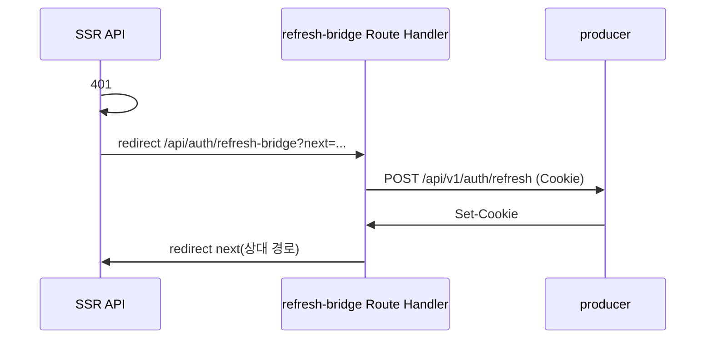

# API 클라이언트/BFF

## 이 문서로 해결할 질문

- 프론트에서 백엔드 API를 어떻게 호출하나요?
- SSR·CSR에서 쿠키·헤더는 어떻게 전달하나요?
- BFF Route Handler는 언제 사용하나요?

## 레이어 구조

```text
client/src/lib/api/
├── http-client.ts          # 저수준 fetch 래퍼
├── error.ts / error.parser.ts
├── domains/                # 도메인별 API 함수
│   ├── recipes.api.ts
│   ├── ingredients.api.ts
│   ├── inventory.api.ts
│   ├── chatbot.api.ts
│   └── users.api.ts
└── server/
    ├── server-fetch-wrapper.ts
    └── isr-fetch.server.ts
```

## http-client (CSR·공통)

| 기능 | 설명 |
| --- | --- |
| `credentials: 'include'` | HttpOnly 쿠키 자동 전송 |
| `X-Correlation-Id` | 요청 추적 헤더 주입 |
| 401 처리 | refresh 1회(인스턴스 락) → 원 요청 재시도 |
| SSR `next`/`cache` | `RequestOptions`로 Data Cache 전달 |

```typescript
// 사용 예
import { httpClient } from '@/lib/api/http-client';
import { getRecipeDetail } from '@/lib/api/domains/recipes.api';

const recipe = await getRecipeDetail(recipeId, { signal });
```

모든 도메인 API는 마지막 인자로 `fetchOptions?: RequestOptions`를 받습니다.

## SSR 헤더 전파

- `withForwardedHeaders()`는 들어온 `Cookie`, `Accept-Language`, Correlation-Id를 전달합니다.
- `serverFetchWrapper({ fetch, currentUrl })`는 401 시 refresh-bridge로 리다이렉트합니다.

## BFF Route Handler

BFF Route Handler는 Next.js `client/src/.../api/`에 두며, 인프라·인증 브리지 전용으로 사용합니다.

| Path | Method | 역할 |
| --- | --- | --- |
| `/api/auth/refresh-bridge` | GET | SSR refresh: Cookie → Producer refresh → Set-Cookie → `next` 복귀 |
| `/api/revalidate` | POST | 온디맨드 ISR: `{ secret, path }` → `revalidatePath` |

### refresh-bridge 흐름



## 에러 처리

- `ApiError`는 HTTP 상태·바디를 정규화합니다.
- `getUserMessage()`는 사용자 노출 메시지를 반환합니다.
- Toast 연동은 [에러 처리/Toast](./error-toast) 문서를 참고하세요.

## 관련 문서

- [인증](./auth)
- [캐시](./cache)
- [도메인 API 가이드](../producer/domain-api)
