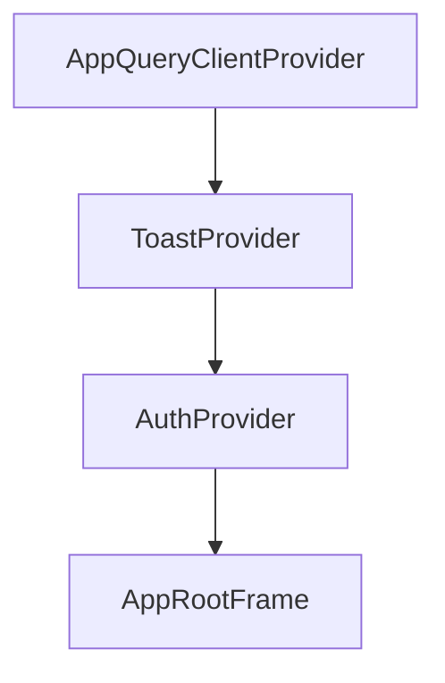

# 아키텍처

## 이 문서로 해결할 질문

- Next.js App Router 구조와 렌더링 전략은 무엇인가요?
- `client/src` 주요 디렉터리 역할은 무엇인가요?
- 전역 Provider·API 레이어는 어떻게 구성되나요?

## 앱 디렉터리

루트는 `client/src/app/`이며 Next.js App Router를 사용합니다.

| 그룹 | 역할 | 예시 URL |
| --- | --- | --- |
| (루트) | 진입 리다이렉트, 전역 에러 | `/` → `/recipe` |
| (auth) | 로그인·OAuth | `/login`, `/oauth/callback` |
| (main) | 앱 본체 (하단 탭) | `/recipe`, `/chatbot`, `/inventory`, `/mypage` |

`(main)` 전용 `layout.tsx`는 없으며, 탭과 Navbar는 페이지·컴포넌트에서 조합합니다.

## 렌더링 전략

| 전략 | 페이지 |
| --- | --- |
| **ISR** (300초) | `/recipe/filter`, `/ingredient/filter` |
| **ISR + CSR** | `/recipe` (공개 섹션 ISR + 개인화 추천 CSR) |
| **온디맨드 ISR** | `/recipe/[id]` |
| **SSR** | `/`, `/recipe/search` |
| **CSR** | 로그인·OAuth, 챗봇, 보관함, 마이페이지 |

렌더링·캐시 정책은 `client/src/.../cache.policy.ts`에 정의되어 있습니다.

## 디렉터리 구조

```text
client/src/
├── app/              # 라우트·Route Handler
├── components/       # UI (도메인별 하위 폴더)
├── lib/
│   ├── api/          # http-client, domains/, server/
│   ├── auth/         # 세션, OAuth, Proxy 연동
│   ├── queries/      # React Query 훅
│   ├── policy/       # cache.policy.ts
│   └── toast/
└── proxy.ts          # 보호 라우트 (refreshToken 검사)
```

컴포넌트는 [컴포넌트 구조](./components)와 `client/src/components/` 기준으로 배치합니다.

## 전역 Provider 트리

전역 Provider 트리는 `client/src/.../layout.tsx`에 다음과 같이 구성됩니다.



순서 변경 시 Query 전역 오류 Toast가 동작하지 않을 수 있습니다.

## API 레이어

| 레이어 | 경로 | 역할 |
| --- | --- | --- |
| HTTP 클라이언트 | `lib/api/http-client.ts` | fetch, 401 refresh, Correlation-Id |
| 도메인 API | `lib/.../*.api.ts` | recipes, ingredients, chatbot 등 |
| SSR 래퍼 | `lib/.../server-fetch-wrapper.ts` | 쿠키 전파, 401 → refresh-bridge |
| BFF | `app/.../refresh-bridge`, `app/.../revalidate` | 인프라 Route Handler |

## CSR 페이지 컨벤션

`page.tsx`(서버)와 `*ClientPage.tsx`(클라이언트)로 분리하며, 메타·Suspense·데이터 전달은 `page.tsx`가, `'use client'` 로직은 ClientPage가 담당합니다.

## 보호·인증

- **Proxy**는 `/chatbot`, `/inventory`, `/mypage/*` 경로에서 쿠키 존재 여부를 검사합니다.
- **AuthProvider**는 세션 상태와 `refresh()`를 관리합니다.
- 상세 내용은 [인증](./auth) 문서를 참고하세요.

## 관련 문서

- [캐시](./cache)
- [API 클라이언트/BFF](./api-bff)
- [상태 관리](./state)
- [E2E 시나리오](../project/e2e-scenarios)
