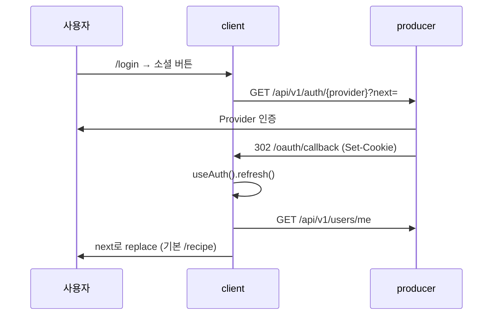

# 인증

## 이 문서로 해결할 질문

- 프론트엔드에서 OAuth 로그인·세션·보호 라우트는 어떻게 동작하나요?
- Proxy·SSR·CSR 각각의 인증 책임은 무엇인가요?
- 401 발생 시 refresh는 어디서 처리되나요?

## 설계 원칙: Proxy–SSR–CSR 분리

OAuth는 **백엔드 주도**입니다. 프론트는 Authorization Code·토큰 교환을 하지 않고, 아래 3계층으로 역할을 나눕니다.

| 계층 | 책임 | 구현 |
| --- | --- | --- |
| **Proxy** | `refreshToken` 쿠키 **존재 여부**만 검사 | `client/src/proxy.ts` |
| **SSR** | API 401 시 refresh-bridge 리다이렉트 | `serverFetchWrapper`, `/api/auth/refresh-bridge` |
| **CSR** | API 401 시 `POST /auth/refresh` 1회 재시도 | `client/src/lib/api/http-client.ts` |

토큰 유효성·회전은 **백엔드 API 호출 단계**에서 검증합니다.

## OAuth 흐름 (프론트 관점)



- 진입 URL: `buildOAuthEntryUrl(provider, next)` — `client/src/lib/auth/providers.ts`
- `next` 안전 검증은 **백엔드** (`resolveSafeNextPath`)
- 실패: `/oauth/error` — `OAuthErrorClientPage.tsx`

## 보호 라우트

### Proxy matcher

```
/chatbot/:path*
/inventory/:path*
/mypage/:path*    (루트 /mypage 제외)
```

`refreshToken` 쿠키 없으면 `/login?next={원래경로}`로 리다이렉트.

### 클라이언트 가드

| 수단 | 용도 |
| --- | --- |
| `ProtectedRoute` | 페이지 단위 래퍼 |
| `useProtectedAction` | 버튼·액션 단위 가드 |

경로 상수 정의: `client/src/lib/auth/routes.ts` (`isProtectedPath`, `LOGIN_PATH` 등)

## 세션 조회

| 환경 | 함수 | 동작 |
| --- | --- | --- |
| SSR | `getServerSession()` | `GET /users/me`, 401 → `null` |
| CSR | `useCurrentUser()` | React Query + `userQueries.me` |
| 공통 | `AuthProvider` | `refresh()`로 세션 재조회 |

쿠키: HttpOnly `accessToken` / `refreshToken` — `credentials: 'include'`(CSR), `Cookie` 헤더 전달(SSR)

## 401 Refresh 처리

### CSR (`http-client`)

API **401** 시 인스턴스 락으로 `POST /api/v1/auth/refresh` 1회 → 원 요청 재시도.

### SSR (`serverFetchWrapper`)

`ApiError` 401 → `buildSsrRefreshBridgeUrl(currentUrl)`로 redirect.

### Refresh Bridge (`/api/auth/refresh-bridge`)

Route Handler가 들어온 `Cookie`로 Producer refresh 호출 → `Set-Cookie` 전달 → `next`로 복귀. 실패 시 로그인 URL(`sessionExpired=true`).

## 주요 파일

| 경로 | 역할 |
| --- | --- |
| `client/src/lib/auth/auth-context.tsx` | `AuthProvider`, `useAuth()` |
| `client/src/lib/auth/session.server.ts` | 서버 세션 유틸 |
| `client/src/lib/auth/session.client.ts` | 클라이언트 세션 유틸 |
| `client/src/app/api/auth/refresh-bridge/route.ts` | SSR refresh 브리지 |
| `client/src/proxy.ts` | Next.js Proxy |

## 관련 문서

- [E2E 시나리오/화면 흐름](../project/e2e-scenarios)
- [인증/인가](../producer/auth)
- [API 클라이언트/BFF](./api-bff)

## 참고 코드·계약

- [클라이언트 아키텍처](../client/architecture) · client/src/app/ (§3.1, §5.2)
- [Producer 인증](../producer/auth), [Client 인증](../client/auth)
- [BFF Route Handler](../client/api-bff) · client/src/app/api/
