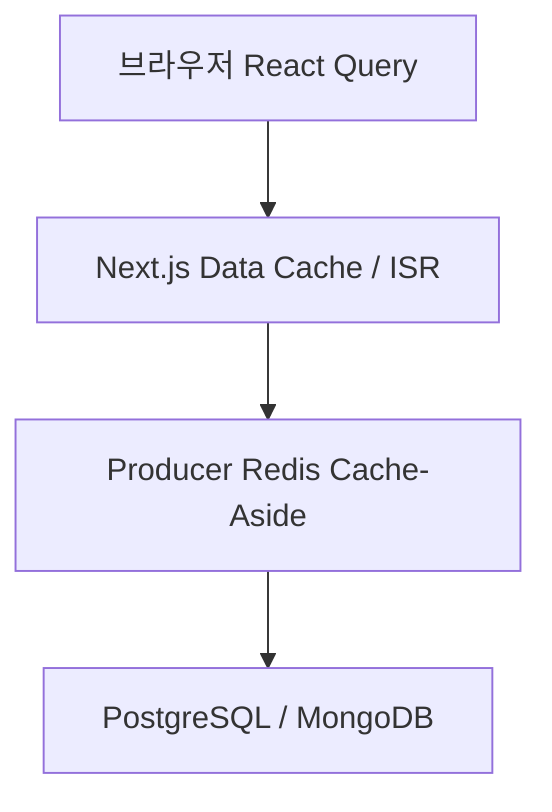

# 캐시

## 이 문서로 해결할 질문

- Next.js ISR/Data Cache와 React Query 캐시는 어떻게 구분되나요?
- `cache.policy.ts` 기준 값은 무엇인가요?
- 레시피 상세 온디맨드 revalidate는 어떻게 트리거하나요?

## 캐시 레이어 개요



각 레이어는 독립적이며, 같은 데이터라도 TTL·무효화 경로가 다릅니다.

## Next.js Data Cache (ISR)

Next.js Data Cache(ISR) 기준은 `client/src/lib/policy/cache.policy.ts`·`client/src/lib/constants/cache-tags.constants.ts`에 정의되어 있습니다.

| 상수 | 값 | 용도 |
| --- | --- | --- |
| `ISR_FETCH_REVALIDATE_SEC` | 300초 | 주기 ISR revalidate |
| `ISR_RECIPE_LIST_FETCH` | `{ next: { revalidate: 300, tags: ['recipes','recipe-list'] } }` | 레시피 메인 |
| `ISR_RECIPE_CATEGORIES_FETCH` | tags `recipes`·`recipe-categories` | 레시피 필터 |
| `ISR_INGREDIENT_CATEGORIES_FETCH` | tags `ingredients`·`ingredient-categories` | 재료 필터 |
| `isrRecipeDetailFetch(id)` | `{ revalidate: false, tags: ['recipes','recipe-detail','recipe:{id}'] }` | 레시피 상세 — tag 무효화만 |

### 캐시 태그

| 태그 | 무효화 범위 |
| --- | --- |
| `recipes` | 레시피 관련 fetch 전체 |
| `recipe-list` | `/recipe` 목록 |
| `recipe-detail` | 모든 레시피 상세 fetch |
| `recipe:{id}` | 특정 레시피 상세 |
| `recipe-categories` | `/recipe/filter` |
| `recipe-static-ids` | `generateStaticParams` |
| `ingredients` | 재료 관련 fetch |
| `ingredient-categories` | `/ingredient/filter` |
| `sitemap` | sitemap 레시피 URL |

### 페이지별 적용

| 페이지 | 전략 |
| --- | --- |
| `/recipe` | ISR + CSR (공개 섹션 주기 ISR, 개인화 추천 CSR) |
| `/recipe/filter`, `/ingredient/filter` | 주기 ISR (300초) |
| `/recipe/[id]` | 온디맨드 ISR + `generateStaticParams`(10건) |
| `/recipe/search` | SSR (ISR 없음) |
| 챗봇·보관함·마이페이지·인증 | CSR |

### ISR fetch 예외 처리

| 상황 | 동작 |
| --- | --- |
| CI 빌드 (`CI=true`) | fetch 실패 시 empty fallback — 빌드 통과 |
| 로컬 빌드 | fetch 실패 시 throw — 조기 발견 |
| 런타임 재검증 실패 | throw — **stale HTML 유지** (빈 화면 덮어쓰기 금지) |

ISR fetch 헬퍼는 `fetchForIsr()`이며, `client/src/.../isr-fetch.server.ts`에 구현되어 있습니다.

### 온디맨드 revalidate

```http
POST /api/revalidate
Content-Type: application/json

{
  "secret": "<REVALIDATE_SECRET>",
  "tags": ["recipes", "recipe:123", "recipe-list", "recipe-static-ids", "sitemap"]
}
```

각 태그에 대해 `revalidateTag(tag)`를 호출합니다. 태그 형식은 `cache-tags.constants.ts`의 `CACHE_TAG_PATTERN`을 따릅니다.

## React Query 캐시

React Query 캐시 기준은 `client/src/.../cache.policy.ts`의 `QUERY_DEFAULTS`, `QUERY_CACHE`입니다.

| 도메인 | staleTime | gcTime |
| --- | --- | --- |
| 기본 | 5분 | 30분 |
| recipeList | 5분 | 30분 |
| recommended | 20분 | 60분 |
| recipeDetail | 10분 | 60분 |
| ingredient | 60분 | 24시간 |
| user | 1분 | 10분 |
| inventory | 30초 | 10분 |
| chatbot | 30초 | 10분 |

### Optimistic Update

Command API(POST/PUT/DELETE) 성공은 Kafka 발행까지만 보장합니다. 뮤테이션 후 **refetch 대신 `setQueryData`로 캐시 직접 갱신**합니다.

자세한 내용은 [상태 관리 — Optimistic Update](./state#optimistic-update-command-api) 문서를 참고하세요.

## Producer Redis와의 관계

CSR/ISR 페이지가 호출하는 API는 Producer Redis 캐시를 거칩니다.

| 데이터 | Producer TTL | 프론트 캐시 |
| --- | --- | --- |
| 개인화 추천 | 3600초 | React Query 20분 |
| 레시피 상세 | 900초 | ISR on-demand + RQ 10분 |
| 재료 목록 | 86400초 | RQ 60분 |

Consumer 캐시 무효화 후 다음 API 호출 시 DB로 폴백하며, 프론트는 별도 무효화 없이 staleTime 만료 또는 수동 invalidate로 갱신합니다.

## 관련 문서

- [캐시 (producer)](../producer/cache)
- [캐시 무효화](../consumer/cache-invalidation)
- [추천 시스템](../project/recommendation)
