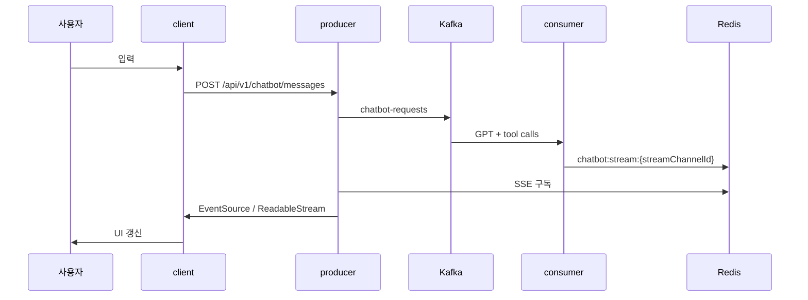

# 챗봇 UI/스트리밍

## 이 문서로 해결할 질문

- 클라이언트는 챗봇 응답 스트림을 어떻게 구독·렌더링하나요?
- `ChatbotStreamEvent` 타입별 UI 동작은 무엇인가요?
- 대화 목록·상세 캐시는 어떻게 갱신하나요?

## 전체 흐름

상세 시퀀스는 [챗봇/SSE](../producer/chatbot-sse)와 [챗봇 처리](../consumer/chatbot) 문서를 참고하세요.

## SSE 이벤트 타입

`ChatbotStreamEvent` 타입은 `@mealio/shared`에 정의되어 있습니다.

| type | UI 동작 |
| --- | --- |
| `chunk` | 스트리밍 텍스트 append |
| `tool_call` | 도구 호출 중 상태 (선택) |
| `done` | 턴 완료·메타데이터 반영 |
| `error` | 오류 메시지·재시도 액션 |

`done.data.suggestedRecipes`가 있으면 `SuggestedRecipeBubble` / `SuggestedRecipeSlider`로 표시합니다.

## 주요 페이지·컴포넌트

| 경로 | 파일 | 역할 |
| --- | --- | --- |
| `/chatbot/list` | `ChatbotConversationListClientPage.tsx` | 대화 목록 |
| `/chatbot/[id]` | `ChatbotConversationClientPage.tsx` | 메시지 전송·SSE 구독 |
| 컴포넌트 | `client/src/.../chatbot/` | 버블·입력·슬라이더 |

컴포넌트는 [컴포넌트 구조](./components)와 `client/src/.../chatbot/` 기준으로 배치합니다.

## React Query 연동

React Query 훅은 `client/src/.../chatbot.queries.ts`에 정의되어 있습니다.

| 훅 | 용도 |
| --- | --- |
| `useConversationListInfinite` | 대화 목록 무한 스크롤 |
| `useConversationDetail` | 단일 대화 메시지 |
| `invalidateChatbotAfterStreamDone` | `done` 수신 후 목록·상세 캐시 갱신 |

챗봇 캐시 정책은 `QUERY_CACHE.chatbot`이며 staleTime은 30초입니다.

## 크레딧 소진 UX

`done.data.isCreditDepleted === true`이면 잔액 소진 안내(인라인 Alert 등)를 표시합니다. 크레딧 차감 로직은 Consumer 책임입니다.

## GA4 계측

`chatbot_message_sent` 이벤트는 `ChatbotConversationClientPage.tsx`에서 전송합니다.

자세한 내용은 [이벤트/분석 파이프라인](../consumer/analytics-pipeline) 문서를 참고하세요.

## 보호 라우트

`/chatbot/*` 경로는 Proxy에서 `refreshToken` 쿠키를 검사하며, 미로그인 시 `/login?next=`로 리다이렉트합니다.

자세한 내용은 [인증](./auth) 문서를 참고하세요.

## 관련 문서

- [챗봇/SSE](../producer/chatbot-sse)
- [챗봇 처리](../consumer/chatbot)
- [에러 처리/Toast](./error-toast)
