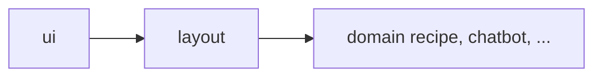

# 컴포넌트 구조/규칙

## 이 문서로 해결할 질문

- `client/src/components/` 폴더 구조는 무엇인가요?
- import 방향 규칙은 무엇인가요?
- 새 컴포넌트를 어디에 두나요?

## 최상위 구조

```text
client/src/components/
├── ui/          # 도메인 중립 프리미티브 (디자인 시스템)
├── layout/      # 앱 셸 (Navbar, Tabbar 등)
├── recipe/      # 레시피 탭
├── chatbot/     # 챗봇 탭
├── inventory/   # 보관함 탭
├── mypage/      # 마이페이지 탭
└── auth/        # 인증 화면
```

라우팅 그룹과의 매핑은 [클라이언트 아키텍처 — 앱 디렉터리](./architecture#앱-디렉터리)를 참고하세요.

## 폴더 컨벤션

컴포넌트 1개는 PascalCase 폴더 1개에 대응합니다.

```text
Button/
├── Button.tsx
├── Button.types.ts      # (선택)
├── Button.stories.tsx
└── index.ts             # public export
```

## import 방향 (단방향)



| 출발 | 허용 | 금지 |
| --- | --- | --- |
| `ui` | `ui`, `lib/*` | `layout`, 모든 도메인 |
| `layout` | `ui`, `layout`, `lib/*` | 모든 도메인 |
| 도메인 | `ui`, `layout`, **같은 도메인**, `lib/*` | **다른 도메인** 직접 참조 |

도메인 간 공통 UI는 `ui/` 또는 `layout/`으로 **승격**합니다.

## 타입·유틸

- Props 타입은 가능하면 `client/src/.../*` 도메인 타입을 직접 사용합니다.
- 도메인 포맷 로직은 `components/<domain>/utils/`에 두며, 범용화 시 `lib/utils/`로 승격합니다.

## Storybook

- 스토리는 컴포넌트 폴더 내부의 `*.stories.tsx`에 둡니다.
- 기본 1개와 의미 있는 변형(로딩, 에러, 빈 상태)만 유지합니다.
- 페이지 전체 복제보다 재사용 단위를 우선합니다.

```bash
pnpm run start:storybook
```

## 새 컴포넌트 배치 결정

| 질문 | 배치 |
| --- | --- |
| 여러 탭에서 쓰는 버튼·입력? | `ui/` |
| 탭바·네비게이션? | `layout/` |
| 레시피 카드·검색 UI? | `recipe/` |
| 챗봇 버블? | `chatbot/` |

아키텍처 문서에 경로가 정의되어 있으면 해당 문서를 우선합니다. [기여 가이드](../other/contributing)를 참고하세요.

## 관련 문서

- [클라이언트 아키텍처](./architecture)
- [Design System](../other/design-system)
