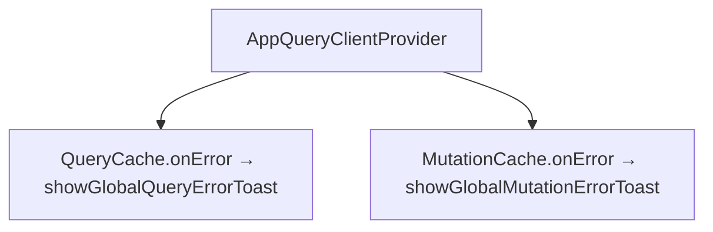
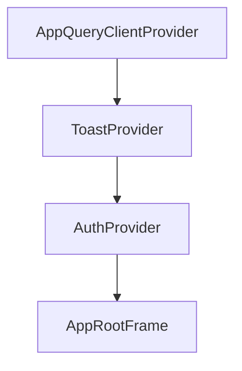

# 에러 처리/Toast

## 이 문서로 해결할 질문

- API 실패·렌더 예외·404는 각각 어떻게 처리하나요?
- React Query 전역 오류 Toast를 끄거나 메시지를 바꾸려면 어떻게 하나요?
- 새 액션 실패 UX를 추가할 때 어디에 코드를 넣나요?

## 역할 분담

| 수단 | 사용 시점 | 구현 위치 |
| --- | --- | --- |
| `error.tsx` | 라우트 트리 복구 불가 렌더 예외 | `client/src/.../error.tsx` |
| `global-error.tsx` | 루트 layout 포함 치명적 예외 | `client/src/.../global-error.tsx` |
| `not-found.tsx` | 404 (리소스 없음) | `client/src/.../not-found.tsx` |
| **인라인 Alert** | 화면 고정 안내 (크레딧 소진 등) | 해당 페이지 컴포넌트 |
| **전역 Toast** | 복구 가능한 API·백그라운드 실패 | `client/src/.../toast/` |

**라우트는 죽이지 않고 컨텍스트를 유지**해야 하는 오류는 Toast로 처리합니다.

## React Query 전역 오류

`QueryClient` 생성 시 `QueryCache` / `MutationCache`의 `onError`에서 `notifyApiError`를 호출합니다.



구현은 `client/src/.../query-client.provider.tsx`와 `client/src/.../global-query-error-toast.ts`에 있습니다.

### meta 옵션

개별 `useQuery` / `useMutation`에서 전역 Toast를 제어합니다.

| meta 필드 | 의미 |
| --- | --- |
| `suppressGlobalErrorToast: true` | 전역 Toast 비활성 (화면에서 직접 처리) |
| `errorToastTitle` | Toast 제목 오버라이드 |

예: `useCurrentUser`는 기본 `errorToastTitle: '세션을 불러오지 못했어요'`를 설정합니다.

타입 확장은 `client/src/.../react-query-meta.d.ts`에 정의되어 있습니다.

## API

| 함수/훅 | 용도 |
| --- | --- |
| `notifyApiError(error, options?)` | `ApiError` → 사용자 메시지 + Toast enqueue |
| `useErrorToast()` | 훅 래퍼 (의존성 배열에 넣기 쉬움) |
| `useToast()` | `enqueue` / `dismiss` / `clear` 직접 제어 |

메시지 변환은 `client/src/.../error.ts`의 `getUserMessage`를 사용합니다.

## Toast 옵션 패턴

| 옵션 | 동작 |
| --- | --- |
| `dedupeKey` | 동일 키 Toast upsert; 2.5초 내 재호출 무시 |
| `skipDedupe: true` | 시간 기반 중복 억제 해제 |
| `durationMs: 0` | 자동 닫힘 없음 |
| `action: { label, onAction }` | 예: 챗봇 "다시 시도" |

## Provider 순서

Provider 순서는 `client/src/.../layout.tsx`에서 다음과 같이 유지합니다.



Toast 브리지가 Query 오류 콜백 시점에 등록되도록 이 순서를 유지합니다.

## 접근성

| variant | ARIA |
| --- | --- |
| `error` | `role="alert"`, `aria-live="assertive"` |
| 그 외 | `role="status"`, `aria-live="polite"` |

## 새 기능 추가 시 가이드

1. **백그라운드 fetch 실패**는 React Query와 전역 Toast를 기본으로 사용합니다. 화면 인라인 처리가 필요하면 `suppressGlobalErrorToast`를 설정합니다.
2. **사용자 액션 실패**(저장·삭제)는 `useMutation`을 사용하고, 필요 시 `errorToastTitle`을 지정합니다.
3. **페이지 전체 불가** 시 Error Boundary 또는 `notFound()`를 사용합니다.
4. **인증 만료**는 `http-client` 401 refresh 흐름([인증](./auth))으로 처리하며, Toast와는 별도입니다.

## 테스트

```bash
pnpm --filter client test:unit
```

## 관련 문서

- [상태 관리](./state)
- [API 클라이언트/BFF](./api-bff)
- [접근성/성능 기준](./accessibility-performance)
