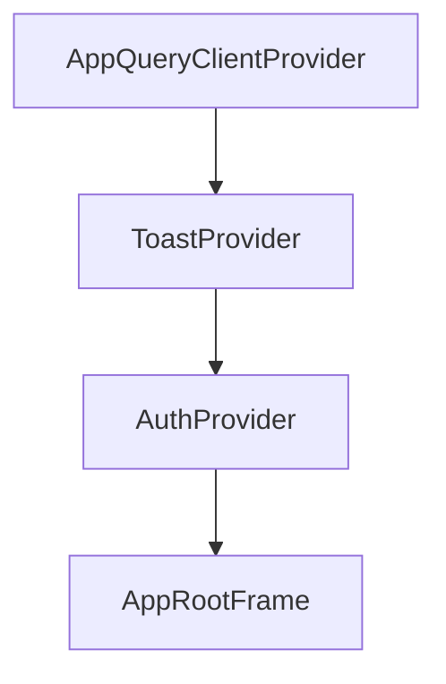

# 상태 관리

## 이 문서로 해결할 질문

- React Query와 Auth 상태는 어떻게 나뉘나요?
- 쿼리 키·캐시 정책은 어디서 관리하나요?
- Optimistic Update 원칙은 무엇인가요?

## 상태 경계

| 상태 | 도구 | 범위 |
| --- | --- | --- |
| 서버 데이터 | **React Query** | 레시피, 재료, inventory, 챗봇, 유저 |
| 인증·세션 | **AuthProvider** | 로그인 여부, `SessionUser` |
| UI 일시 | 컴포넌트 `useState` | 디바운스, 토글 피드백 등 최소 |

**쿼리 캐시가 화면 데이터의 기준**입니다.

## Provider 트리



`client/src/.../layout.tsx`에서 Provider를 합성하며, Query 오류 Toast는 ToastProvider 이후에 등록됩니다.

## React Query 구조

React Query 모듈은 `client/src/.../queries/`에 위치합니다.

| 파일 | 역할 |
| --- | --- |
| `query-client.provider.tsx` | QueryClient 생성, 전역 onError |
| `recipe.queries.ts` | `recipeQueries` 키, `useRecommendedRecipes` 등 |
| `ingredient.queries.ts` | 재료 검색 infinite |
| `inventory.queries.ts` | 보관함·관심 레시피 |
| `chatbot.queries.ts` | 대화 목록·상세 |
| `user.queries.ts` | `useCurrentUser`, 닉네임 변경 |
| `auth.queries.ts` | `useLogoutMutation` |

### 쿼리 키 계층

```typescript
recipeQueries.all → lists() → list(filters)
                 → details() → detail(id)
```

키 팩토리 패턴으로 invalidate 범위를 제어합니다.

## 캐시 정책

캐시 정책 기준은 `client/src/.../cache.policy.ts`입니다.

- `QUERY_DEFAULTS`는 staleTime 5분, gcTime 30분을 사용합니다.
- `QUERY_CACHE.*`는 도메인별로 override하며, recommended는 20분, inventory는 30초 등으로 설정합니다.

## Optimistic Update (Command API)

Producer-Consumer 구조에서 HTTP 200은 DB 반영 완료가 아닌 **Kafka 발행 성공**을 의미합니다.

1. 뮤테이션 성공 시 `setQueryData`로 캐시를 직접 갱신합니다.
2. 에러 시 롤백합니다.
3. 성공 후에는 **refetch하지 않습니다**(stale 데이터 재유입 방지).

예외적으로 토글 버튼 등 즉각 피드백용 **한정된 localState**를 허용하며, 뮤테이션 훅이 캐시를 갱신하고 에러 시 prop과 동기화합니다.

자세한 내용은 [클라이언트 아키텍처 — API 레이어](./architecture#api-레이어) 문서를 참고하세요.

## Auth와의 연동

- `AuthProvider.refresh()`는 OAuth 콜백 후 세션을 마킹합니다.
- `useCurrentUser`는 `userQueries.me`를 사용하며, 실패 시 `errorToastTitle` 기본값을 적용합니다.
- 로그아웃 시 `userQueries.me`를 invalidate합니다.

## 관련 문서

- [캐시](./cache)
- [에러 처리/Toast](./error-toast)
- [인증](./auth)
