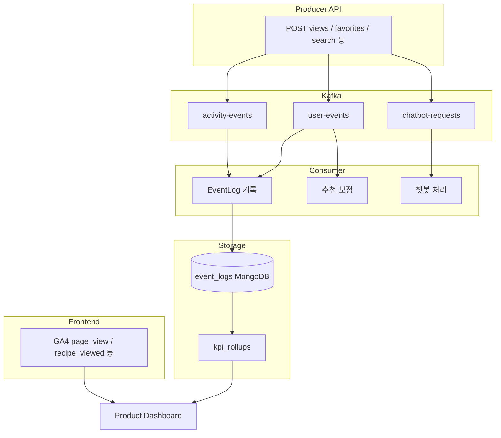

# 이벤트/분석 파이프라인

## 이 문서로 해결할 질문

- 사용자 행동 이벤트는 어디서 수집되고 어디에 저장되나요?
- GA4와 EventLog·Kafka의 역할 분리는 무엇인가요?
- KPI 롤업은 어떻게 동작하나요?

## 파이프라인 개요



## 수집 경로 분리

| 계층 | 형식 | 용도 |
| --- | --- | --- |
| **GA4** | `snake_case` (`recipe_viewed`) | UI 퍼널·탐색 분석 |
| **EventLog** | `domain.action` (`recipe.view`) | 도메인 확정·추천·KPI 원본 |
| **Kafka 토픽** | `kebab-case` (`activity-events`) | 비동기 처리 버스 |

동일 의미를 GA와 EventLog에 **이중 정의하지 않습니다**. 이름만 다를 수 있으나 기준 저장소는 EventLog입니다.

## 주요 Kafka 토픽

| 토픽 | 발행 주체 | Consumer 처리 |
| --- | --- | --- |
| `activity-events` | Producer (조회·검색·좋아요 등) | EventLog + 추천 보정 |
| `user-events` | Producer (관심·재료 CRUD·프로필) | EventLog + Inventory + 추천 |
| `chatbot-requests` | Producer (챗봇 메시지) | GPT 처리 + ChatbotLog |

토픽·그룹·DLQ 상세는 [Kafka 소비/신뢰성](./kafka-reliability) 문서를 참고하세요.

## EventLog 저장

- MongoDB `event_logs` 컬렉션에 저장합니다.
- TTL은 90일입니다.
- `TrackUserActivityHandler`와 activity-events processor 등이 기록을 담당합니다.

이벤트 추가 시 **반드시** [Observability](../other/observability)에 먼저 등록합니다.

## GA4 ↔ EventLog 매핑 (구현 완료)

| GA4 | EventLog | 발행 |
| --- | --- | --- |
| `recipe_viewed` | `recipe.view` | Producer views API |
| `recipe_saved` | `recipe.favorites_add` | Producer favorites API |
| `chatbot_message_sent` | `chatbot.message` | Consumer processor |

GA 이벤트 상수는 `client/src/.../analytics-events.ts`에 정의되어 있습니다.

## KPI 롤업

EventLog TTL 90일을 보완하기 위해 일별 롤업 잡이 KPI를 집계합니다.

| KPI | 원본 | 롤업 잡 |
| --- | --- | --- |
| `kpi_recipe_favorite_cvr` | `recipe.view`, `recipe.favorites_add` | `rollupRecipeFavoriteCvr()` |
| `kpi_recommendation_e2e_latency` | `recipe.favorites_add` (occurredAt→processedAt) | `rollupRecommendationLatency()` |
| `kpi_search_click_rate` | `search.query`, `search.click` | search CTR 롤업 |

롤업 구현은 `server/consumer/.../kpi-rollup.service.ts`에 있습니다.

```bash
pnpm run kpi:rollup
```

## 운영·검증

| 항목 | 문서/도구 |
| --- | --- |
| 통합 검증 시나리오 | [Observability — 검증 (배포 후)](../other/observability#검증-배포-후) (EventLog·KPI 롤업 포함) |
| KPI 계약 | [Observability](../other/observability) |
| 알림·장애 대응 | [Observability](../other/observability), [Consumer 운영](./operations) |
| Grafana 대시보드 | `observability/grafana/` |

## 신규 이벤트 추가 절차

1. [Observability](../other/observability)에 이벤트 행을 추가합니다.
2. shared event enum 또는 `analytics-events.ts`를 갱신합니다.
3. Producer에서 발행하거나 Consumer에서 기록하는 처리를 구현합니다.
4. GA 연동 시 내부 프론트 이벤트 계측 체크리스트를 반영합니다.
5. PR 리뷰에서 사전 미등록 이벤트를 차단합니다.

## 관련 문서

- [추천 파이프라인](./recommendation-pipeline)
- [이벤트 발행](../producer/event-publishing)
- [Observability](../other/observability)
