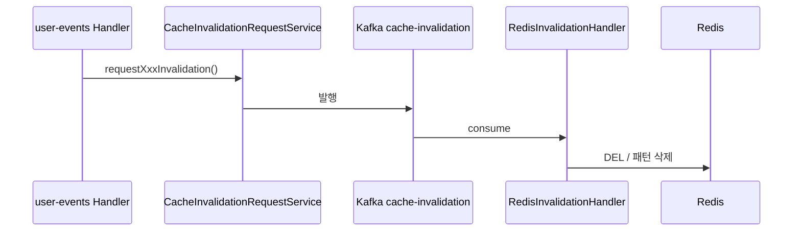

# 캐시 무효화

## 이 문서로 해결할 질문

- 캐시 무효화는 언제·누가·어떻게 트리거하나요?
- 토픽별 삭제되는 Redis 키는 무엇인가요?
- Handler가 Kafka를 직접 발행하지 않는 이유는 무엇인가요?

## 흐름

**원칙**: 도메인 Handler는 Kafka를 직접 발행하지 않습니다. `CacheInvalidationRequestService`만 발행합니다.

## 토픽 계약

| 항목 | 값 |
| --- | --- |
| 토픽 | `cache-invalidation` |
| DLQ | `cache-invalidation-dlq` |
| 그룹 | `cache-invalidation-group` |
| 발행 주체 | Consumer 내부 (`CacheInvalidationRequestService`) |

### payload 타입

| type | 삭제 대상 | 트리거 예 |
| --- | --- | --- |
| `USER_PROFILE` | `user:{userId}` | 닉네임 변경, 챗봇 크레딧 차감 |
| `INVENTORY` | `inventory:{userId}` | 재료·관심 레시피 CRUD |
| `RECIPE` | `recipe:{id}`, list/search/static-ids 패턴 | 레시피 데이터 변경 |
| `RECOMMENDATION` | `recommendation:{userId}` | 추천 원본 테이블 갱신 후 |
| `INGREDIENT` | `cachePatternIngredientInvalidation()` (list/search 패턴·categories) | 재료 마스터 데이터 변경 |

삭제 로직은 `server/consumer/.../redis-invalidation.handler.ts`에 구현되어 있으며, `@mealio/shared`의 `cachePatternRecipeInvalidation()` 등을 사용합니다.

## 주요 발행 트리거

| 경로 | 무효화 타입 |
| --- | --- |
| `UpdateUserProfileHandler` | USER_PROFILE |
| `UpdateInventoryHandler` | INVENTORY |
| `RecommendationHandler` | RECOMMENDATION |
| `ActivityRecommendationService` | RECOMMENDATION |
| `ChatbotCreditService` (차감 시) | USER_PROFILE |

## 일관성 보장

Producer Cache-Aside와 동일 Redis를 사용하므로, 무효화가 발행되면 Redis 키가 삭제됩니다. 이후 API 요청은 cache miss로 DB에서 값을 읽어온 뒤 새 값을 캐시에 저장합니다.

프론트 React Query·ISR은 별도 레이어이며, staleTime 만료 또는 사용자 재방문 시 갱신됩니다.

## RECIPE 패턴 삭제

`RECIPE` 타입은 `recipe:list:*`, `recipe:search:*`, `recipe:list:static-ids:*` 패턴과 `recipe:categories` 단건 키를 삭제합니다.

패턴 정의는 `@mealio/shared` `cache-keys.ts`의 `cachePatternRecipeInvalidation()`을 참고하세요.

## 관련 문서

- [Consumer 아키텍처](./architecture)
- [캐시 (producer)](../producer/cache)
- [추천 파이프라인](./recommendation-pipeline)
- [Redis 키/캐시 계약](../shared/redis-cache-contract)
