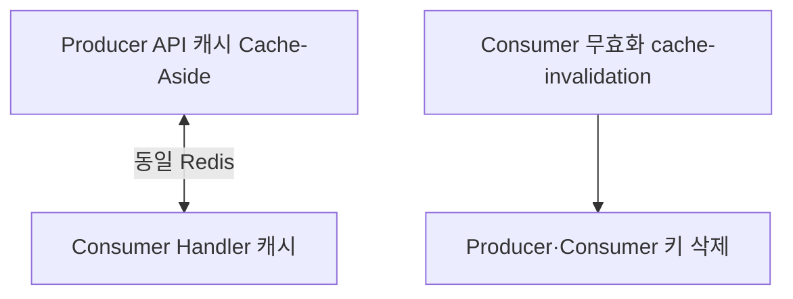

# 캐시

## 이 문서로 해결할 질문

- Consumer에서 Redis 캐시를 쓰는 곳은 어디인가요?
- Producer 캐시와 어떻게 정합을 맞추나요?
- 챗봇 Handler 캐시 TTL은 무엇인가요?

## Consumer 캐시 역할

Consumer는 **조회 성능 최적화**를 위해 Handler 단에서 Redis를 직접 사용합니다. Producer Cache-Aside와 **동일 Redis 인스턴스**를 공유합니다.

| 용도 | 키 예 | TTL 정의 |
| --- | --- | --- |
| 챗봇 재료 메타 | `ingredient:by-id:{id}` | `CHATBOT_INGREDIENT_BY_ID_CACHE_TTL_SECONDS` (3600초) |
| 챗봇 카테고리 | `recipe:chatbot:food-categories` | `CHATBOT_FOOD_CATEGORIES_CACHE_TTL_SECONDS` (3600초) |
| recipe ingestion 카테고리 | `recipe:ingestion:food-categories` | submit job 전용 |

정책 파일: `server/consumer/src/policy/chatbot-cache.policy.ts`

## 사용 Handler

| Handler | 캐시 내용 |
| --- | --- |
| `InventoryHandler` | 재료 id→name (Producer 키와 구분) |
| `FoodCategoriesHandler` | 레시피·재료 활성 카테고리 JSON |
| `category-context.service` (ingestion) | submit 단계 LLM 컨텍스트 |

## Producer와의 관계

Consumer Handler 캐시는 **무효화 토픽 대상이 아닐 수 있습니다**. TTL 만료 또는 도메인 이벤트 후 자연 갱신에 의존하는 키가 있습니다. Producer 쪽 `user`/`inventory`/`recipe`/`recommendation` 키는 [캐시 무효화](./cache-invalidation)로 삭제됩니다.

## 챗봇 크레딧 차감 → 캐시 연동

크레딧 실제 차감 시 `ChatbotCreditService`가 `USER_PROFILE` 무효화를 발행해 Producer `user:{userId}` 캐시와 정합을 맞춥니다.

→ [챗봇 처리](./chatbot)

## 관련 문서

- [캐시 (producer)](../producer/cache)
- [캐시 무효화](./cache-invalidation)
- [Redis 키/캐시 계약](../shared/redis-cache-contract)
