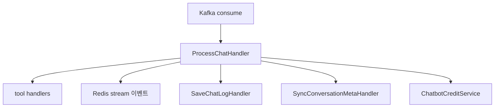

# 챗봇 처리

## 이 문서로 해결할 질문

- Consumer가 챗봇 메시지를 어떻게 처리하나요?
- GPT Function Calling·tool handler 구조는 무엇인가요?
- 크레딧 멱등 차감은 어떻게 보장하나요?

## 처리 파이프라인

챗봇 처리는 `chatbot-requests` 토픽과 `chatbot-group` 컨슈머 그룹으로 구독합니다.

## ProcessChatHandler

| 단계 | 동작 |
| --- | --- |
| 1 | `buildMessagesForGpt()`로 메시지 배열 구성 (`server/consumer/.../conversation.manager.ts`) |
| 2 | OpenAI Chat Completions 스트리밍 호출 |
| 3 | `tool_calls` 발생 시 해당 Handler 디스패치 |
| 4 | 응답 chunk를 Redis `chatbot:stream:{streamChannelId}`에 발행 |
| 5 | 턴 완료 시 `done` 이벤트 + 크레딧 차감 |

핵심 구현은 `server/consumer/.../ProcessChatHandler.ts`에 있습니다.

## Tool Handlers

| Handler | tool | 역할 |
| --- | --- | --- |
| `InventoryHandler` | `get_user_inventory` | 보유/관심 재료·레시피 조회 |
| `FoodCategoriesHandler` | `get_food_categories` | 카테고리 마스터 (Redis 1h) |
| `SearchRecipesHandler` | `search_recipes` | semantic-first ANN·재랭킹 검색 |
| `FinalizeRecipeSelectionHandler` | `finalize_recipe_selection` | 후보 중 최종 추천 레시피 확정 |

도구 스키마는 `server/consumer/.../chatbot-tools.definition.ts`에 정의되어 있습니다.

tool 호출 시 Consumer가 DB/Redis에서 직접 조회합니다.

## ChatbotLog 저장

- MongoDB `chatbot_logs` 컬렉션에 저장하며, TTL은 30일입니다.
- `SaveChatLogHandler`가 user/assistant 턴을 `conversationId`와 함께 저장합니다.
- 히스토리 확장 시 `conversationId` 기준 최근 N턴을 조회해 `buildMessagesForGpt`에 전달합니다.

## 크레딧 멱등 차감

| 항목 | 계약 |
| --- | --- |
| 테이블 | `chatbot_credit_deductions` (PK: `stream_channel_id`) |
| 서비스 | `ChatbotCreditService` |
| 멱등 | `createMany` + `skipDuplicates` — 동일 `streamChannelId` 이중 차감 방지 |
| 비용 | `usage.totalTokens` → `computeChatbotCreditCost()` |
| `done` 반영 | `isCreditDepleted` in `ChatbotStreamDoneEvent` |

신규 차감이 발생하면 `cache-invalidation` 토픽에 `USER_PROFILE` 무효화를 발행합니다.

## 이벤트·KPI

| EventLog | 시점 |
| --- | --- |
| `chatbot.start` | 대화 시작 |
| `chatbot.message` | 메시지 처리 성공 |

이벤트·KPI 연동은 [이벤트/분석 파이프라인](./analytics-pipeline)을 참고하세요.

## 신뢰성

- at-least-once Kafka 전달을 전제로 하며, 크레딧·로그는 멱등 키로 중복 처리에 안전합니다.
- 처리 실패 시 메시지는 `chatbot-requests-dlq`로 보냅니다.
- consumer lag는 `server/consumer/.../consumer-lag.monitor.ts`로 모니터링합니다.

## 관련 문서

- [Kafka 소비/신뢰성](./kafka-reliability)
- [챗봇/SSE](../producer/chatbot-sse)
- [챗봇 UI/스트리밍](../client/chatbot-ui)
- [캐시](./cache)
