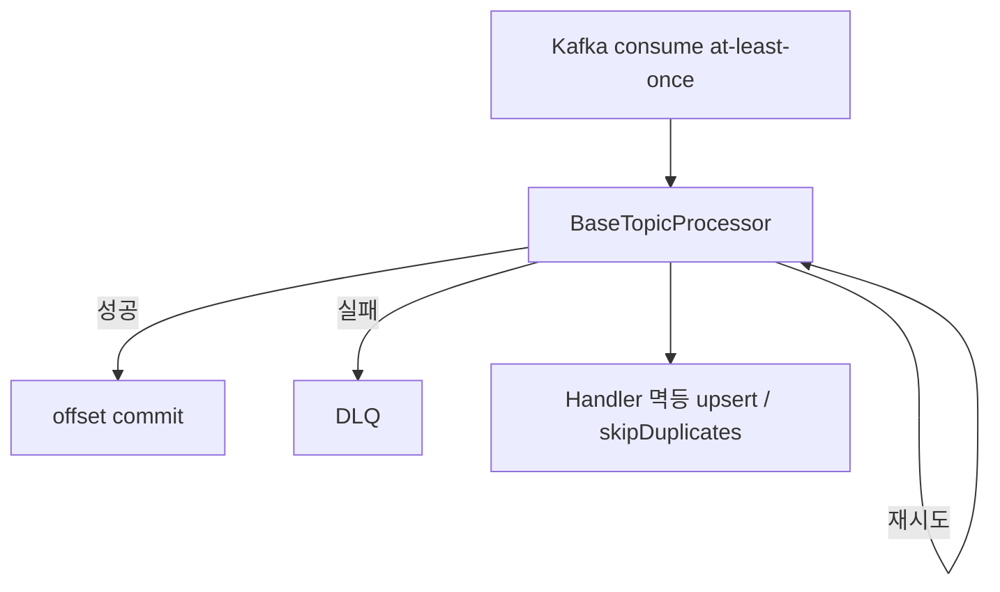

# Kafka 소비/신뢰성

## 이 문서로 해결할 질문

- Consumer group·토픽·DLQ 구조는 무엇인가요?
- at-least-once·멱등성은 어떻게 보장하나요?
- lag 모니터링은 어떻게 하나요?

## 토픽·그룹 매핑

| 토픽 | DLQ | Consumer Group |
| --- | --- | --- |
| `chatbot-requests` | `chatbot-requests-dlq` | `chatbot-group` |
| `user-events` | `user-events-dlq` | `analytics-group` |
| `activity-events` | `activity-events-dlq` | `activity-events-group` |
| `cache-invalidation` | `cache-invalidation-dlq` | `cache-invalidation-group` |
| `recipe-ingestion-retrieved` | `recipe-ingestion-retrieved-dlq` | `recipe-ingestion-persist-group` |

상수 정의: `@mealio/shared` `KAFKA_TOPICS`, `KAFKA_DLQ_TOPICS`

## 처리 파이프라인

## 멱등성 패턴

| 영역 | 패턴 |
| --- | --- |
| 추천 점수 | upsert + unique 제약 |
| 크레딧 차감 | `stream_channel_id` PK + `skipDuplicates` |
| EventLog | 이벤트 dedupe 키 (activity) |
| recipe persist | `(source, sourceRecipeId)` upsert |

## 파티션 키

순서 보장이 필요한 메시지는 key 지정:

- `chatbot-requests`: `conversationId` 또는 `streamChannelId`
- `cache-invalidation`: `userId`

## DLQ 운영

- DLQ 메시지는 원본 토픽 처리 실패 기록
- 로그에 `correlationId`, `sentryEventId` 포함
- 재처리: 원인 수정 후 수동 replay (runbook 참고)

알림: `ALERT_DLQ_SPIKE` — [Observability](../other/observability), [Consumer 운영](./operations)

## Lag 모니터링

- `consumer-lag.monitor.ts` — `GROUP_TOPIC_MAP` 폴링
- Prometheus: `kafka_consumer_lag`
- 알림: `ALERT_KAFKA_LAG` (> 1000, 15m)

대응: Consumer 로그 → handler 오류 → OpenAI/DB 병목 확인.

## 로컬 개발

- `docker/compose-kafka.yml` + Kafka UI (`:8080`)
- Producer 기동 시 로컬 토픽·DLQ 자동 생성

## 관련 문서

- [이벤트 발행](../producer/event-publishing)
- [운영/복구](./operations)
- [Consumer 아키텍처](./architecture)
