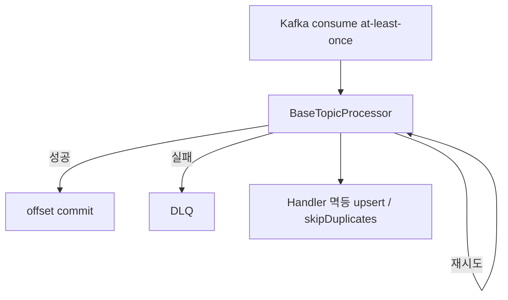

# Kafka 소비/신뢰성

## 이 문서로 해결할 질문

- Consumer group·토픽·DLQ 구조는 무엇인가요?
- at-least-once·멱등성은 어떻게 보장하나요?
- lag 모니터링은 어떻게 하나요?

## 토픽·그룹 매핑

| 토픽 | DLQ | Consumer Group |
| --- | --- | --- |
| `chatbot-requests` | `chatbot-requests-dlq` | `chatbot-group` |
| `user-events` | `user-events-dlq` | `analytics-group` |
| `activity-events` | `activity-events-dlq` | `activity-events-group` |
| `cache-invalidation` | `cache-invalidation-dlq` | `cache-invalidation-group` |
| `recipe-ingestion-retrieved` | `recipe-ingestion-retrieved-dlq` | `recipe-ingestion-persist-group` |

토픽·DLQ 이름은 `@mealio/shared`의 `KAFKA_TOPICS`, `KAFKA_DLQ_TOPICS` 상수에 정의되어 있습니다.

## 처리 파이프라인

## 멱등성 패턴

| 영역 | 패턴 |
| --- | --- |
| 추천 점수 | upsert + unique 제약 |
| 크레딧 차감 | `stream_channel_id` PK + `skipDuplicates` |
| EventLog | 이벤트 dedupe 키 (activity) |
| recipe persist | `(source, sourceRecipeId)` upsert |

## 파티션 키

순서 보장이 필요한 메시지에는 파티션 키를 지정합니다.

- `chatbot-requests`는 `conversationId` 또는 `streamChannelId`를 키로 사용합니다.
- `cache-invalidation`은 `userId`를 키로 사용합니다.

## DLQ 운영

- DLQ 메시지는 원본 토픽 처리 실패를 기록합니다.
- 로그에는 `correlationId`, `sentryEventId`가 포함됩니다.
- 재처리는 원인을 수정한 뒤 수동 replay합니다(runbook 참고).

`ALERT_DLQ_SPIKE` 알림과 대응 절차는 [Observability](../other/observability)와 [Consumer 운영](./operations)을 참고하세요.

## Lag 모니터링

- `consumer-lag.monitor.ts`가 `GROUP_TOPIC_MAP`을 폴링합니다.
- Prometheus 메트릭 `kafka_consumer_lag`로 수집합니다.
- `ALERT_KAFKA_LAG` 알림은 lag가 1000을 15분 이상 초과할 때 발생합니다.

대응 시 Consumer 로그에서 handler 오류를 확인하고, OpenAI·DB 병목 여부를 점검합니다.

## 로컬 개발

- `docker/compose-kafka.yml`과 Kafka UI(`:8080`)로 로컬 브로커를 띄웁니다.
- Producer를 기동하면 로컬 토픽·DLQ가 자동으로 생성됩니다.

## 관련 문서

- [이벤트 발행](../producer/event-publishing)
- [운영/복구](./operations)
- [Consumer 아키텍처](./architecture)
