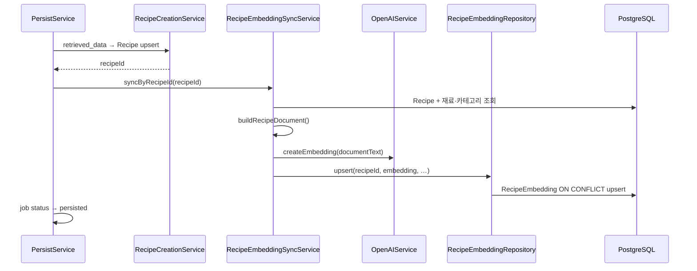
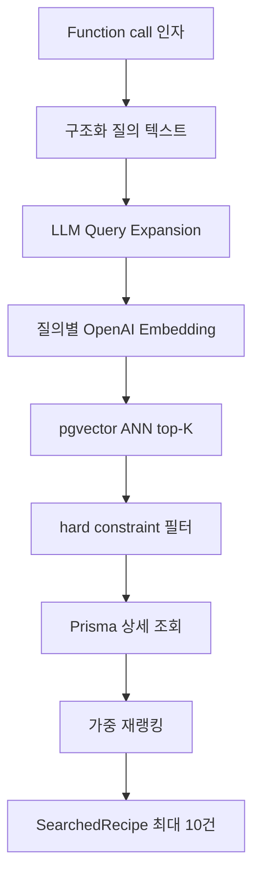

# 레시피 임베딩

## 이 문서로 해결할 질문

- `RecipeEmbedding` 테이블은 무엇을 저장하고 어디서 갱신하나요?
- 챗봇 `search_recipes`가 pgvector ANN 검색을 어떻게 사용하나요?
- 임베딩 동기화·검색이 실패할 때 어디를 확인하나요?

## 역할

`RecipeEmbedding`은 PostgreSQL **pgvector**에 레시피 문서 임베딩을 저장하는 **semantic 검색 인덱스**입니다. 챗봇 `search_recipes` tool의 후보 수집 기반 데이터로 사용됩니다.

| 경로 | 주체 | 동작 |
| --- | --- | --- |
| **쓰기** | recipe ingestion persist | Recipe upsert 직후 OpenAI Embedding → `RecipeEmbedding` upsert |
| **읽기** | 챗봇 `SearchRecipesHandler` | 질의 임베딩 → ANN top-K → 재랭킹 후 GPT에 반환 |

전체 ETL 흐름은 [레시피 수집 상세](./recipe-ingestion)를, 챗봇 tool 파이프라인은 [챗봇 처리](./chatbot)를 참고하세요.

## 데이터 모델

Prisma 모델은 `schema.prisma`의 `RecipeEmbedding`이며, `embedding` 컬럼(`vector(1536)`)은 **raw query**로 접근합니다.

| 필드 | 의미 |
| --- | --- |
| `recipe_id` (PK) | `Recipe.id` FK, 1:1 |
| `embedding` | OpenAI 임베딩 벡터 |
| `document_text` | 임베딩 생성에 사용한 구조화 원문 |
| `embedding_model` | 사용 모델명 (`OPENAI_EMBEDDING_MODEL`) |
| `version` | upsert마다 +1 (재색인 횟수) |
| `source_updated_at` | 원본 `Recipe.updatedAt` 스냅샷 |

ANN 검색은 `ORDER BY embedding <=> query_vector LIMIT k`(cosine distance)로 수행합니다.

## 쓰기 — persist 임베딩 동기화

persist 단계는 `RecipeCreationService` 트랜잭션 **성공 직후** `RecipeEmbeddingSyncService.syncByRecipeId()`를 호출합니다. 임베딩 생성·업서트가 실패하면 persist 전체가 실패하고 job은 `retrieved`로 롤백됩니다.

구현은 `server/consumer/.../recipe-embedding-sync.integration.ts`, `server/consumer/.../recipe-embedding.repository.ts`에 있습니다.

### document_text 구성

레시피 메타·재료·조리법을 줄 단위 키-값 텍스트로 직렬화합니다.

| 섹션 | 포함 필드 |
| --- | --- |
| 식별·요약 | `recipe_id`, `title`, `description` |
| 분류·조리 | `category`, `cook_time_minutes`, `difficulty`, `servings`, `cooking_method`, `dish_type` |
| 영양·팁 | `nutrition_per_serving`, `cooking_tip` |
| 재료 | `ingredients` — 이름·분량·단위·optional·재료 카테고리 |
| 조리법 | `instructions` — 단계 번호와 content를 한 줄로 연결 |

동일 레시피를 재 persist하면 `document_text`·`embedding`·`version`이 갱신됩니다.

## 읽기 — search_recipes semantic-first

구현은 `server/consumer/.../SearchRecipesHandler.ts`에 있습니다.

### 처리 단계

| # | 단계 | 설명 |
| --- | --- | --- |
| 1 | 질의 텍스트 | keywords·must_have·avoid·cook_time·servings를 줄 단위로 구성 |
| 2 | Query Expansion | LLM이 최대 3개 paraphrase 질의 생성 |
| 3 | 질의 임베딩 | `OpenAIService.createEmbeddings()` — persist와 **동일 모델** |
| 4 | ANN top-K | 질의당 top 50, `isPublished = true` hard filter |
| 5 | 기피 재료 | `avoidIngredientIds`는 SQL `NOT IN (RecipeIngredient)`로 제외 |
| 6 | 점수 병합 | 질의별 max semantic score + 다중 질의 hit coverage bonus |
| 7 | 재랭킹 | semantic·keyword·inventory·user preference·soft constraint 가중 합산 |
| 8 | 결과 | `finalScore` 내림차순 상위 10건, `reasonSignals` 포함 |

`cookTime`·`servings`·카테고리·`mustHaveIngredients`는 **탈락이 아닌 soft signal**(재랭킹 점수)로 처리합니다.

### 재랭킹 가중치

정책 상수는 `server/consumer/.../recipe-search.policy.ts`에 정의되어 있습니다.

| 신호 | 가중치 | 비고 |
| --- | --- | --- |
| semantic | 0.50 | ANN cosine 유사도 |
| keyword | 0.15 | 제목·설명 등 키워드 hit |
| inventoryMatch | 0.15 | `ingredientIds` 보유 재료 매칭 |
| userPreference | 0.10 | `UserRecipeRecommendation.score` |
| softConstraint | 0.10 | cookTime·servings·카테고리·mustHave |

## 환경 변수

| 변수 | 용도 |
| --- | --- |
| `OPENAI_API_KEY` | Embedding API 인증 |
| `OPENAI_EMBEDDING_MODEL` | persist upsert·`search_recipes` 질의 임베딩 공통 모델 |

상세는 [Consumer 환경 변수](./environment-variables)를 참고하세요.

## 운영 검증

| # | 시나리오 | 확인 포인트 |
| --- | --- | --- |
| 1 | persist 1건 성공 | PostgreSQL `RecipeEmbedding`에 해당 `recipe_id` row·`version >= 1` |
| 2 | persist 재실행(멱등) | `version` 증가·`document_text` 갱신 |
| 3 | `isPublished = false` 레시피 | ANN 결과에 포함되지 않음 |
| 4 | 챗봇 `search_recipes` | `semanticScore`·`reasonSignals`가 응답에 포함 |
| 5 | `avoidIngredientIds` 지정 | 해당 재료를 포함한 레시피가 ANN에서 제외 |

임베딩 API 장애 시 persist job이 `retrieved`로 롤백되므로, ingestion 메트릭(`recipe_ingestion_stage_total{stage="persist"}`)과 OpenAI 호출 로그를 함께 확인합니다.

## 관련 문서

- [레시피 수집 상세](./recipe-ingestion)
- [챗봇 처리](./chatbot)
- [Consumer 환경 변수](./environment-variables)
- [데이터 모델/스키마](../shared/data-models)
- [도메인](../project/domain)
