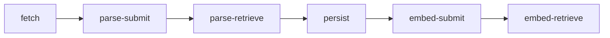
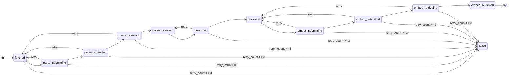

# 레시피 수집 상세

## 이 문서로 해결할 질문

- recipe-ingestion 각 단계 책임은 무엇인가요?
- job 상태 전이와 멱등 키는 무엇인가요?
- 운영/복구는 어떻게 검증하나요?

전체 ETL 개요는 [레시피 수집(ETL)](../project/recipe-ingestion)을 참고하세요.

## 파이프라인



| 단계 | 주체 | 저장소/출력 |
| --- | --- | --- |
| fetch | standalone job | MongoDB `recipe_ingestion_jobs` (`fetched`) + Kafka trigger |
| parse-submit | standalone job + Kafka consumer | OpenAI Parse Batch (`parse_submitted`) |
| parse-retrieve | standalone job | `retrieved_data` + `recipe-ingestion-persist-triggered` |
| persist | Kafka consumer | PostgreSQL Recipe upsert (`persisted`) |
| embed-submit | standalone job + Kafka consumer | OpenAI Embedding Batch (`embed_submitted`) |
| embed-retrieve | standalone job | RecipeEmbedding(pgvector) upsert (`embed_retrieved`) |

## 상태 전이



## Kafka 트리거

| 토픽 | 발행 단계 | 소비 단계 |
| --- | --- | --- |
| `recipe-ingestion-parse-submit-triggered` | fetch | parse-submit consumer |
| `recipe-ingestion-persist-triggered` | parse-retrieve | persist consumer |
| `recipe-ingestion-embed-submit-triggered` | persist | embed-submit consumer |

모든 payload는 `{ runId, fetchedCount, triggeredAt }` 형식을 사용합니다.

## `recipe_ingestion_jobs` 필드

스키마 SSOT: `server/shared/.../recipe-ingestion-job.schema.ts`, 상세는 agent `recipe_ingestion_guidelines.md` §3.1.

### `status`

`fetched` → `parse_submitting` → `parse_submitted` → `parse_retrieving` → `parse_retrieved` → `persisting` → `persisted` → `embed_submitting` → `embed_submitted` → `embed_retrieving` → `embed_retrieved` (또는 `failed`)

### 타임스탬프 (Mongoose camelCase)

| Mongo | Mongoose | 설정 시점 |
| --- | --- | --- |
| `fetched_at` | `fetchedAt` | fetch upsert |
| `submitted_at` | `submittedAt` | `parse_submitted` 또는 `embed_submitted` |
| `retrieved_at` | `retrievedAt` | `parse_retrieved` 또는 `embed_retrieved` |
| `persisted_at` | `persistedAt` | `persisted` |
| `failed_at` | `failedAt` | `failed` |

`submitted_at`·`retrieved_at`은 parse·embed 단계가 공유합니다. embed 단계에서 재설정되면 parse 단계 시각을 덮어씁니다.

## CLI

```bash
pnpm run recipe-ingestion:fetch
pnpm run recipe-ingestion:parse-submit --run-id <runId>
pnpm run recipe-ingestion:parse-retrieve --run-id <runId>
pnpm run recipe-ingestion:persist --run-id <runId>
pnpm run recipe-ingestion:embed-submit --run-id <runId>
pnpm run recipe-ingestion:embed-retrieve --run-id <runId>
```

## 운영 검증

| # | 시나리오 | 확인 포인트 |
| --- | --- | --- |
| 1 | fetch | `fetched` 증가, `recipe-ingestion-parse-submit-triggered` 발행 |
| 2 | parse-submit | `parse_submitted` 증가, parse batch_id 기록 |
| 3 | parse-retrieve | `parse_retrieved` 증가, `recipe-ingestion-persist-triggered` 발행 |
| 4 | persist | Recipe upsert, `persisted` 증가, `recipe-ingestion-embed-submit-triggered` 발행 |
| 5 | embed-submit | `embed_submitted` 증가, embed batch_id 기록 |
| 6 | embed-retrieve | RecipeEmbedding upsert, `embed_retrieved` 증가 |

## 관련 문서

- [레시피 수집(ETL)](../project/recipe-ingestion)
- [배치/스케줄 작업](./batch-jobs)
- [Kafka 소비/신뢰성](./kafka-reliability)
- [레시피 임베딩](./recipe-embedding)
- [Consumer 운영](./operations)
