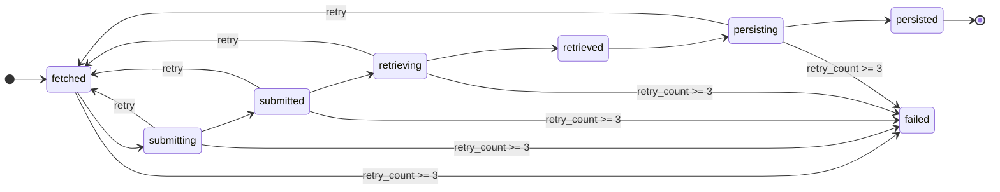

# 레시피 수집 상세

## 이 문서로 해결할 질문

- fetch→submit→retrieve→persist 각 단계의 책임은 무엇인가요?
- job 상태 전이와 멱등 키는 무엇인가요?
- 운영·검증은 어떻게 하나요?

전체 ETL 개요는 [레시피 수집(ETL)](../project/recipe-ingestion)을 참고하세요.

## 파이프라인


| 단계 | 주체 | 저장소·출력 |
| --- | --- | --- |
| **fetch** | standalone job | MongoDB `recipe_ingestion_jobs` (`fetched`) + Kafka |
| **submit** | standalone job | OpenAI Batch (`submitted`) |
| **retrieve** | standalone job | `retrieved_data` + Kafka |
| **persist** | Kafka consumer | PostgreSQL Recipe |

진행 상태의 기준 저장소는 MongoDB `recipe_ingestion_jobs`이며, API 커서는 `recipe_ingestion_state`를 사용합니다.

## 데이터 원천

데이터 원천은 식약처 Open API의 조리식품 레시피 DB입니다.

```text
GET /api/{keyId}/{serviceId}/json/{startIdx}/{endIdx}
```

- `source_id`는 API 응답의 `RCP_SEQ`이며, 멱등 upsert 키로 사용합니다.
- 1회 fetch는 최대 1000건이며, `fetchLimit`은 1000 이하여야 합니다.

## 상태 전이



| 전이 | 트리거 |
| --- | --- |
| → fetched | fetch job API row upsert |
| → submitted | OpenAI batch 생성 |
| → retrieved | batch output 파싱 |
| → persisted | PG upsert 성공 |
| → failed | retry ceiling |

## submit Consumer

- `recipe-ingestion-fetch-completed` 토픽을 구독합니다.
- payload는 `{ startSourceId, endSourceId, fetchedCount, triggeredAt }` 형식입니다.
- consumer는 payload를 트리거 신호로 사용하고, 실제 제출 대상은 MongoDB `status: fetched` 재조회 결과로 결정합니다.
- `fetched` → `submitting` 조건부 전환으로 멱등성을 보장합니다.

## persist Consumer

- `recipe-ingestion-retrieved` 토픽을 구독합니다.
- payload는 `{ startSourceId, endSourceId, fetchedCount, triggeredAt }` 형식입니다.
- consumer는 payload를 트리거 신호로 사용하고, 실제 persist 대상은 MongoDB `status: retrieved` + `source_id` 구간 재조회 결과로 결정합니다.
- `retrieved` → `persisting` 조건부 전환으로 멱등성을 보장합니다.
- PostgreSQL에는 `(source, sourceRecipeId)` unique upsert로 저장합니다.

## CLI

```bash
pnpm run recipe-ingestion:fetch
pnpm run recipe-ingestion:submit --submit-batch-size 50
pnpm run recipe-ingestion:submit --start-source-id 1 --end-source-id 100
pnpm run recipe-ingestion:retrieve
pnpm run recipe-ingestion:persist --job-id <jobId>
```

### fetch

| 매개변수 | 기본값 | 설명 |
| --- | --- | --- |
| `--fetch-limit <n>` | 100 | 1회 fetch 건수. 양의 정수, 최대 1000 |

### submit

| 매개변수 | 기본값 | 설명 |
| --- | --- | --- |
| `--submit-batch-size <n>` | 100 | 1회 OpenAI Batch 제출 건수. 양의 정수, 최대 1000 |
| `--start-source-id <n>` | — | 처리할 `source_id` 하한. `--end-source-id` 미지정 시 `startSourceId + submitBatchSize - 1` |
| `--end-source-id <n>` | — | 처리할 `source_id` 상한(max index). `--start-source-id` 미지정 시 `source_id <= endSourceId` |
| `--retry-failed` | — | `failed` job을 `fetched`로 되돌린 뒤 재제출 |
| `--retry-failed-limit <n>` | 100 | `--retry-failed` 시 1회 처리 상한 |

### retrieve

별도의 매개변수 없이 `status: submitted` job의 OpenAI Batch 완료를 확인하고 결과를 반영합니다.

### persist

| 매개변수 | 기본값 | 설명 |
| --- | --- | --- |
| `--persist-batch-size <n>` | 100 | `--job-id` 미지정 시 1회 처리할 `retrieved` job 수 |
| `--job-id <jobId>` | — | 지정 job만 수동 persist (Kafka 재전달·복구용) |

## 운영 검증

아래 시나리오로 fetch→submit→retrieve→persist happy path와 복구 경로를 확인합니다.

| # | 시나리오 | 확인 포인트 |
| --- | --- | --- |
| 1 | fetch (소량 `--fetch-limit`) | MongoDB `recipe_ingestion_jobs`에 `fetched` 증가·`recipe-ingestion-fetch-completed` 발행 |
| 2 | submit consumer (상시) | `submitted`·OpenAI `batch_id` 기록 |
| 3 | retrieve | `retrieved`·`recipe-ingestion-retrieved` 토픽 발행 |
| 4 | persist consumer (상시) | PostgreSQL Recipe upsert·job `persisted` |
| 5 | submit `--retry-failed --retry-failed-limit N` | `failed` job 재큐잉 후 재submit |
| 6 | Kafka 재전달·`persist --job-id` | 멱등 persist·수동 복구 |

메트릭(`recipe_ingestion_stage_total` 등) 확인 절차는 [Observability](../other/observability)를 참고하세요.

## 관련 문서

- [레시피 수집(ETL)](../project/recipe-ingestion)
- [배치/스케줄 작업](./batch-jobs)
- [Kafka 소비/신뢰성](./kafka-reliability)
- [Consumer 운영](./operations)
