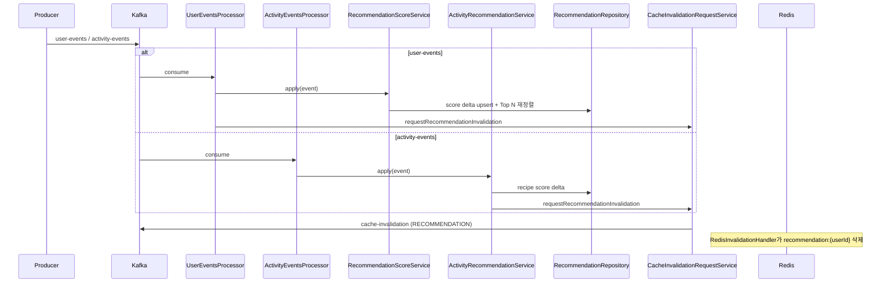

# 추천 파이프라인

## 이 문서로 해결할 질문

- Consumer가 추천 점수를 어떻게 갱신하나요?
- `user-events`·`activity-events` 중 어떤 이벤트가 `UserRecipeRecommendation`에 반영되나요?
- Top N 재정렬·캐시 무효화는 어떤 순서로 일어나나요?
- 추천 반영이 느릴 때 어디를 확인하나요?

## Consumer 책임

Producer가 발행한 Kafka 이벤트를 소비해 PostgreSQL `user_recipe_recommendations` 원본 테이블의 점수를 갱신하고, `cache-invalidation` 토픽으로 `recommendation:{userId}` Redis 키 삭제를 요청합니다.

조회·캐시·API 응답은 Producer가 담당합니다. 전체 흐름은 [추천 시스템](../project/recommendation)을 참고하세요.

## Kafka 진입점

| 토픽 | 그룹 | 핸들러 | DLQ |
| --- | --- | --- | --- |
| `user-events` | `analytics-group` | `RecommendationHandler` | `user-events-dlq` |
| `activity-events` | `activity-events-group` | `ActivityRecommendationService` | `activity-events-dlq` |

`user-events` processor는 프로필·재고 갱신 후 **항상** `RecommendationHandler`를 호출합니다. `activity-events`는 EventLog 저장·조회수 증가 후 추천 보정을 시도하며, 추천 실패만 warn 로그로 남기고 offset commit은 계속합니다.

## 처리 흐름

## 점수 갱신 알고리즘

`RecommendationRepository`가 단일 트랜잭션으로 다음을 수행합니다.

1. 이벤트별 `score` delta를 `(userId, recipeId)`에 upsert합니다. 신규 행은 임시 rank(`9999 + recipeId`)로 충돌을 방지합니다.
2. `score > 0` 후보를 `score DESC → updatedAt DESC → recipeId ASC` 순으로 정렬합니다.
3. 해당 사용자의 행을 모두 삭제한 뒤 상위 **10건**(`MAX_RECOMMENDATION_ROWS`)만 rank 1..N으로 다시 작성합니다.

재료 이벤트는 `recipe_ingredients`에서 연관 `recipeId`를 조회(최대 200건)한 뒤, 각 레시피에 동일 delta를 적용합니다.

## user-events 가중치

`RecommendationScoreService`가 처리합니다. `signup`·`login`·`nickname.update`·`userId <= 0`은 무시합니다.

| 이벤트 | delta | 적용 대상 |
| --- | --- | --- |
| `recipe.favorites_add` | +1.8 | `favoriteRecipeIds` |
| `recipe.favorites_remove` | -1.8 | `recipeId` |
| `ingredient.favorites_add` | +0.8 | 연관 레시피 |
| `ingredient.favorites_remove` | -0.8 | 연관 레시피 |
| `ingredient.favorites_update` | +0.5 | 연관 레시피 |
| `ingredient.add` | +0.25 | 연관 레시피 |
| `ingredient.update` | +0.15 | 연관 레시피 |
| `ingredient.remove` | -0.2 | 연관 레시피 |

## activity-events 가중치

`ActivityRecommendationService`가 처리합니다. 로그인 사용자(`actor.userId > 0`)이고 `recipeId`를 resolve할 수 있을 때만 반영합니다.

| 이벤트 | delta | 비고 |
| --- | --- | --- |
| `recipe.view` | +0.1 | `entity.type === 'recipe'` 또는 `payload.recipeId` |
| `recipe.share` | +0.4 | 동일 |
| `search.click` | +0.25 | 클릭한 레시피 ID |
| `search.query` | — | delta 0, 추천 미반영 |

`recipe.view`의 조회수 증가(`Recipe.viewCount`)는 추천과 별도로 `ActivityEventsProcessor`에서 처리합니다.

## 캐시 무효화

점수 갱신 직후 `CacheInvalidationRequestService.requestRecommendationInvalidation(userId)`를 호출합니다.

| 항목 | 값 |
| --- | --- |
| 발행 토픽 | `cache-invalidation` |
| payload type | `RECOMMENDATION` |
| 삭제 키 | `recommendation:{userId}` |

Handler는 Kafka를 직접 발행하지 않습니다. 자세한 내용은 [캐시 무효화](./cache-invalidation)를 참고하세요.

## 신뢰성

| 항목 | 동작 |
| --- | --- |
| 전달 보장 | at-least-once — `(userId, recipeId)` upsert로 중복 delta 안전 |
| user-events 실패 | processor 전체 재시도 → `user-events-dlq` |
| activity-events 추천 실패 | warn 로그만, EventLog·조회수 처리는 유지 |
| 파티션 키 | `cache-invalidation`은 `userId` 기준 순서 보장 |

## 주요 구현 경로

| 항목 | 경로 |
| --- | --- |
| user-events processor | `consumers/user-events/user-events.processor.ts` |
| user-events 핸들러 | `consumers/user-events/handlers/RecommendationHandler.ts` |
| user-events 점수 | `consumers/user-events/services/recommendation-score.service.ts` |
| activity-events 보정 | `consumers/activity-events/services/activity-recommendation.service.ts` |
| 원본 테이블·Top N | `persistence/repositories/postgresql/recommendation.repository.ts` |
| Top N 상한 | `@mealio/shared` `MAX_RECOMMENDATION_ROWS` (= 10) |

## 운영·KPI

- **E2E 지연 KPI** `kpi_recommendation_e2e_latency`는 EventLog `recipe.favorites_add`의 `occurredAt`부터 `processedAt`까지 p95를 측정합니다.
- 일별 롤업은 `jobs/kpi-rollup/kpi-rollup.service.ts` cron 잡이 담당합니다.
- 지연 알림은 [Observability](../other/observability)와 [Consumer 운영 — 추천 반영 지연](./operations#추천-반영-지연-alert_reco_latency)을 참고하세요.

지연 발생 시 확인 순서는 `user-events` lag → `RecommendationHandler` DB 트랜잭션 → `activity-events` warn 로그입니다.

## 변경 시 체크리스트

1. 가중치를 변경하면 `recommendation-score.service.ts`와 `activity-recommendation.service.ts`를 수정하고 [추천 시스템](../project/recommendation) 요약 표를 갱신합니다.
2. Top N 상한을 변경하면 `recommendation.policy.ts`의 `MAX_RECOMMENDATION_ROWS`와 Producer `GET /recipes/recommended` limit을 함께 맞춥니다.
3. 캐시 키를 변경하면 [Redis 키/캐시 계약](../shared/redis-cache-contract)과 [producer 캐시](../producer/cache)를 함께 갱신합니다.

## 관련 문서

- [추천 시스템](../project/recommendation)
- [Consumer 아키텍처](./architecture)
- [캐시 무효화](./cache-invalidation)
- [Kafka 소비/신뢰성](./kafka-reliability)
- [추천 API](../producer/recommendation-api)
