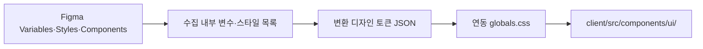

# Design System / Design-to-Code

## 이 문서로 해결할 질문

- Figma 디자인을 코드로 옮길 때 무엇을 기준으로 봐야 하나요?
- 디자인 토큰 → CSS 워크플로우는 무엇인가요?
- 구현 시 금지·권장 사항은 무엇인가요?

## 토큰·스타일 계층

| 순서 | 근거 | 역할 |
| --- | --- | --- |
| 1 | 내부 디자인 토큰 JSON · `client/src/.../globals.css` | 컬러·타이포·스페이싱·컴포넌트 토큰 |
| 2 | `client/src/.../globals.css` | `:root`, `@theme`, 컴포넌트 recipe |
| 3 | [접근성·성능](../client/accessibility-performance) | UX·a11y·성능·톤 원칙 |

Figma MCP 출력(React+Tailwind)은 **참고용** — 프로젝트 스택에 맞게 변환합니다.

## Design-to-Code 워크플로우



| 단계 | 내용 |
| --- | --- |
| 1. 수집 | Figma 변수·로컬 스타일을 내부 목록 문서로 정리 |
| 2. 변환 | 목록을 구조화된 디자인 토큰 JSON으로 반영 |
| 3. 연동 | 토큰을 `globals.css`에 매핑 |
| 4. 구현 | 컴포넌트·페이지에 토큰·variant 적용 |

코드·웹을 Figma에 반영할 때는 내부 Code-to-Design 가이드를 따릅니다.

## 구현 총칙 (요약)

1. **토큰 우선** — hex·px를 JSX에 하드코딩하지 않음
2. **시맨틱 HTML + 전역 타이포** — Figma 텍스트 스타일 → 태그·유틸 클래스
3. **variant 1:1** — Figma 컴포넌트 프로퍼티 ↔ 코드 `variant` prop
4. **아이콘** — `lucide-react`, 개별 import
5. **날짜/시간** — `client/src/.../date.ts` 포맷 함수 사용

## 컴포넌트 배치

- UI 프리미티브: `client/src/.../ui/`
- 도메인 UI: `client/src/.../{recipe|chatbot|...}/`

→ [컴포넌트 구조/규칙](../client/components)

## Storybook

컴포넌트별 `*.stories.tsx` — 기본 + 의미 있는 변형(로딩, 에러, 빈 상태).

```bash
pnpm run start:storybook
pnpm run build:storybook
```

## 분석·품질

토큰 구조·대비·중복은 내부 디자인 시스템 분석 절차로 검토하고, 권장 수정사항은 내부 피드백 문서로 관리합니다.

## 관련 문서

- [접근성/성능 기준](../client/accessibility-performance)
- [컴포넌트 구조](../client/components)
- Figma: [Mealio 디자인 파일](https://www.figma.com/design/r9bdZPeswvPR1ncezzt4ri/Mealio)
