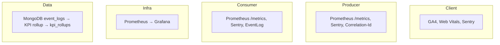

# Observability

## 이 문서로 해결할 질문

- Mealio 관측성 스택 구성은 무엇인가요?
- 로그·메트릭·이벤트·KPI 문서는 어디에 있나요?
- 배포 후 검증은 어떻게 하나요?

## 스택 개요

## Observability 문서 맵

| 주제 | 설명 | 관련 문서 |
| --- | --- | --- |
| 통합 검증 | 헬스·메트릭·EventLog·KPI 수동 검증 시나리오 | [검증 (배포 후)](#검증-배포-후) |
| 이벤트 사전 | GA ↔ EventLog ↔ Kafka 이벤트 매핑 | [분석 파이프라인](../consumer/analytics-pipeline) |
| KPI 계약 | KPI ID·계산식 정의 | [핵심 KPI (요약)](#핵심-kpi-요약) |
| 집계 파이프라인 | EventLog → 롤업 → 대시보드 | [분석 파이프라인](../consumer/analytics-pipeline) |
| Runbook | 알림·장애 대응 | [Consumer 운영](../consumer/operations) |
| 프론트 계측 | GA4 이벤트 체크리스트 | `client/src/.../analytics/` |

## 핵심 KPI (요약)

| KPI | 설명 |
| --- | --- |
| `kpi_recipe_favorite_cvr` | 조회 → 관심 전환율 |
| `kpi_recommendation_e2e_latency` | favorites_add → 추천 반영 지연 |
| `kpi_kafka_fail_rate` | Kafka 처리 실패율 |
| `kpi_kafka_lag_p95` | Consumer lag |
| `kpi_chatbot_dau_messages` | 챗봇 DAU 메시지 |

## Correlation-Id

클라이언트에서 Producer, Kafka, Consumer까지 요청을 전 구간에서 추적할 수 있습니다.

- 요청 헤더 `X-Correlation-Id`로 상관 ID를 전달합니다.
- 구조화 로그에는 `correlationId` 필드를 포함합니다.

## Grafana

- 대시보드 프로비저닝 설정은 `observability/grafana/`에 있습니다.
- 운영 대시보드는 `mealio-ops.json`을 사용합니다.
- 알림 규칙은 `alerting/rules.yml`에 정의하며, Slack `#ops`와 `#product` 채널로 전송합니다.

로컬 환경에서는 Grafana를 `:3030` 포트에서 확인할 수 있으며, `compose-monitoring`으로 기동합니다.

## 검증 (배포 후)

배포 후 아래 항목을 순서대로 확인합니다.

1. `/health`, `/ready` 엔드포인트가 정상 응답하는지 확인합니다.
2. Correlation-Id가 전 구간에 전파되는지 확인합니다.
3. Prometheus가 메트릭을 정상적으로 스크랩하는지 확인합니다.
4. Sentry 테스트 이벤트가 수신되는지 확인합니다.
5. GA4 `page_view` 이벤트가 기록되는지 확인합니다.
6. EventLog 파이프라인이 동작하는지 확인합니다.
7. KPI 롤업 job이 정상 실행되는지 확인합니다.

## 관련 문서

- [이벤트/분석 파이프라인](../consumer/analytics-pipeline)
- [Producer 운영](../producer/operations)
- [Consumer 운영/복구](../consumer/operations)
