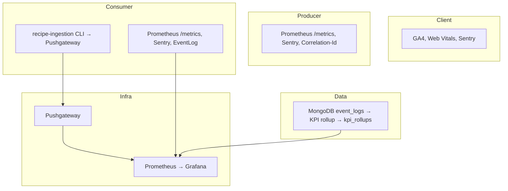

# Observability

## 이 문서로 해결할 질문

- Mealio 관측성 스택 구성은 무엇인가요?
- 로그·메트릭·이벤트·KPI 문서는 어디에 있나요?
- 배포 후 검증은 어떻게 하나요?

## 스택 개요



## 문서 맵

| 주제 | 설명 | 관련 문서 |
| --- | --- | --- |
| 통합 검증 | 헬스·메트릭·EventLog·KPI 수동 검증 시나리오 | [검증 (배포 후)](#검증-배포-후) |
| 이벤트 사전 | GA ↔ EventLog ↔ Kafka 이벤트 매핑·네이밍 | [이벤트 등록·네이밍](#이벤트-등록네이밍) · [분석 파이프라인](../consumer/analytics-pipeline) |
| KPI 계약 | KPI ID·계산식·SSOT 분리 | [핵심 KPI (요약)](#핵심-kpi-요약) |
| 집계 파이프라인 | EventLog → 롤업 → 대시보드 | [분석 파이프라인](../consumer/analytics-pipeline) |
| Runbook | 알림·장애 대응 | [알림·장애 대응](#알림장애-대응) · [Consumer 운영](../consumer/operations) |
| 프론트 계측 | GA4 이벤트 체크리스트 | `client/src/.../analytics-events.ts` |

## 이벤트 등록·네이밍

신규 이벤트는 **본 문서와 내부 이벤트 사전에 등록한 뒤** 코드에 반영합니다.

| 계층 | 형식 | 예 |
| --- | --- | --- |
| GA4 (프론트) | `snake_case` | `recipe_viewed`, `chatbot_message_sent` |
| EventLog / Kafka | `domain.action` | `recipe.view`, `recipe.favorites_add` |
| Kafka 토픽 | `kebab-case` | `activity-events`, `user-events` |

GA4는 UI 퍼널, EventLog는 도메인 확정·추천·KPI 원본의 단일 근거입니다.

등록 절차와 파이프라인 상세는 [이벤트/분석 파이프라인](../consumer/analytics-pipeline) 문서를 참고합니다.

## 핵심 KPI (요약)

| KPI | 설명 | SSOT |
| --- | --- | --- |
| `kpi_recipe_favorite_cvr` | 조회 → 관심 전환율 | EventLog (일 롤업) |
| `kpi_search_click_rate` | 검색 클릭률 | EventLog (일 롤업) |
| `kpi_ga_recipe_funnel` | GA 퍼널(상세→저장) | GA4 |
| `kpi_chatbot_dau_messages` | 챗봇 일간 메시지 유저 수 | EventLog |
| `kpi_kafka_fail_rate` | Kafka 처리 실패율 | Prometheus (Consumer) |
| `kpi_kafka_lag_p95` | Consumer lag p95 | Prometheus (Consumer) |
| `kpi_recommendation_e2e_latency` | favorites_add → 추천 반영 지연 | EventLog |
| `kpi_dlq_backlog` | DLQ 적체 | Prometheus + Kafka |

운영 메트릭(Prometheus)과 제품 이벤트(EventLog·GA4)는 **수집 경로를 분리**합니다.

always-on Consumer는 `METRICS_PORT` `/metrics`로 scrape하고, recipe-ingestion **CLI** batch job은 종료 직전 Pushgateway로 push합니다 (`PUSHGATEWAY_URL` 설정 시). Prometheus는 Pushgateway를 함께 scrape합니다.

## Correlation-Id

클라이언트에서 Producer, Kafka, Consumer까지 요청을 전 구간에서 추적할 수 있습니다.

- 요청 헤더 `X-Correlation-Id`로 상관 ID를 전달합니다.
- 구조화 로그에는 `correlationId` 필드를 포함합니다.
- Consumer 실패·DLQ 로그에는 `correlationId`와 `sentryEventId`를 함께 남깁니다.

## Grafana

- 대시보드 프로비저닝 설정은 `observability/grafana/`에 있습니다.
- 운영 대시보드는 `mealio-ops.json`을 사용합니다.
- 알림 규칙은 `alerting/rules.yml`에 정의하며, Slack `#ops`와 `#product` 채널로 전송합니다.

로컬 환경에서는 Grafana `:3030`, Prometheus `:9090`, Pushgateway `:9091`에서 확인할 수 있습니다.

```bash
docker compose -f docker/compose-database.yml -f docker/compose-kafka.yml -f docker/compose-monitoring.yml up -d
```

## 알림·장애 대응

운영(Ops)과 제품(Product) 알림을 분리합니다.

| Alert ID | KPI | 채널 |
| --- | --- | --- |
| `ALERT_KAFKA_FAIL_RATE` | `kpi_kafka_fail_rate` | Slack #ops |
| `ALERT_KAFKA_LAG` | `kpi_kafka_lag_p95` | Slack #ops + on-call |
| `ALERT_DLQ_SPIKE` | `kpi_dlq_backlog` | Slack #ops |
| `ALERT_RECO_LATENCY` | `kpi_recommendation_e2e_latency` | Slack #product |
| `ALERT_CVR_DROP` | `kpi_recipe_favorite_cvr` | Slack #product |
| `ALERT_CHATBOT_DAU` | `kpi_chatbot_dau_messages` | Slack #product |

장애 대응 절차와 임계치 근거는 [Consumer 운영/복구](../consumer/operations) 문서를 참고합니다.

## 검증 (배포 후)

staging 또는 로컬 Compose 인프라에서 아래 항목을 순서대로 확인합니다.

1. `/health`, `/ready` 엔드포인트가 정상 응답하는지 확인합니다.
2. Correlation-Id가 Producer·Kafka·Consumer 전 구간에 전파되는지 확인합니다.
3. Producer·Consumer `/metrics`, **Pushgateway**, Prometheus 타겟이 `UP`인지 확인합니다.
4. Sentry 테스트 이벤트가 수신되는지 확인합니다.
5. GA4 `page_view` 이벤트가 기록되는지 확인합니다.
6. EventLog 파이프라인(`activity-events`, `user-events`)이 동작하는지 확인합니다.
7. KPI 롤업 job(`pnpm run kpi:rollup`)이 정상 실행되는지 확인합니다.

## 관련 문서

- [이벤트/분석 파이프라인](../consumer/analytics-pipeline)
- [Producer 운영](../producer/operations)
- [Consumer 운영/복구](../consumer/operations)
- [기여 가이드](./contributing)
