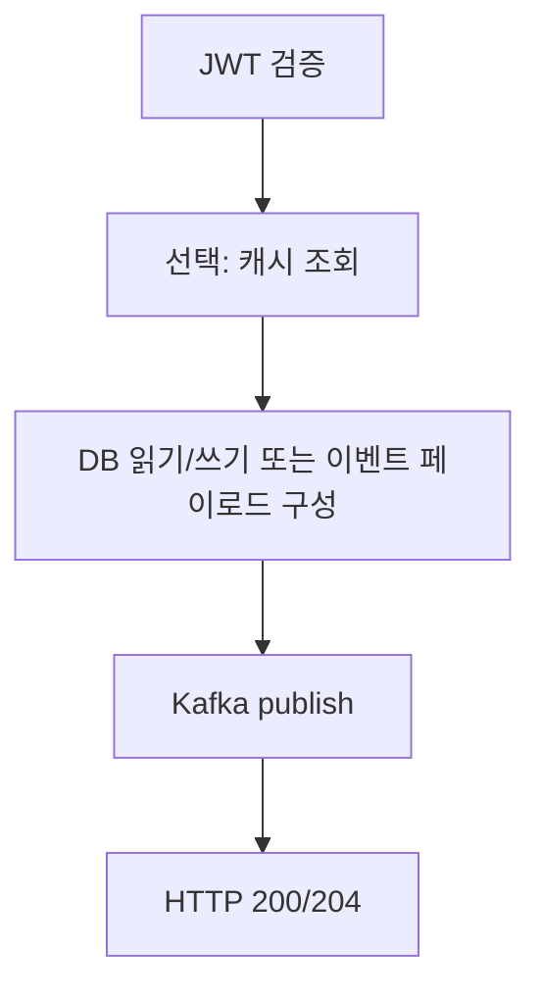

# 아키텍처

## 이 문서로 해결할 질문

- NestJS 모듈 구조와 책임 경계는 무엇인가요?
- 인프라 레이어는 어떻게 구성되나요?
- Kafka 발행·캐시·인증이 어디에 위치하나요?

## 역할

Producer는 클라이언트 요청의 **실시간 처리**, **읽기·캐시 우선 조회**, **Kafka 이벤트 발행**, 챗봇 **SSE 중계**를 담당합니다.

GPT 호출, 추천 점수 갱신, ETL은 **Consumer**가 담당합니다.

## 모듈 구조

```text
server/producer/src/
├── main.ts / app.module.ts
├── config/           # env 검증, Swagger
├── policy/           # cache, rate-limit, chatbot TTL
├── modules/
│   ├── auth/         # OAuth, JWT, refresh
│   ├── users/        # 프로필, 활동
│   ├── recipes/      # 조회, 검색, 추천 API
│   ├── ingredients/  # 재료 검색
│   ├── inventory/    # 보관함 CRUD
│   ├── chatbot/      # 메시지, SSE
│   ├── health/       # /health, /ready
│   └── middleware/   # rate-limit, logging, correlation-id
├── infrastructure/
│   ├── cache/        # Cache-Aside 전략
│   ├── database/     # Prisma/Mongoose repositories
│   └── kafka/        # Producer service
└── optimization/
    └── monitoring/   # Prometheus /metrics
```

## 도메인 모듈 패턴

| 레이어 | 역할 |
| --- | --- |
| `*.controller.ts` | HTTP 라우팅, Guard, DTO 검증 |
| `*.service.ts` | 비즈니스 로직, 캐시, Kafka 발행 |
| `dto/` | 요청·응답 계약 |
| `infrastructure/.../repository` | DB 접근 |

## 인프라

| 인프라 | 용도 |
| --- | --- |
| PostgreSQL (Prisma) | User, Recipe, Ingredient, 추천 원본 테이블 |
| MongoDB (Mongoose) | Inventory, EventLog, ChatbotLog, ChatbotConversation |
| Redis | Cache-Aside, rate limit, refresh 세션 캐시 |
| Kafka | `user-events`, `activity-events`, `chatbot-requests` |

## 쓰기 API 패턴



클라이언트는 Optimistic UI로 즉시 UX를 반영합니다.

## 관측성

- `server/producer/.../correlation-id.middleware.ts`는 요청을 추적합니다.
- `server/producer/.../metrics.controller.ts`는 `METRICS_ENABLED=true`일 때 `PORT`와 동일 포트의 `/metrics`를 노출합니다.
- Sentry 연동은 `@mealio/shared/observability`를 사용합니다.

## 정책 파일

| 파일 | 내용 |
| --- | --- |
| `server/producer/.../cache.policy.ts` | Redis TTL(초) |
| `server/producer/.../rate-limit.policy.ts` | 윈도우·최대 요청 |
| `server/producer/.../chatbot.policy.ts` | SSE 타임아웃 |

## 관련 문서

- [환경 변수](./environment-variables)
- [도메인 API 가이드](./domain-api)
- [인증/인가](./auth)
- [캐시](./cache)
- [이벤트 발행](./event-publishing)
- [챗봇/SSE](./chatbot-sse)
- [운영](./operations)
- [시스템 아키텍처](../project/architecture)
