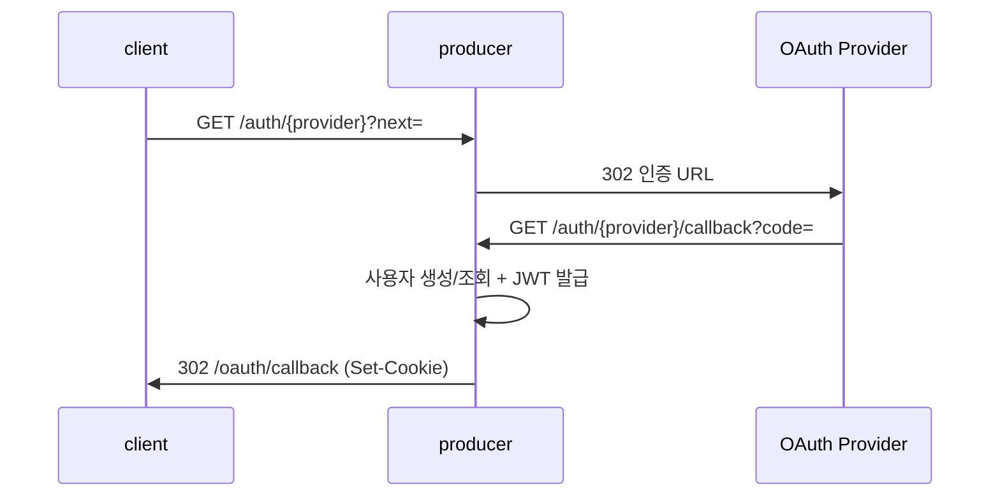

# 인증/인가

## 이 문서로 해결할 질문

- Producer OAuth·JWT·Refresh 흐름은 무엇인가요?
- Guard 종류와 적용 기준은 무엇인가요?
- Refresh Token 저장소와 회전 정책은 무엇인가요?

## OAuth (백엔드 주도)

클라이언트는 `GET /api/v1/auth/{provider}`만 호출합니다. Code 교환·JWT 발급·쿠키 설정은 Producer가 처리합니다.

### API 요약

| Method | Path | 동작 |
| --- | --- | --- |
| GET | `/api/v1/auth/{provider}` | Provider 인증 URL로 302 |
| GET | `/api/v1/auth/{provider}/callback` | Code 교환 → JWT 쿠키 → 프론트 302 |
| POST | `/api/v1/auth/refresh` | Refresh 회전 → 새 쿠키 |
| POST | `/api/v1/auth/logout` | 쿠키 삭제 + 세션 revoke |

지원 Provider는 `google`, `kakao`, `naver`입니다.

필요한 환경 변수는 Client ID/Secret, `FRONTEND_APP_BASE_URL`, `FRONTEND_OAUTH_SUCCESS_CALLBACK_PATH`, `FRONTEND_OAUTH_ERROR_PATH`입니다.

## JWT·Guard

| Guard | 동작 | 사용 예 |
| --- | --- | --- |
| `JwtAuthGuard` | Access Token 필수, 없으면 401 | 추천 API, 프로필 수정 |
| `OptionalJwtAuthGuard` | 토큰 없으면 익명 통과, 무효 토큰은 401 | 조회수 기록 등 |
| `OAuthCallbackGuard` | state 검증 등 콜백 보안 | OAuth callback |

데코레이터는 `@CurrentUser()`, `@CurrentUserOptional()`을 사용합니다.

구현은 `server/producer/.../guards/`에 있습니다.

## Refresh Token

| 항목 | 계약 |
| --- | --- |
| 형식 | Opaque `sessionId.secret` |
| 저장소 | PostgreSQL `auth_refresh_sessions` |
| 캐시 | Redis `auth:refresh:session:{sessionId}` (가속용) |
| 회전 | refresh 성공 시 기존 revoke + 신규 발급 |
| 재사용 탐지 | revoke된 세션 재사용 → 해당 유저 활성 세션 일괄 revoke + 401 |

쿠키 속성은 HttpOnly, Secure, SameSite=Lax, Path=/로 설정합니다.

## `next` 리다이렉트 안전 정책

- `next`는 `/`로 시작하는 상대 경로만 허용하며 `//`는 금지합니다.
- 검증은 `resolveSafeNextPath`(백엔드 전용)로 수행합니다.
- OAuth 실패 시에도 안전한 `next`만 에러 페이지로 전달합니다.

## OAuth 실패 처리

`oauth-callback-exception.filter.ts`는 Provider 에러나 state 불일치 시 `FRONTEND_OAUTH_ERROR_PATH`로 302 리다이렉트합니다(`errorCode`, `errorMessage` 포함).

## 주요 모듈 경로

| 경로 | 역할 |
| --- | --- |
| `modules/.../auth.controller.ts` | OAuth·refresh·logout |
| `modules/.../*.strategy.ts` | Google/Kakao/Naver Passport |
| `modules/auth/auth.service.ts` | 사용자 생성/조회, JWT 발급 |

## 관련 문서

- [인증 (client)](../client/auth)
- [API 문서](./api)
