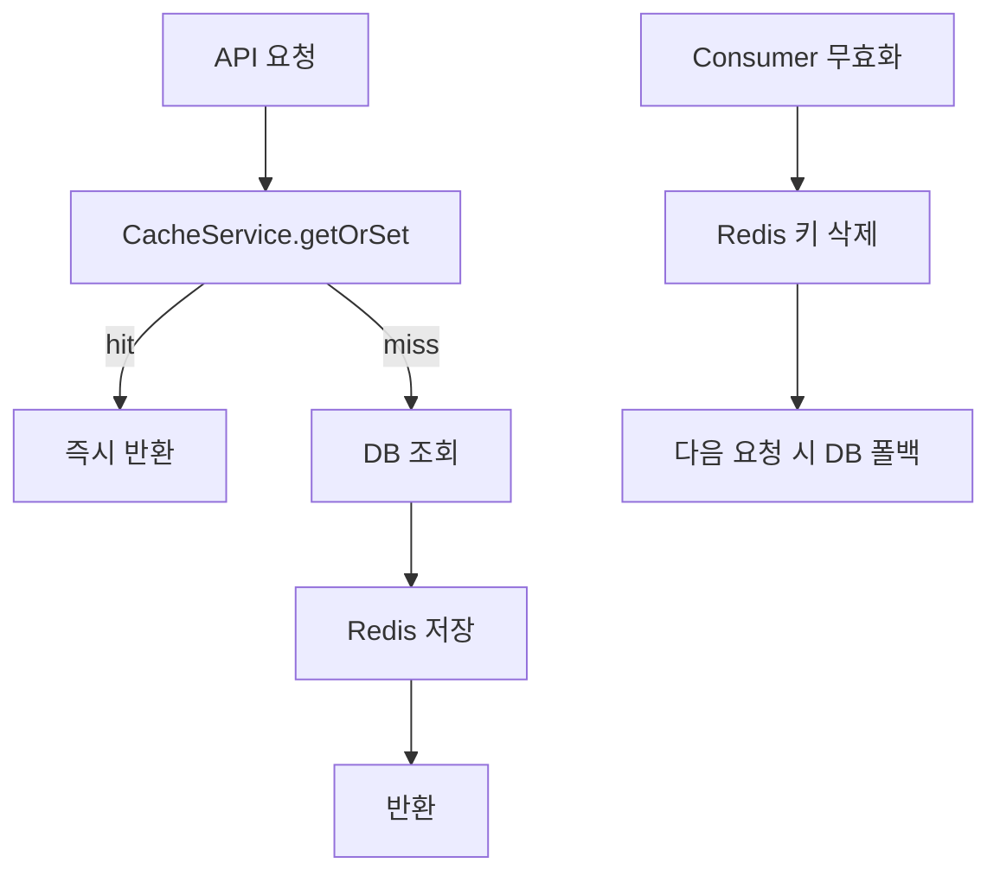

# 캐시

## 이 문서로 해결할 질문

- Producer Redis Cache-Aside 패턴은 무엇인가요?
- 도메인별 TTL·캐시 키는 무엇인가요?
- 캐시 miss·무효화 후 동작은 어떻게 되나요?

## Cache-Aside 패턴

구현은 `server/producer/.../cache/`에 있습니다.

## TTL 정의

TTL은 `server/producer/.../cache.policy.ts`에서 초 단위로 정의합니다.

| 상수 | TTL | 도메인 |
| --- | --- | --- |
| `CACHE_TTL_RECIPE_LIST_SECONDS` | 300 (5분) | 레시피 목록·검색 |
| `CACHE_TTL_RECIPE_DETAIL_SECONDS` | 900 (15분) | 레시피 상세 |
| `CACHE_TTL_RECOMMENDATION_SECONDS` | 3600 (1시간) | 개인화 추천 |
| `CACHE_TTL_INGREDIENT_SECONDS` | 86400 (24시간) | 재료 목록·검색 |
| `CACHE_TTL_INVENTORY_SECONDS` | 300 (5분) | 내 재료함 |
| `CACHE_TTL_USER_PROFILE_SECONDS` | 300 (5분) | 유저 프로필 |

각 도메인은 `*-cache-strategy.ts`에서 위 상수를 import합니다.

## 전략 클래스

| 파일 | 키 패턴 | 비고 |
| --- | --- | --- |
| `user-cache-strategy.ts` | `user:{userId}` | |
| `inventory-cache-strategy.ts` | `inventory:{userId}` | |
| `recommendation-cache-strategy.ts` | `recommendation:{userId}` | [추천 API](./recommendation-api) |
| recipe/ingredient 전략 | `recipe:*`, `ingredient:*` | list/search/categories |

키 헬퍼는 `@mealio/shared` `cache-keys.ts`에 정의되어 있으며, [Redis 키/캐시 계약](../shared/redis-cache-contract)을 참고하세요.

## 무효화 (Consumer 연동)

`cache-invalidation` 토픽을 소비하는 `RedisInvalidationHandler`가 Redis 키를 삭제합니다.

| 무효화 타입 | 삭제 대상 |
| --- | --- |
| `USER_PROFILE` | `user:{userId}` |
| `INVENTORY` | `inventory:{userId}` |
| `RECIPE` | `recipe:{id}`, `recipe:list:*`, `recipe:search:*` |
| `RECOMMENDATION` | `recommendation:{userId}` |

→ [캐시 무효화](../consumer/cache-invalidation)를 참고하세요.

## Rate Limiting (별도 네임스페이스)

`rate_limit:api:{identifier}:{windowId}` 키로 Redis 기반 API 요청 제한을 적용하며, 애플리케이션 데이터 캐시와 분리됩니다.

구현은 `server/producer/.../rate-limit.middleware.ts`에 있습니다.

## 변경 시 체크리스트

1. TTL을 변경할 때는 `cache.policy.ts`와 해당 `*-cache-strategy.ts`를 함께 수정합니다.
2. 새 캐시 키를 추가할 때는 `server/shared/.../cache-keys.ts`와 무효화 패턴을 함께 갱신합니다.
3. 무효화 트리거를 추가할 때는 Consumer `CacheInvalidationRequestService`를 함께 수정합니다.

## 관련 문서

- [캐시 (client)](../client/cache)
- [캐시 무효화 (consumer)](../consumer/cache-invalidation)
- [Redis 키/캐시 계약](../shared/redis-cache-contract)
- [추천 API](./recommendation-api)
- [도메인 API 가이드](./domain-api)
