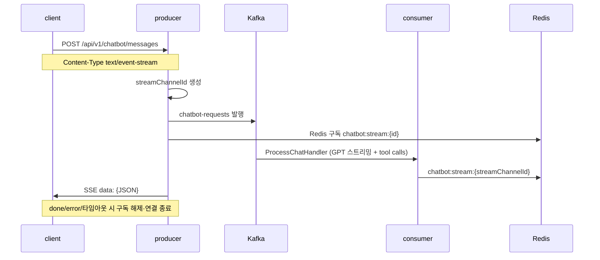

# 챗봇/SSE

## 이 문서로 해결할 질문

- Producer가 챗봇 요청을 받아 SSE로 스트리밍하는 흐름은 무엇인가요?
- Redis 채널·이벤트 계약은 무엇인가요?
- SSE 연결 종료 조건은 무엇인가요?

## 6단계 흐름



`POST /chatbot/messages` 한 요청이 SSE 응답을 반환합니다.

## API

| Method | Path | 역할 |
| --- | --- | --- |
| POST | `/api/v1/chatbot/messages` | 메시지 전송 + SSE 스트림 응답 (`text/event-stream`) |
| GET | `/api/v1/chatbot/conversations` | 대화 목록 |
| GET | `/api/v1/chatbot/conversations/{id}` | 대화 상세 |

인증은 JWT가 필수이며 `JwtAuthGuard`를 적용합니다.

## Redis·이벤트 계약

| 항목 | 값 |
| --- | --- |
| 채널 | `chatbot:stream:{streamChannelId}` |
| 헬퍼 | `@mealio/shared` `getChatbotStreamChannel()` |
| 이벤트 | `ChatbotStreamEvent` |

### 이벤트 타입

| type | payload 요약 |
| --- | --- |
| `chunk` | 스트리밍 텍스트 조각 |
| `tool_call` | Function Calling 진행 |
| `done` | `conversationId`, `isCreditDepleted`, 선택 `suggestedRecipes` |
| `error` | 오류 메시지 |

`done` 이벤트 계약 상세는 [챗봇 처리 — 크레딧 멱등 차감](../consumer/chatbot#크레딧-멱등-차감)을 참고하세요.

## Kafka 페이로드

토픽은 `chatbot-requests`(`KAFKA_TOPICS.CHATBOT_REQUESTS`)입니다.

```json
{
  "userId": 1,
  "message": "오늘 뭐 먹지?",
  "conversationId": "conv_...",
  "streamChannelId": "stream_..."
}
```

GPT tool call 시 Consumer가 DB/Redis에서 직접 조회합니다.

## Producer 모듈

| 경로 | 역할 |
| --- | --- |
| `server/producer/.../chatbot.controller.ts` | messages(SSE)·conversations 엔드포인트 |
| `server/producer/.../chatbot.service.ts` | Kafka 발행, Redis 구독, SSE 전달 |

SSE 타임아웃은 `server/producer/.../chatbot.policy.ts`의 `CHATBOT_STREAM_TIMEOUT_MS`로 제한됩니다.

## 설계 원칙

- Producer는 GPT를 호출하지 않으며, 비동기 처리는 Consumer가 전담합니다.
- SSE는 Redis 이벤트를 **그대로** 클라이언트에 전달하며 변환을 최소화합니다.
- `streamChannelId`당 크레딧 멱등 차감은 Consumer `ChatbotCreditService`가 처리합니다.

## 관련 문서

- [챗봇 UI/스트리밍](../client/chatbot-ui)
- [챗봇 처리](../consumer/chatbot)
- [이벤트 발행](./event-publishing)
- [도메인 API 가이드](./domain-api)
