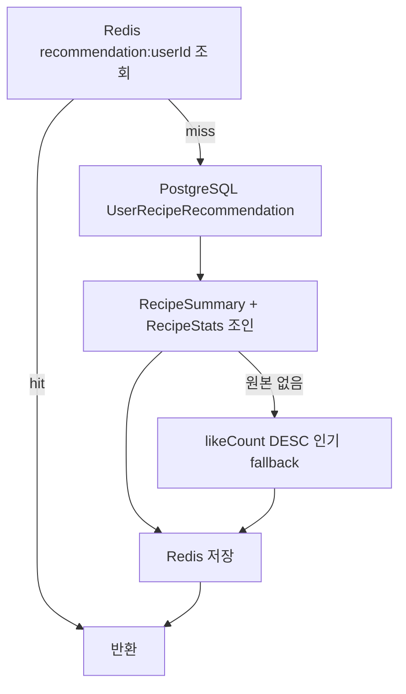

# 추천 API

## 이 문서로 해결할 질문

- `GET /recipes/recommended` 계약과 응답 필드는 무엇인가요?
- 캐시·fallback·무효화는 어떻게 동작하나요?
- Consumer 추천 파이프라인과의 관계는 무엇인가요?

전체 흐름은 [추천 시스템](../project/recommendation)을 참고하세요.

## 엔드포인트

```http
GET /api/v1/recipes/recommended?limit=10
Authorization: Cookie accessToken (JWT 필수)
```

| 항목 | 값 |
| --- | --- |
| 전략 | `recommendation-cache-strategy.ts` |
| 키 | `recommendation:{userId}` |
| TTL | 3600초 (`CACHE_TTL_RECOMMENDATION_SECONDS`) |

## 응답 (`RecommendedRecipeItemDto[]`)

| 필드 | 설명 |
| --- | --- |
| `recipe` | `RecipeSummary` (제목, 이미지, stats 등) |
| `rank` | 추천 순위 (1부터) |
| `score` | 추천 점수 |
| `reason` | 추천 근거 문구 |
| `calculatedAt` | 원본 갱신 시각 |

OpenAPI 스키마는 `RecipeRecommendationItem`입니다.

## 조회 로직



Fallback 시 `reason`에 초기 추천 데이터 없음을 명시합니다.

## 캐시

| 항목 | 값 |
| --- | --- |
| 전략 | `recommendation-cache-strategy.ts` |
| 키 | `recommendation:{userId}` |
| TTL | 3600초 (`CACHE_TTL_RECOMMENDATION_SECONDS`) |

무효화는 Consumer `RECOMMENDATION` 타입으로 수행하며, [캐시 무효화](../consumer/cache-invalidation)를 참고하세요.

## 프론트엔드 연동

- `/recipe` CSR 섹션은 `useRecommendedRecipes()`를 사용하며, React Query `QUERY_CACHE.recommended`를 적용합니다.
- 로그인이 필수이며, 비로그인 시 섹션을 미표시하거나 로그인을 유도합니다.

## 원본 갱신 (Consumer)

`user-events`는 `RecommendationHandler`로, `activity-events`는 `ActivityRecommendationService`로 처리되어 PostgreSQL upsert와 Top N(10) 재정렬이 수행되고, `RECOMMENDATION` 캐시 무효화가 이어집니다.

가중치 요약은 [추천 시스템 — 주요 이벤트 가중치](../project/recommendation#주요-이벤트-가중치-요약)를, 상세는 [추천 파이프라인](../consumer/recommendation-pipeline#user-events-가중치)을 참고하세요.

## 확장 시 유의

챗봇 `SuggestedRecipe`와 추천 원본 테이블를 **직접 동기화하지 않습니다**. 필요 시 챗봇 tool이 본 API를 호출하는 방식으로 확장합니다.

## 관련 문서

- [추천 파이프라인](../consumer/recommendation-pipeline)
- [Redis 키/캐시 계약](../shared/redis-cache-contract)
- [캐시 (client)](../client/cache)
