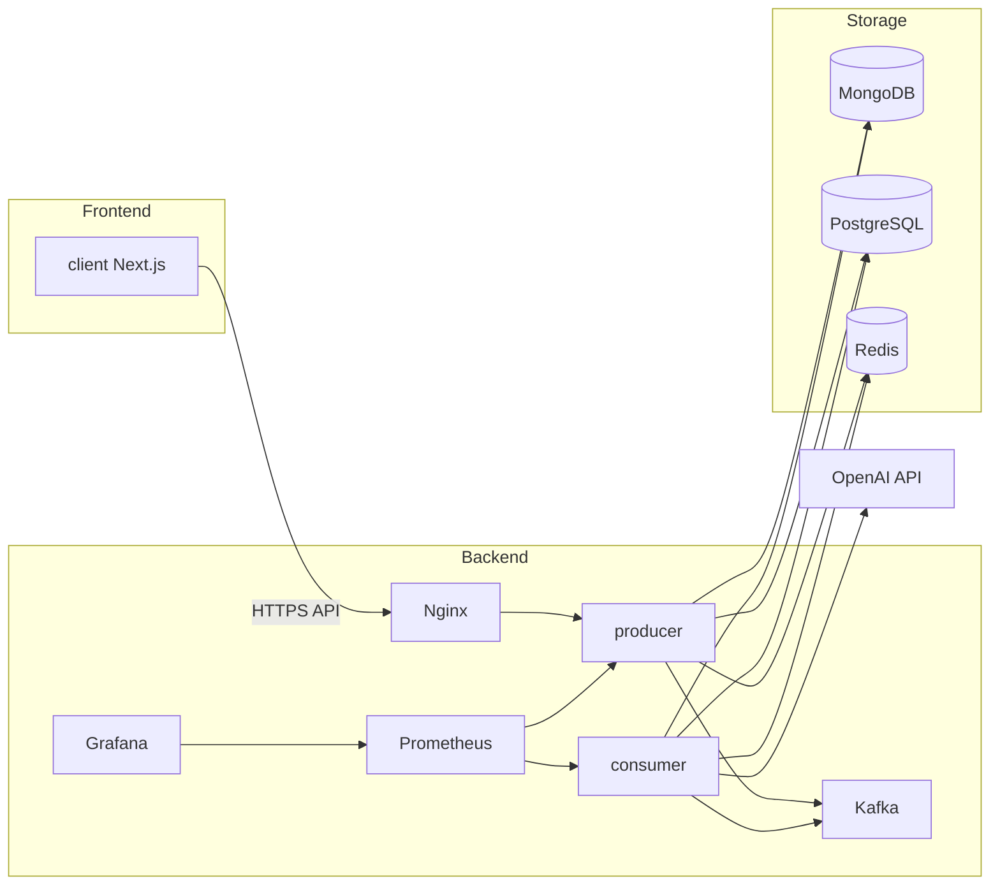
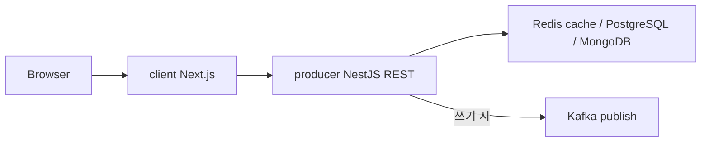
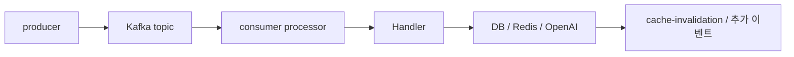

# 시스템 아키텍처

## 이 문서로 해결할 질문

- Mealio의 주요 컴포넌트와 데이터 흐름은 무엇인가요?
- 동기(HTTP)와 비동기(Kafka) 경계는 어디인가요?
- 프로덕션 인프라 배치는 어떻게 되나요?

## 컴포넌트 다이어그램

- **Frontend**: SSR·ISR을 사용하므로 Node.js 서버 런타임이 필요합니다. 백엔드와 독립적으로 배포하거나 동일 환경에 함께 배포할 수 있습니다.
- **Backend**: producer·consumer·Kafka·관측은 함께 배포되며, Nginx가 외부 요청을 라우팅합니다.

## 요청 경로 (동기)

읽기는 **Cache-Aside**를 우선 적용하며, 쓰기는 HTTP 200 응답 후 Consumer가 최종 반영합니다.

## 이벤트 경로 (비동기)

## 패키지 책임

| 패키지 | 동기/비동기 | 핵심 책임 |
| --- | --- | --- |
| `client` | 동기(HTTP/SSE) | UI, BFF Route Handler, ISR |
| `producer` | 동기 + 발행 | API, OAuth, 캐시 조회, Kafka produce, SSE 중계 |
| `consumer` | 비동기 | Kafka consume, GPT, 추천, ETL, KPI 롤업 |
| `shared` | — | 스키마, 타입, Kafka/Redis 상수 |

## 데이터 저장소 역할

| 저장소 | 데이터 예 |
| --- | --- |
| PostgreSQL | User, Recipe, Ingredient, UserRecipeRecommendation |
| MongoDB | Inventory, ChatbotLog, EventLog, ingestion jobs |
| Redis | API 캐시, refresh 세션 캐시, 챗봇 스트림, dedupe |
| Kafka | 도메인 이벤트 버스 (영속 아님) |
| S3 | 레시피 이미지 (확장) |

→ [도메인](./domain)

## 외부 서비스

| 서비스 | 사용처 |
| --- | --- |
| OpenAI | 챗봇, recipe ingestion Batch |
| Sentry | 에러 추적 (client, producer, consumer) |
| GA4 | 프론트 행동 분석 |
| CloudFlare | CDN (정적 자산·ISR) |

## 크로스 컷 관심사

| 관심사 | 구현 |
| --- | --- |
| 인증 | OAuth 백엔드 주도, JWT HttpOnly 쿠키 |
| 캐시 | Producer Cache-Aside + Consumer 무효화 |
| 관측성 | Correlation-ID, Prometheus `/metrics`, EventLog |
| 신뢰성 | Kafka at-least-once, DLQ, 멱등 키 |

## 관련 문서

- [레시피 수집(ETL)](./recipe-ingestion)
- [추천 시스템](./recommendation)
- [모노레포 구조](./monorepo)
- [배포/환경 전략](./deployment)
- [E2E 시나리오](./e2e-scenarios)
