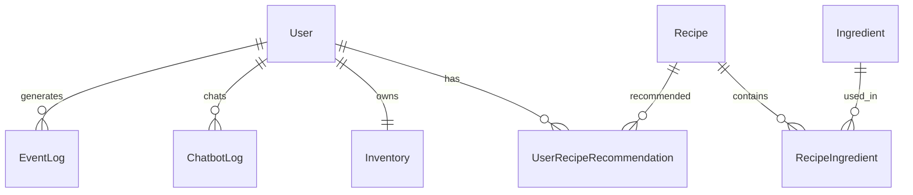

# 도메인 개요

## 이 문서로 해결할 질문

- Mealio의 핵심 엔티티와 관계는 무엇인가요?
- 어떤 데이터가 PostgreSQL에, 어떤 데이터가 MongoDB에 저장되나요?
- 추천·챗봇·이벤트가 어떤 도메인과 연결되나요?

## 저장소 분리 원칙

| 저장소 | ORM | 담당 데이터 |
| --- | --- | --- |
| **PostgreSQL** | Prisma | 정형 도메인 — User, Recipe, Ingredient, 추천 원본 테이블 |
| **MongoDB** | Mongoose | 상태·로그 — Inventory, ChatbotLog, EventLog |
| **Redis** | — | 캐시, 세션, 챗봇 스트림, 분산 락 |

## 핵심 엔티티 (RDB)

### User

소셜 로그인 기반 사용자. `platformName` + `platformId`로 식별. `creditBalance`로 챗봇 사용량을 관리합니다.

### Recipe / Ingredient

- **Recipe**: 레시피 메타·조리 절차(`instructions` JSON)·영양·이미지
- **Ingredient**: 재료 마스터
- **RecipeIngredient**: 레시피↔재료 N:M 관계
- **RecipeCategory / IngredientCategory**: 카테고리 마스터

### UserRecipeRecommendation

**개인화 추천 원본 테이블**. 사용자별 `recipeId`·`rank`·`score`·`reason`을 저장합니다. Producer API가 이 테이블을 조회하고, Consumer가 이벤트에 따라 갱신합니다.

→ [추천 시스템](./recommendation)

## 상태·로그 도메인 (NoSQL)

### Inventory (`inventories`)

사용자별 **보유 재료·관심 재료·관심 레시피** ID 목록. 로그인 유저 전용 상태 문서입니다.

### ChatbotLog (`chatbot_logs`)

LLM 대화 기록. 30일 TTL.

### EventLog (`event_logs`)

도메인 이벤트 스트림(`recipe.view`, `ingredient.add` 등). 90일 TTL. KPI 롤업·추천 보정의 원본입니다.

→ [이벤트/분석 파이프라인](../consumer/analytics-pipeline)

## 도메인 관계 요약

## 기능별 도메인 매핑

| 기능 | 주요 엔티티 | 저장소 |
| --- | --- | --- |
| 소셜 로그인 | User | PostgreSQL |
| 레시피 검색·상세 | Recipe, RecipeStats | PostgreSQL + Redis 캐시 |
| 보유/관심 재료 | Inventory, Ingredient | MongoDB + PostgreSQL |
| 개인화 추천 | UserRecipeRecommendation | PostgreSQL + Redis |
| 챗봇 | ChatbotLog, User.creditBalance | MongoDB + PostgreSQL |
| 행동 분석 | EventLog | MongoDB → KPI 롤업 |

## 변경 시 참고 경로

| 변경 대상 | 코드 기준 |
| --- | --- |
| RDB 스키마 | `server/shared/src/database/prisma/schema.prisma` |
| NoSQL 스키마 | `server/shared/src/database/mongoose/schemas/` |
| 의미·필드 설명 | [데이터 모델](../shared/data-models) · server/shared/src/database/prisma/schema.prisma |

스키마 변경 후 [데이터 모델](../shared/data-models) · server/shared/src/database/prisma/schema.prisma와 Docusaurus [데이터 모델/스키마](../shared/data-models)를 함께 갱신합니다.

## 관련 문서

- [데이터 모델/스키마](../shared/data-models)
- [추천 시스템](./recommendation)
- [데이터/계약 인덱스](./contracts-index)

## 참고 코드·계약

- [데이터 모델](../shared/data-models) · server/shared/src/database/prisma/schema.prisma
- [프로젝트 개요](../project/overview)
