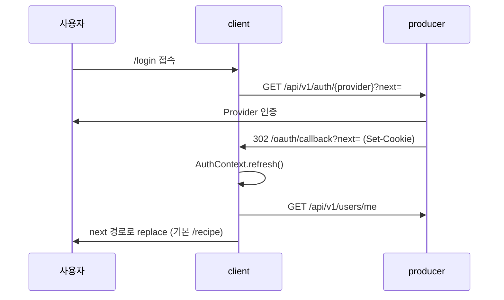

# E2E 시나리오/화면 흐름

## 이 문서로 해결할 질문

- 사용자가 앱에 진입해 레시피·챗봇·보관함을 이용하는 흐름은?
- OAuth 로그인은 어디서 시작하고 어디로 복귀하는가?
- 보호 라우트(로그인 필수)는 어디인가?

## 앱 구조 (하단 탭)

| 탭 | 대표 URL | 렌더링 |
| --- | --- | --- |
| 레시피 | `/recipe` | ISR + CSR(개인화 추천) |
| 챗봇 | `/chatbot/list` | CSR (보호 라우트) |
| 보관함 | `/inventory/ingredients/owned` | CSR (보호 라우트) |
| 마이페이지 | `/mypage` | CSR |

루트 `/`는 `/recipe`로 리다이렉트합니다.

## 화면 전환 맵

```mermaid
flowchart TB
    START([/) --> RECIPE["/recipe"]
    RECIPE --> DETAIL["/recipe/id"]
    RECIPE --> SEARCH["/recipe/search"]
    RECIPE --> CHAT["/chatbot/list"]
    RECIPE --> INV["/inventory"]
    RECIPE --> MY["/mypage"]
    CHAT --> CONV["/chatbot/id"]
    LOGIN["/login"] --> RECIPE
    LOGIN -.실패.-> ERR["/oauth/error"]
    ERR -.-> LOGIN
```

상세 다이어그램: `agent/common/screen_flowchart.mermaid`

## 시나리오 1: OAuth 로그인



- 실패 시: Producer → `/oauth/error` 302
- `next` 경로 안전 검증은 **백엔드** 책임 (`resolveSafeNextPath`)
- 상세: [인증](../client/auth), [인증/인가](../producer/auth)

## 시나리오 2: 레시피 탐색 → 상세

1. `/recipe` — 공개 섹션(ISR) + 로그인 시 개인화 추천 섹션(CSR)
2. `/recipe/search` — 검색어 기반 SSR 결과
3. `/recipe/[id]` — 온디맨드 ISR 상세, 조회 시 `recipe.view` 이벤트 발행
4. 관심 추가 시 `recipe.favorites_add` → 추천 점수 갱신

→ [추천 시스템](./recommendation)

## 시나리오 3: 보관함 재료 관리

1. `/inventory/ingredients/owned` — 보유 재료 CRUD
2. `/ingredient/filter?type=owned` — 재료 추가 UI
3. 변경 시 Producer API → Kafka `user-events` → Consumer가 Inventory·추천·캐시 무효화 처리

Proxy는 `/chatbot`, `/inventory`, `/mypage/*`(루트 `/mypage` 제외)에서 `refreshToken` 쿠키 존재 여부를 검사합니다.

## 시나리오 4: 챗봇 대화

1. `/chatbot/list` — 대화 목록
2. `/chatbot/[id]` — 메시지 전송 → Producer SSE 구독
3. Producer → Kafka `chatbot-requests` → Consumer GPT 처리 → Redis 스트림 → SSE 전달
4. 턴 완료 시 크레딧 멱등 차감

→ [챗봇 UI/스트리밍](../client/chatbot-ui), [챗봇/SSE](../producer/chatbot-sse), [챗봇 처리](../consumer/chatbot)

## 렌더링 전략 요약

| 전략 | 페이지 예 |
| --- | --- |
| ISR | `/recipe`, `/recipe/filter`, `/ingredient/filter` |
| 온디맨드 ISR | `/recipe/[id]` |
| SSR | `/recipe/search` |
| CSR | 챗봇, 보관함, 마이페이지, 인증 |

## 관련 문서

- [클라이언트 아키텍처](../client/architecture)
- [인증](../client/auth)
- [캐시](../client/cache)

## SSOT

- `agent/common/screen_flowchart.mermaid`
- `agent/frontend/spec/frontend_architecture_spec.md` (§2, §3)
