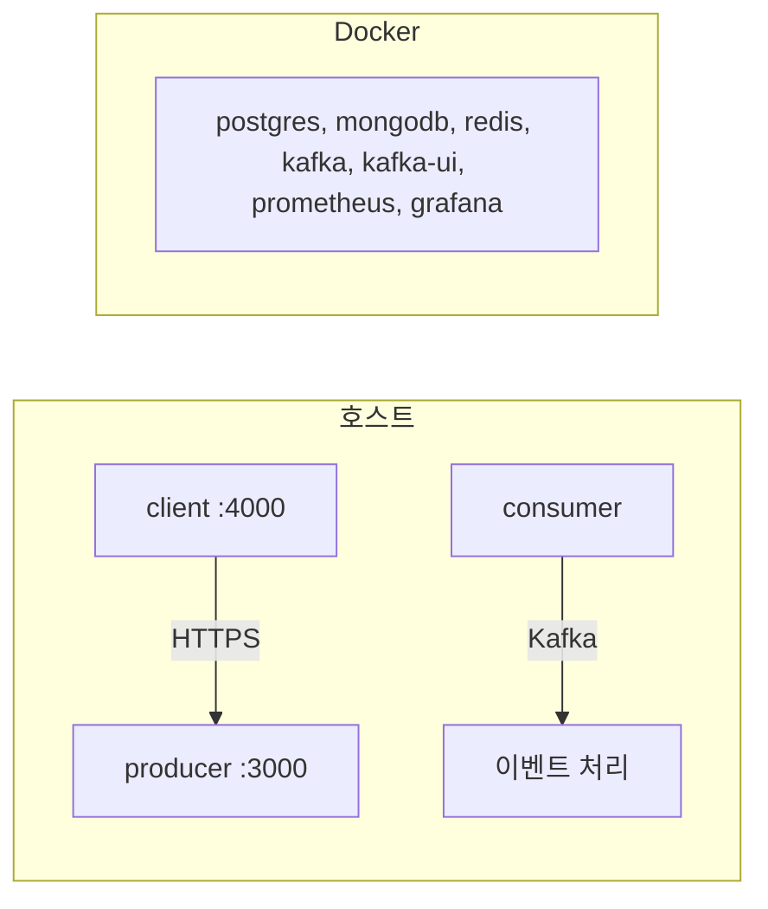

import CodeBlock from '@theme/CodeBlock';
import { GITHUB_REPO, GITHUB_REPO_CLONE_URL } from '@site/src/constants/github';

# 로컬 개발/온보딩

## 이 문서로 해결할 질문

- 로컬에서 Mealio를 처음 실행하려면 무엇이 필요한가요?
- Docker Compose와 앱(client/producer/consumer)은 어떻게 기동하나요?
- `.env.local` 파일은 어디에 두고 무엇을 설정하나요?

## Prerequisites

| 항목 | 버전 |
| --- | --- |
| Node.js | 20+ |
| pnpm | 9+ |
| Docker / Docker Compose | 최신 |

## 1. 저장소 클론 및 의존성 설치

<CodeBlock language="bash">{`git clone ${GITHUB_REPO_CLONE_URL}
cd ${GITHUB_REPO}

corepack enable
corepack prepare pnpm@latest --activate
pnpm install`}</CodeBlock>

## 2. 환경 변수 준비

개발 환경은 **인프라만 Docker**, **앱은 호스트에서 기동**하는 패턴을 사용합니다.

```bash
# 인프라 Compose용 (DB·Kafka·관측)
cp .env.docker.example .env.docker.local

# 호스트에서 앱 실행용
cp client/.env.example client/.env.local
cp server/producer/.env.example server/producer/.env.local
cp server/consumer/.env.example server/consumer/.env.local
```

| 파일 | 용도 |
| --- | --- |
| `.env.docker.local` | MongoDB·PostgreSQL·Redis·Kafka·Prometheus·Grafana |
| `client/.env.local` | Next.js API URL, OAuth 콜백 경로 등 |
| `server/producer/.env.local` | DB URL, Redis, Kafka, JWT, OAuth 클라이언트 |
| `server/consumer/.env.local` | DB URL, Redis, Kafka, OpenAI 등 |

패키지별 상세 변수는 각 패키지 문서를 참고하세요.

- [client 환경 변수](../client/environment-variables)
- [producer 환경 변수](../producer/environment-variables)
- [consumer 환경 변수](../consumer/environment-variables)
- [shared 환경 변수](../shared/environment-variables)
- [인프라 환경 변수](./infrastructure-environment-variables)

`APP_ENV`는 루트 `package.json` 스크립트/Compose에서 런타임 주입합니다.

## 3. 인프라 기동 (Docker Compose)

```bash
docker compose --env-file .env.docker.local -f docker/compose-database.yml -f docker/compose-kafka.yml -f docker/compose-kafka-ui.yml -f docker/compose-monitoring.yml up -d
```

기동되는 서비스: MongoDB, PostgreSQL, Redis, Kafka, Kafka UI, Prometheus, Grafana.

## 4. DB 마이그레이션·시드

```bash
pnpm run db:prisma:generate
pnpm run db:prisma:migrate:dev
pnpm run db:prisma:seed
pnpm run db:mongoose:seed
```

## 5. 앱 기동

터미널 3개에서 각각 실행합니다.

```bash
pnpm run start:producer   # API (기본 포트 3000)
pnpm run start:consumer   # Kafka Consumer
pnpm run start:client     # Next.js (기본 포트 4000)
```

## 6. 문서 사이트 (선택)

```bash
pnpm start:docs    # Docusaurus 개발 서버
```

## 로컬 아키텍처 요약



## 자주 쓰는 명령

| 명령 | 설명 |
| --- | --- |
| `pnpm run ci` | install + build + lint + test |
| `pnpm run kpi:rollup` | KPI 롤업 배치 (consumer job) |
| `pnpm run recipe-ingestion:fetch` | 레시피 수집 fetch 단계 |

## 관련 문서

- [배포/환경 전략](./deployment)
- [모노레포 구조](./monorepo)
- [도메인](./domain)
