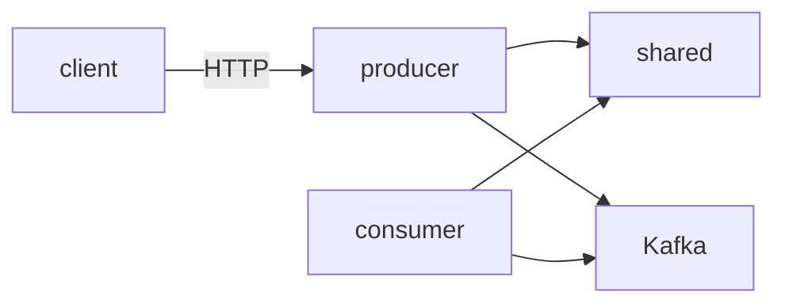

# 모노레포 구조

## 이 문서로 해결할 질문

- 패키지별 역할과 의존 방향은 무엇인가요?
- 루트에서 자주 쓰는 명령은 무엇인가요?

## 디렉터리 구조

```text
mealio/
├── client/                 # @mealio/client — Next.js
├── server/
│   ├── producer/           # @mealio/producer — NestJS API
│   ├── consumer/           # @mealio/consumer — Kafka 워커
│   └── shared/             # @mealio/shared — 공용 라이브러리
├── docs/                   # mealio-docs — Docusaurus
├── docker/                 # Compose·Dockerfile
├── observability/          # Grafana provisioning 등
└── package.json            # 루트 워크스페이스 스크립트
```

## 패키지 의존 방향



- `client`는 `producer`를 **HTTP로만** 호출 (shared 직접 의존 없음)
- `producer`·`consumer`는 `@mealio/shared` import
- `producer` ↔ `consumer` **직접 import 금지** — Kafka 계약으로만 통신

## 워크스페이스

`pnpm-workspace.yaml`:

```yaml
packages:
  - client
  - docs
  - server/shared
  - server/producer
  - server/consumer
```

## 루트 스크립트

| 명령 | 설명 |
| --- | --- |
| `pnpm run start:client` | Next.js dev |
| `pnpm run start:producer` | NestJS API dev |
| `pnpm run start:consumer` | Consumer dev |
| `pnpm run start:docs` | Docusaurus dev |
| `pnpm run db:prisma:migrate:dev` | Prisma 마이그레이션 |
| `pnpm run ci` | install + build + lint + test |

## shared 패키지 범위

| 제공 | 경로 예 |
| --- | --- |
| Prisma client | `@mealio/shared/prisma-client` |
| Mongoose schemas | `database/mongoose/` |
| Kafka 상수 | `constants/kafka-topics.ts` |
| Redis 키 | `constants/cache-keys.ts` |
| 이벤트 타입 | `types/events/` |

→ [Shared 패키지 개요](../shared/overview)

## CI

`pnpm run ci` — client·producer·consumer lint/test, shared·앱 빌드.

GitHub Actions 워크플로: `.github/workflows/`

## 관련 문서

- [로컬 개발/온보딩](./getting-started)
- [클라이언트 아키텍처](../client/architecture)
- [Producer 아키텍처](../producer/architecture)
- [Consumer 아키텍처](../consumer/architecture)
