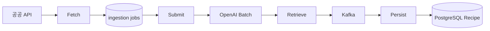

# 레시피 수집(ETL)

## 이 문서로 해결할 질문

- Mealio 레시피 데이터는 어디서 오고 어떻게 가공되나요?
- 파이프라인 단계별 상세 문서는 어디에 있나요?

## 목적

식약처 **공공데이터** 레시피를 수집하고, **OpenAI Batch API**로 정규화·매핑한 뒤 PostgreSQL에 영속화합니다.

## 단계 요약

| 단계 | 실행 | 결과 |
| --- | --- | --- |
| fetch | cron / CLI | `status: fetched` |
| submit | cron / CLI | `batch_id`, `submitted` |
| retrieve | cron / CLI | `retrieved` + Kafka 이벤트 |
| persist | always-on consumer | `persisted` + Recipe row |

## 참고 코드·계약

| 저장소 | 내용 |
| --- | --- |
| MongoDB `recipe_ingestion_jobs` | 파이프라인 job 문서 |
| MongoDB `recipe_ingestion_state` | API 페이징 커서 |
| PostgreSQL | 최종 Recipe 도메인 |

## 운영 특성

- 저트래픽 배치: 일 1회 이하 가정
- `fetch` / `submit` / `retrieve`는 **독립 job** — cron으로 조율
- `fetchLimit >= submitBatchSize` 권장

## 상세 문서

- [레시피 수집 상세](../consumer/recipe-ingestion) — 상태 전이·CLI·persist
- [배치/스케줄 작업](../consumer/batch-jobs) — 실행 명령

## 참고 코드·계약

- [레시피 수집 파이프라인](../project/recipe-ingestion)
- [레시피 수집](../project/recipe-ingestion)
