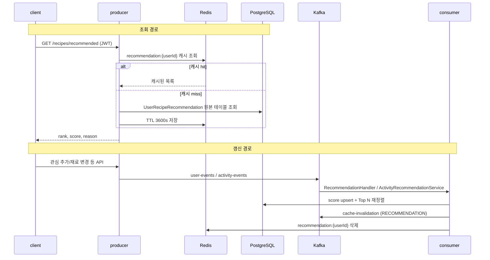

# 추천 시스템

## 이 문서로 해결할 질문

- 개인화 추천은 어떻게 생성·조회·갱신되나요?
- Producer·Consumer·Redis·PostgreSQL 각각의 역할은 무엇인가요?
- 추천이 느리거나 stale할 때 어디를 확인하나요?

## 전체 흐름

## 원본 테이블: UserRecipeRecommendation

PostgreSQL `user_recipe_recommendations` 테이블이 **추천 결과의 단일 진실 공급원**입니다.

- Consumer가 이벤트별 delta로 `score`를 누적
- Top 10(`MAX_RECOMMENDATION_ROWS`)을 rank 1..N으로 재작성
- Producer API는 이 원본 테이블을 조회해 응답 (캐시 miss 시)

원본 테이블에 데이터가 없으면 **인기 레시피(`likeCount` DESC)** 로 fallback합니다.

## 패키지별 책임

| 패키지 | 역할 | 상세 문서 |
| --- | --- | --- |
| **client** | `/recipe` CSR 섹션에서 추천 API 호출 | [캐시](../client/cache) |
| **producer** | `GET /recipes/recommended`, Redis Cache-Aside | [추천 API](../producer/recommendation-api) |
| **consumer** | 이벤트→점수 갱신→캐시 무효화 | [추천 파이프라인](../consumer/recommendation-pipeline) |
| **shared** | `recommendation:{userId}` 키·Top N 상한 | [Redis 키/캐시 계약](../shared/redis-cache-contract) |

## 주요 이벤트 가중치 (요약)

상세 표·처리 조건: [Consumer 추천 파이프라인 — 이벤트별 가중치](../consumer/recommendation-pipeline#user-events-가중치)

**user-events** (강한 선호 신호)

| 이벤트 | delta |
| --- | --- |
| `recipe.favorites_add` | +1.8 |
| `recipe.favorites_remove` | -1.8 |
| `ingredient.favorites_add` | +0.8 (연관 레시피) |
| `ingredient.add` | +0.25 |
| `ingredient.remove` | -0.2 (연관 레시피) |

**activity-events** (행동 보정, 로그인 사용자·recipeId 필요)

| 이벤트 | delta |
| --- | --- |
| `recipe.view` | +0.1 |
| `recipe.share` | +0.4 |
| `search.click` | +0.25 |

## 캐시 정책

| 항목 | 값 |
| --- | --- |
| 키 | `recommendation:{userId}` |
| TTL | 3600초 (1시간) |
| 무효화 | Consumer `cache-invalidation` 토픽 → Redis 키 삭제 |

다음 조회 시 DB 폴백으로 최신 원본을 반영합니다.

## 운영·KPI

- **E2E 지연 KPI**: `kpi_recommendation_e2e_latency` — EventLog `recipe.favorites_add`의 `occurredAt` → `processedAt` p95
- 지연 알림: [Observability](../other/observability), [Consumer 운영](../consumer/operations)

## 변경 시 체크리스트

1. 가중치 변경 → [Consumer 추천 파이프라인](../consumer/recommendation-pipeline) + score service
2. Top N 상한 → `recommendation.policy.ts` + Producer `limit` 쿼리
3. API 응답 변경 → OpenAPI + [추천 API](../producer/recommendation-api)
4. 캐시 키/TTL 변경 → [producer 캐시](../producer/cache) 및 [consumer 캐시 무효화](../consumer/cache-invalidation)

## 관련 문서

- [추천 API](../producer/recommendation-api)
- [추천 파이프라인](../consumer/recommendation-pipeline)
- [캐시 무효화](../consumer/cache-invalidation)
